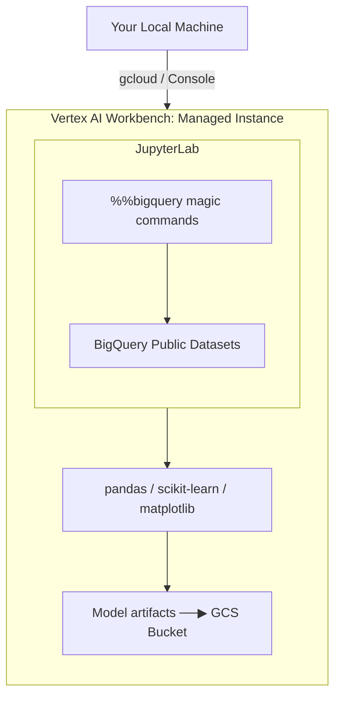

# Tutorial 1.1: Vertex AI Workbench & Jupyter Lab

Vertex AI Workbench provides managed JupyterLab instances that run on GCP with pre-installed ML libraries, native BigQuery integration, and direct access to Vertex AI services. It replaces the old AI Platform Notebooks and is the recommended starting point for data science work on GCP.

In this tutorial you set up a Workbench instance, pull data from BigQuery Public Datasets using magic commands, perform exploratory data analysis, and train a local scikit-learn model — the first step toward the **Customer Propensity & Support System**.



**Next tutorial:** [2.1 Custom Training Jobs](../phase2_training/01_custom_training.md)

---

## 1. Enable the required APIs

### Console

**APIs & Services > Enable APIs** — search for and enable:
- **Vertex AI API**
- **Notebooks API**

### gcloud CLI

```bash
gcloud services enable \
  aiplatform.googleapis.com \
  notebooks.googleapis.com
```

---

## 2. Create a Workbench Instance

### Console

1. **Vertex AI > Workbench > Instances > Create New**
2. **Name**: `ml-experiment-lab`
3. **Region / Zone**: `us-central1` / `us-central1-a`
4. **Environment**: *Vertex AI > Python (Latest)* — includes TensorFlow, PyTorch, scikit-learn, XGBoost
5. **Machine type**: `e2-standard-4` (4 vCPU, 16 GB RAM)
6. **Disk**: 100 GB standard boot disk
7. Click **Create** (takes 2–3 minutes)

### gcloud CLI

```bash
PROJECT_ID=$(gcloud config get-value project)

gcloud workbench instances create ml-experiment-lab \
  --location=us-central1-a \
  --machine-type=e2-standard-4 \
  --vm-image-project=deeplearning-platform-release \
  --vm-image-family=common-cpu-notebooks
```

Verify it is running:

```bash
gcloud workbench instances list --location=us-central1-a
```

---

## 3. Open JupyterLab

### Console

**Vertex AI > Workbench > Instances** — click **Open JupyterLab** next to `ml-experiment-lab`.

### gcloud CLI

```bash
# Opens the notebook proxy URL in your default browser
gcloud workbench instances get-iam-policy ml-experiment-lab \
  --location=us-central1-a
```

In JupyterLab, create a new **Python 3** notebook.

---

## 4. Pull data from BigQuery using magic commands

Workbench instances have `google-cloud-bigquery` and the `%%bigquery` IPython magic pre-installed. No authentication needed — the instance uses the attached service account.

```python
# Cell 1 — install/upgrade if needed (usually already present)
# !pip install --quiet google-cloud-bigquery pandas db-dtypes
```

```python
%%bigquery df
-- US Census bureau: income data for propensity modeling
SELECT
  age,
  workclass,
  education,
  marital_status,
  occupation,
  hours_per_week,
  income_bracket
FROM `bigquery-public-data.ml_datasets.census_adult_income`
WHERE age BETWEEN 18 AND 70
LIMIT 10000
```

```python
# Cell 3 — inspect
import pandas as pd
print(df.shape)
df.head()
```

---

## 5. Exploratory data analysis

```python
import matplotlib.pyplot as plt

# Target distribution
df['income_bracket'].value_counts().plot(kind='bar', title='Income bracket distribution')
plt.tight_layout()
plt.show()

# Age distribution by income
df.boxplot(column='age', by='income_bracket', figsize=(8, 4))
plt.title('Age by income bracket')
plt.suptitle('')
plt.show()

# Missing values
print(df.isnull().sum())
```

---

## 6. Train a scikit-learn model locally

```python
from sklearn.model_selection import train_test_split
from sklearn.ensemble import GradientBoostingClassifier
from sklearn.preprocessing import LabelEncoder
from sklearn.metrics import classification_report
import joblib, os

# Encode categoricals
df_encoded = df.copy()
for col in df_encoded.select_dtypes('object').columns:
    df_encoded[col] = LabelEncoder().fit_transform(df_encoded[col].astype(str))

X = df_encoded.drop('income_bracket', axis=1)
y = df_encoded['income_bracket']

X_train, X_test, y_train, y_test = train_test_split(X, y, test_size=0.2, random_state=42)

model = GradientBoostingClassifier(n_estimators=100, max_depth=4, random_state=42)
model.fit(X_train, y_train)

print(classification_report(y_test, model.predict(X_test)))
```

---

## 7. Save the model artifact to GCS

```python
PROJECT_ID = !gcloud config get-value project
PROJECT_ID = PROJECT_ID[0]
BUCKET = f"ml-artifacts-{PROJECT_ID}"

# Create bucket (run once)
import subprocess
subprocess.run(["gsutil", "mb", "-l", "us-central1", f"gs://{BUCKET}"], check=False)

# Save model
os.makedirs("model", exist_ok=True)
joblib.dump(model, "model/propensity_model.joblib")

# Upload to GCS
subprocess.run(["gsutil", "cp", "model/propensity_model.joblib",
                f"gs://{BUCKET}/models/v1/propensity_model.joblib"])
print(f"Model saved to gs://{BUCKET}/models/v1/propensity_model.joblib")
```

---

## 8. Cost control — stop the instance when not in use

Workbench instances charge while running (~$0.13/hr for e2-standard-4). Stop it between sessions:

### Console

**Vertex AI > Workbench > Instances** — click **Stop** next to the instance.

### gcloud CLI

```bash
# Stop (preserves disk, no compute charges)
gcloud workbench instances stop ml-experiment-lab \
  --location=us-central1-a

# Start again later
gcloud workbench instances start ml-experiment-lab \
  --location=us-central1-a

# Delete when done with the series
gcloud workbench instances delete ml-experiment-lab \
  --location=us-central1-a --quiet
```

---

## 9. What you built

| Component | Technology |
|-----------|-----------|
| Managed notebook environment | Vertex AI Workbench |
| Data source | BigQuery Public Datasets (census_adult_income) |
| Data access method | `%%bigquery` IPython magic |
| Model | GradientBoostingClassifier (scikit-learn) |
| Artifact storage | GCS (`gs://ml-artifacts-PROJECT/models/v1/`) |

### Why move to managed training?

Running training inside the notebook works for small datasets but has limitations:
- **Notebook kernel restarts** terminate the job
- **No parallelism** — only one set of hyperparameters at a time
- **Instance size** is fixed — you can't scale up for large data

These are exactly the problems solved in Phase 2.

---

## Next steps

- [Tutorial 2.1: Custom Training Jobs](../phase2_training/01_custom_training.md) — submit training to managed infrastructure
