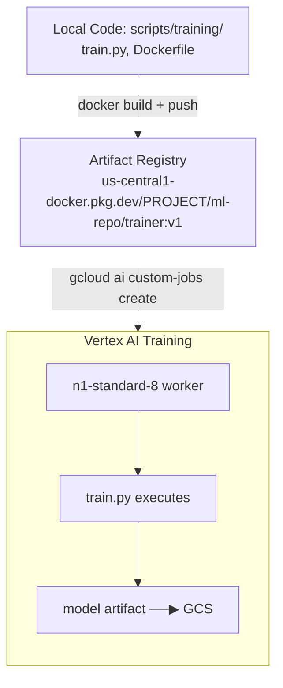

# Tutorial 2.1: Distributed Training with Custom Containers

Running training in a Vertex AI Workbench notebook is convenient for experimentation but impractical for production: the notebook must stay open, you can't easily scale to multiple machines, and the environment is not reproducible. **Custom Training Jobs** solve all three problems.

In this tutorial you package the propensity model training code into a Python package, containerize it, push it to **Artifact Registry**, and submit it as a managed **Vertex AI Custom Training Job**.



**Previous tutorial:** [1.1 Vertex AI Workbench](../phase1_experimentation/01_vertex_ai_workbench.md)
**Next tutorial:** [2.2 Hyperparameter Tuning](./02_hyperparameter_tuning.md)

---

## 1. Enable required APIs

```bash
gcloud services enable \
  aiplatform.googleapis.com \
  artifactregistry.googleapis.com \
  cloudbuild.googleapis.com
```

---

## 2. Create an Artifact Registry repository

### Console

1. **Artifact Registry > Repositories > Create Repository**
2. **Name**: `ml-repo`
3. **Format**: Docker
4. **Region**: `us-central1`
5. Click **Create**

### gcloud CLI

```bash
gcloud artifacts repositories create ml-repo \
  --repository-format=docker \
  --location=us-central1 \
  --description="ML training container images"
```

---

## 3. Review the training script

The training script is at [scripts/training/train.py](../scripts/training/train.py). It:
1. Downloads the BigQuery census dataset into a Pandas DataFrame
2. Trains a `GradientBoostingClassifier`
3. Evaluates on a hold-out test set
4. Saves the model artifact to `AIP_MODEL_DIR` (the GCS path Vertex AI injects)

Key environment variables Vertex AI sets automatically:
- `AIP_MODEL_DIR` — GCS URI where you should write model artifacts
- `AIP_TRAINING_DATA_URI` — GCS URI of training data (if using managed datasets)

---

## 4. Build and push the container image

```bash
PROJECT_ID=$(gcloud config get-value project)
IMAGE_URI="us-central1-docker.pkg.dev/$PROJECT_ID/ml-repo/trainer:v1"

# Authenticate Docker to Artifact Registry
gcloud auth configure-docker us-central1-docker.pkg.dev

# Build from the Dockerfile in scripts/training/
docker build -t $IMAGE_URI ai_ml_gcp/scripts/training/

# Push to Artifact Registry
docker push $IMAGE_URI

echo "Image pushed: $IMAGE_URI"
```

---

## 5. Submit the Custom Training Job

### Console

1. **Vertex AI > Training > Custom Jobs > Create**
2. **Display name**: `propensity-train-v1`
3. **Worker pool 0**:
   - Container image: paste `$IMAGE_URI`
   - Machine type: `n1-standard-8`
   - Accelerator: None (CPU training)
4. **Model output directory**: `gs://ml-artifacts-PROJECT/models/v1/`
5. Click **Start Training**

### gcloud CLI

```bash
PROJECT_ID=$(gcloud config get-value project)
BUCKET="ml-artifacts-$PROJECT_ID"
IMAGE_URI="us-central1-docker.pkg.dev/$PROJECT_ID/ml-repo/trainer:v1"

gcloud ai custom-jobs create \
  --region=us-central1 \
  --display-name=propensity-train-v1 \
  --worker-pool-spec=machine-type=n1-standard-8,replica-count=1,container-image-uri=$IMAGE_URI \
  --args="--model-dir=gs://$BUCKET/models/v1/"
```

---

## 6. Monitor the training job

### Console

**Vertex AI > Training > Custom Jobs** — click the job to see logs, metrics, and status.

### gcloud CLI

```bash
# List jobs
gcloud ai custom-jobs list --region=us-central1

# Stream logs for a specific job
JOB_ID=$(gcloud ai custom-jobs list --region=us-central1 \
  --format='value(name)' --limit=1 | awk -F/ '{print $NF}')

gcloud ai custom-jobs stream-logs $JOB_ID --region=us-central1
```

---

## 7. Verify the model artifact

```bash
PROJECT_ID=$(gcloud config get-value project)

gsutil ls gs://ml-artifacts-$PROJECT_ID/models/v1/
# Expected: propensity_model.joblib (or SavedModel/ directory for TF models)
```

---

## 8. What you built

| Step | What happened |
|------|--------------|
| Packaged code | Training logic in a reproducible Docker container |
| Artifact Registry | Versioned container image storage |
| Custom Training Job | Managed execution on scalable infrastructure |
| Model artifact | Saved to GCS, ready for registration |

### Advantages over notebook training

| Aspect | Notebook | Custom Training Job |
|--------|----------|-------------------|
| Reproducibility | Manual (kernel state) | Deterministic (container) |
| Scalability | Fixed notebook VM | Any machine type / GPU |
| Parallelism | Sequential | Multiple workers |
| Auditability | Hard to trace | Full logs in Cloud Logging |

---

## Next steps

- [Tutorial 2.2: Hyperparameter Tuning (Vizier)](./02_hyperparameter_tuning.md) — find optimal hyperparameters automatically
