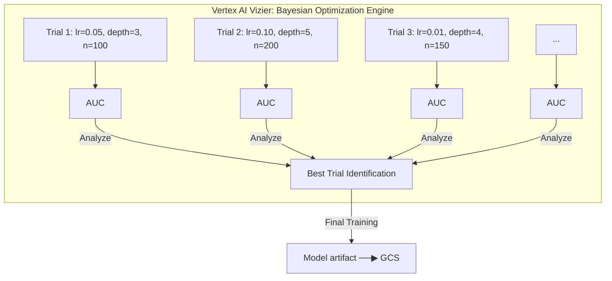

# Tutorial 2.2: Hyperparameter Tuning with Vertex AI Vizier

Choosing hyperparameters manually is slow and biased. **Vertex AI Hyperparameter Tuning** (powered by Google Vizier) automates the search: you define the parameter space and a metric to optimize, and Vertex AI runs parallel trials using Bayesian optimization — each trial informs the next.

In this tutorial you add `hypertune` reporting to the training script and submit a tuning job to find the best `learning_rate`, `max_depth`, and `n_estimators` for the propensity model.



**Previous tutorial:** [2.1 Custom Training Jobs](./01_custom_training.md)
**Next tutorial:** [3.1 Vertex AI Pipelines](../phase3_mlops/01_vertex_pipelines.md)

---

## 1. Add hypertune reporting to train.py

The training script must report the metric back to the Vizier service. Add this to [scripts/training/train.py](../scripts/training/train.py):

```python
import hypertune

# After training and evaluation:
hpt = hypertune.HyperTune()
hpt.report_hyperparameter_tuning_metric(
    hyperparameter_metric_tag='auc',
    metric_value=roc_auc_score(y_test, model.predict_proba(X_test)[:, 1]),
    global_step=1
)
```

Add `hypertune` to your `requirements.txt` or `Dockerfile`:

```dockerfile
RUN pip install hypertune scikit-learn google-cloud-bigquery pandas db-dtypes
```

Rebuild and push the updated image:

```bash
PROJECT_ID=$(gcloud config get-value project)
IMAGE_URI="us-central1-docker.pkg.dev/$PROJECT_ID/ml-repo/trainer:v2"

docker build -t $IMAGE_URI ai_ml_gcp/scripts/training/
docker push $IMAGE_URI
```

---

## 2. Submit the Hyperparameter Tuning Job

### Console

1. **Vertex AI > Training > Create > Hyperparameter Tuning Job**
2. **Display name**: `propensity-hptuning-v1`
3. **Optimization metric**:
   - Metric tag: `auc`
   - Goal: **Maximize**
4. **Parameters** — add three parameters:

   | Parameter | Type | Min | Max |
   |-----------|------|-----|-----|
   | `learning_rate` | Double | 0.01 | 0.3 |
   | `max_depth` | Integer | 2 | 8 |
   | `n_estimators` | Integer | 50 | 300 |

5. **Trials**: Max trials = 20, Parallel trials = 5
6. **Worker pool**: Container image URI (v2), machine type `n1-standard-4`
7. Click **Start Tuning**

### gcloud CLI

```bash
PROJECT_ID=$(gcloud config get-value project)
BUCKET="ml-artifacts-$PROJECT_ID"
IMAGE_URI="us-central1-docker.pkg.dev/$PROJECT_ID/ml-repo/trainer:v2"

# Write the job config
cat > hp_tuning_job.yaml << EOF
displayName: propensity-hptuning-v1
studySpec:
  metrics:
  - metricId: auc
    goal: MAXIMIZE
  parameters:
  - parameterId: learning_rate
    doubleValueSpec:
      minValue: 0.01
      maxValue: 0.30
  - parameterId: max_depth
    integerValueSpec:
      minValue: 2
      maxValue: 8
  - parameterId: n_estimators
    integerValueSpec:
      minValue: 50
      maxValue: 300
  algorithm: ALGORITHM_UNSPECIFIED   # Bayesian (default)
maxTrialCount: 20
parallelTrialCount: 5
trialJobSpec:
  workerPoolSpecs:
  - machineSpec:
      machineType: n1-standard-4
    replicaCount: 1
    containerSpec:
      imageUri: $IMAGE_URI
      args:
      - --model-dir=gs://$BUCKET/models/tuning/
EOF

gcloud ai hp-tuning-jobs create \
  --region=us-central1 \
  --config=hp_tuning_job.yaml
```

---

## 3. Monitor the tuning job

### Console

**Vertex AI > Training > Hyperparameter Tuning Jobs** — click the job to see a live parallel coordinates chart of trials and their AUC scores.

### gcloud CLI

```bash
# List all tuning jobs
gcloud ai hp-tuning-jobs list --region=us-central1

# Describe a specific job
JOB_ID=$(gcloud ai hp-tuning-jobs list --region=us-central1 \
  --format='value(name)' --limit=1 | awk -F/ '{print $NF}')

gcloud ai hp-tuning-jobs describe $JOB_ID --region=us-central1
```

---

## 4. Retrieve the best trial

```bash
# The describe output includes all trials and their metrics.
# Find the trial with the highest AUC:
gcloud ai hp-tuning-jobs describe $JOB_ID \
  --region=us-central1 \
  --format='json' | python3 - << 'EOF'
import json, sys
data = json.load(sys.stdin)
trials = data.get('trials', [])
best = max(trials, key=lambda t: float(t['finalMeasurement']['metrics'][0]['value']))
print("Best trial parameters:")
for p in best['parameters']:
    print(f"  {p['parameterId']}: {p.get('floatValue') or p.get('intValue')}")
print(f"Best AUC: {best['finalMeasurement']['metrics'][0]['value']:.4f}")
EOF
```

---

## 5. Retrain the final model with best parameters

Once you have the best parameters, retrain a final model using the standard custom training job from Tutorial 2.1, passing the optimal values as arguments:

```bash
gcloud ai custom-jobs create \
  --region=us-central1 \
  --display-name=propensity-final-v1 \
  --worker-pool-spec=machine-type=n1-standard-8,replica-count=1,container-image-uri=$IMAGE_URI \
  --args="--learning-rate=0.08,--max-depth=5,--n-estimators=200,--model-dir=gs://$BUCKET/models/final/"
```

---

## 6. What you built

| Concept | Detail |
|---------|--------|
| Search algorithm | Bayesian optimization (Vizier) |
| Search space | learning_rate [0.01–0.3], max_depth [2–8], n_estimators [50–300] |
| Parallel trials | 5 concurrent training runs |
| Metric reported | AUC (via `hypertune` library) |
| Result | Best hyperparameter set, model saved to GCS |

### Vizier vs grid/random search

| Method | Trials needed | Intelligence |
|--------|--------------|-------------|
| Grid search | O(n^k) — exponential | None — exhaustive |
| Random search | Fixed | None — no learning |
| Vizier (Bayesian) | Much fewer | Each trial informs the next |

---

## Next steps

- [Tutorial 3.1: Vertex AI Pipelines](../phase3_mlops/01_vertex_pipelines.md) — automate the full training workflow with KubeFlow Pipelines
