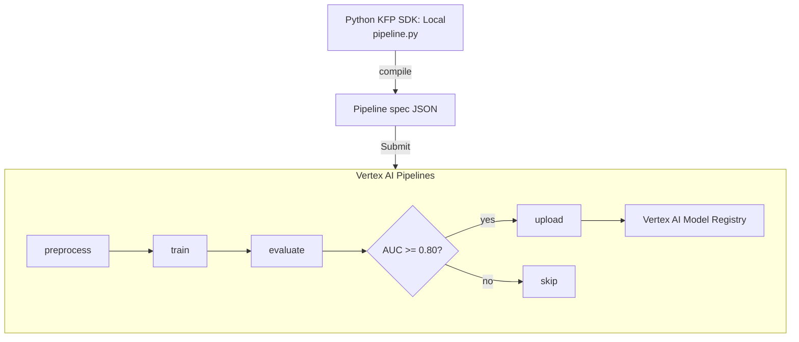

# Tutorial 3.1: Vertex AI Pipelines (KubeFlow)

Individual training jobs are a good start, but a real MLOps workflow needs the full sequence — data validation, training, evaluation, and conditional deployment — to run automatically, reproducibly, and with a full audit trail. **Vertex AI Pipelines** runs Kubeflow Pipelines (KFP) on managed infrastructure: you write Python components, compile to a pipeline spec, and Vertex AI orchestrates every step in its own container.

In this tutorial you build a three-step pipeline: **preprocess → train → evaluate & conditionally upload model**.



**Previous tutorial:** [2.2 Hyperparameter Tuning](../phase2_training/02_hyperparameter_tuning.md)
**Next tutorial:** [3.2 Model Registry & Monitoring](./02_model_registry_monitoring.md)

---

## 1. Install the KFP SDK

Run this locally (or inside Workbench):

```bash
pip install kfp google-cloud-aiplatform --upgrade
```

---

## 2. Review the pipeline script

The full pipeline is at [scripts/pipelines/propensity_pipeline.py](../scripts/pipelines/propensity_pipeline.py). The key pattern for a KFP component is:

```python
from kfp.v2 import dsl
from kfp.v2.dsl import component, Output, Model, Metrics

@component(
    base_image="python:3.10-slim",
    packages_to_install=["scikit-learn", "google-cloud-bigquery", "pandas", "db-dtypes", "joblib"]
)
def train_model(
    project: str,
    model_artifact: Output[Model],
    metrics: Output[Metrics],
    learning_rate: float = 0.08,
    max_depth: int = 5,
    n_estimators: int = 200,
):
    # ... training logic ...
    metrics.log_metric("auc", auc_score)
    joblib.dump(clf, model_artifact.path + "/model.joblib")
```

Each `@component` runs in its own container. Inputs/outputs are passed as typed artifacts or primitive values. `Output[Model]` automatically maps to a GCS path managed by Vertex AI.

---

## 3. Compile the pipeline

```bash
cd ai_ml_gcp/scripts/pipelines/

python3 - << 'EOF'
from kfp.v2 import compiler
from propensity_pipeline import propensity_pipeline

compiler.Compiler().compile(
    pipeline_func=propensity_pipeline,
    package_path="propensity_pipeline.json"
)
print("Compiled to propensity_pipeline.json")
EOF
```

---

## 4. Submit the pipeline run

### Console

1. **Vertex AI > Pipelines > Runs > Create Run**
2. **Upload a pipeline template** — select `propensity_pipeline.json`
3. **Pipeline run name**: `propensity-run-001`
4. **Region**: `us-central1`
5. Set runtime parameters (project ID, etc.)
6. Click **Submit**

### gcloud CLI (via Python SDK)

```python
import google.cloud.aiplatform as aip

PROJECT_ID = "YOUR_PROJECT_ID"   # replace
BUCKET     = f"ml-artifacts-{PROJECT_ID}"
REGION     = "us-central1"

aip.init(project=PROJECT_ID, location=REGION, staging_bucket=f"gs://{BUCKET}")

job = aip.PipelineJob(
    display_name="propensity-run-001",
    template_path="propensity_pipeline.json",
    pipeline_root=f"gs://{BUCKET}/pipeline_root",
    parameter_values={
        "project": PROJECT_ID,
        "learning_rate": 0.08,
        "max_depth": 5,
        "n_estimators": 200,
        "auc_threshold": 0.80,
    },
)

job.run(sync=True)   # set sync=False to return immediately
```

Run as a script:

```bash
python3 run_pipeline.py
```

---

## 5. Inspect the pipeline run

### Console

**Vertex AI > Pipelines > Runs** — click the run to see the DAG visualization, component logs, input/output artifacts, and metrics for each step.

### gcloud CLI

```bash
# List pipeline runs
gcloud ai pipeline-jobs list --region=us-central1

# Describe a specific run
JOB_ID=$(gcloud ai pipeline-jobs list --region=us-central1 \
  --format='value(name)' --limit=1 | awk -F/ '{print $NF}')

gcloud ai pipeline-jobs describe $JOB_ID --region=us-central1
```

---

## 6. Schedule the pipeline (recurring execution)

### Console

**Vertex AI > Pipelines > Schedules > Create Schedule**
- Frequency: `0 2 * * 1` (every Monday at 02:00 UTC)
- Pipeline template: `propensity_pipeline.json`

### Python SDK

```python
schedule = aip.PipelineJobSchedule(
    pipeline_spec_uri=f"gs://{BUCKET}/pipeline_specs/propensity_pipeline.json",
    display_name="propensity-weekly",
)

schedule.create(
    cron="0 2 * * 1",   # every Monday at 02:00 UTC
    max_concurrent_run_count=1,
    max_run_count=52,    # run for one year
)
```

---

## 7. What you built

| Component | Technology |
|-----------|-----------|
| Pipeline definition | Kubeflow Pipelines (KFP) v2 SDK |
| Step isolation | Each component runs in its own container |
| Conditional logic | `dsl.Condition` — only upload if AUC ≥ threshold |
| Artifact tracking | Vertex ML Metadata (lineage graph) |
| Scheduling | Vertex AI Pipeline Schedules (cron) |

### Why pipelines over standalone jobs?

| Concern | Standalone Job | Pipeline |
|---------|--------------|---------|
| Reproducibility | Hard (no graph) | Full DAG with artifact lineage |
| Partial re-runs | Not possible | Re-run from any failed step |
| Conditional logic | Manual scripting | First-class `dsl.Condition` |
| Audit trail | Logs only | Vertex ML Metadata lineage |

---

## Next steps

- [Tutorial 3.2: Model Registry & Monitoring](./02_model_registry_monitoring.md) — version models and detect data drift in production
