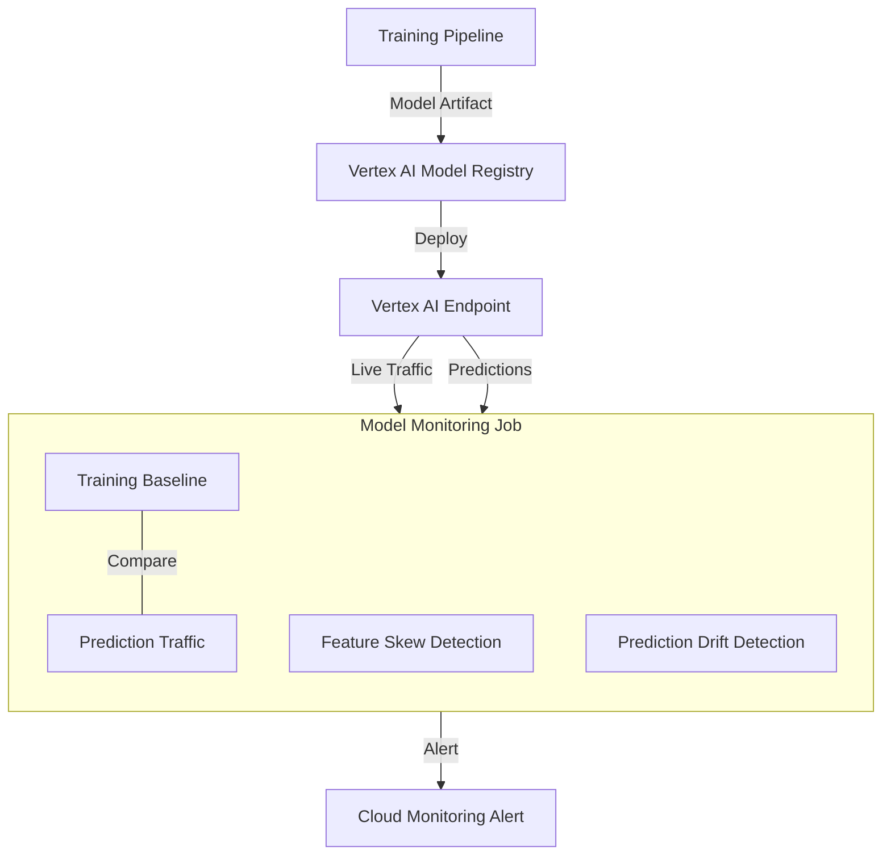

# Tutorial 3.2: Model Registry & Monitoring

Deploying a model is only the beginning. Over time, the real-world data distribution shifts — users behave differently, products change — and model accuracy degrades silently. **Vertex AI Model Registry** provides versioned model management, while **Vertex AI Model Monitoring** continuously compares live traffic feature distributions against the training baseline and alerts when drift exceeds a threshold.



**Previous tutorial:** [3.1 Vertex AI Pipelines](./01_vertex_pipelines.md)
**Next tutorial:** [4.1 Endpoints & Batch Prediction](../phase4_serving/01_endpoints_batch_prediction.md)

---

## 1. Register a model in the Model Registry

The pipeline from Tutorial 3.1 uploads the model automatically if AUC passes the threshold. You can also register manually:

### Console

1. **Vertex AI > Model Registry > Import**
2. **Model name**: `propensity-model`
3. **Region**: `us-central1`
4. **Model framework**: Scikit-learn
5. **Model artifact location**: `gs://ml-artifacts-PROJECT/models/final/`
6. **Serving container**: `us-docker.pkg.dev/vertex-ai/prediction/sklearn-cpu.1-3:latest`
7. Click **Import**

### gcloud CLI

```bash
PROJECT_ID=$(gcloud config get-value project)
BUCKET="ml-artifacts-$PROJECT_ID"

gcloud ai models upload \
  --region=us-central1 \
  --display-name=propensity-model \
  --artifact-uri=gs://$BUCKET/models/final/ \
  --container-image-uri=us-docker.pkg.dev/vertex-ai/prediction/sklearn-cpu.1-3:latest \
  --container-health-route=/health \
  --container-predict-route=/predict
```

---

## 2. List model versions

Each time you upload a model with the same display name, Vertex AI creates a new **version** under the same model resource:

### Console

**Vertex AI > Model Registry** — click `propensity-model` to see the version list with upload timestamps and artifact URIs.

### gcloud CLI

```bash
# Get model ID
MODEL_ID=$(gcloud ai models list --region=us-central1 \
  --filter="displayName=propensity-model" \
  --format='value(name)' | awk -F/ '{print $NF}')

# List versions
gcloud ai models list-version $MODEL_ID --region=us-central1
```

---

## 3. Deploy a model version to an endpoint

Create a dedicated endpoint and deploy the model version to it:

### Console

1. **Vertex AI > Model Registry** — click the model > **Deploy & Test > Deploy to Endpoint**
2. **Endpoint name**: `propensity-endpoint`
3. **Traffic split**: 100% to this version
4. **Machine type**: `n1-standard-2`
5. **Min replicas**: 1, **Max replicas**: 5 (autoscaling)
6. Click **Deploy** (takes ~5 minutes)

### gcloud CLI

```bash
# Create the endpoint
gcloud ai endpoints create \
  --region=us-central1 \
  --display-name=propensity-endpoint

# Get endpoint ID
ENDPOINT_ID=$(gcloud ai endpoints list --region=us-central1 \
  --filter="displayName=propensity-endpoint" \
  --format='value(name)' | awk -F/ '{print $NF}')

# Deploy model to endpoint
gcloud ai endpoints deploy-model $ENDPOINT_ID \
  --region=us-central1 \
  --model=$MODEL_ID \
  --display-name=propensity-v1 \
  --machine-type=n1-standard-2 \
  --min-replica-count=1 \
  --max-replica-count=5 \
  --traffic-split=0=100
```

---

## 4. Test a prediction

```bash
PROJECT_ID=$(gcloud config get-value project)
ENDPOINT_ID="YOUR_ENDPOINT_ID"   # from step above

# Send a prediction request (Census income features)
curl -X POST \
  -H "Authorization: Bearer $(gcloud auth print-access-token)" \
  -H "Content-Type: application/json" \
  "https://us-central1-aiplatform.googleapis.com/v1/projects/$PROJECT_ID/locations/us-central1/endpoints/$ENDPOINT_ID:predict" \
  -d '{
    "instances": [
      [39, 0, 1, 2, 3, 40],
      [52, 1, 2, 0, 4, 45]
    ]
  }'
```

---

## 5. Enable Model Monitoring

Model Monitoring compares the distribution of features in live prediction traffic against the training data baseline and alerts on skew/drift.

### Console

1. **Vertex AI > Model Monitoring > Create Job**
2. **Endpoint**: `propensity-endpoint`
3. **Training data baseline**: point to `gs://ml-artifacts-PROJECT/data/train.csv`
4. **Monitoring frequency**: Every 1 hour
5. **Alert thresholds**:
   - Skew threshold (training vs serving): 0.3
   - Drift threshold (serving over time): 0.3
6. **Notification email**: your email
7. Click **Create**

### Python SDK

```python
import google.cloud.aiplatform as aip

PROJECT_ID = "YOUR_PROJECT_ID"
ENDPOINT_ID = "YOUR_ENDPOINT_ID"
BUCKET = f"ml-artifacts-{PROJECT_ID}"

aip.init(project=PROJECT_ID, location="us-central1")

endpoint = aip.Endpoint(ENDPOINT_ID)

monitoring_job = aip.ModelDeploymentMonitoringJob.create(
    display_name="propensity-monitoring",
    project=PROJECT_ID,
    location="us-central1",
    endpoint=endpoint,
    logging_sampling_strategy={"random_sample_config": {"sample_rate": 0.8}},
    model_deployment_monitoring_objective_configs=[{
        "deployed_model_id": "YOUR_DEPLOYED_MODEL_ID",
        "objective_config": {
            "training_dataset": {
                "data_format": "csv",
                "gcs_source": {"uris": [f"gs://{BUCKET}/data/train.csv"]},
            },
            "training_prediction_skew_detection_config": {
                "skew_thresholds": {
                    "age":            {"value": 0.3},
                    "hours_per_week": {"value": 0.3},
                }
            },
            "prediction_drift_detection_config": {
                "drift_thresholds": {
                    "age":            {"value": 0.3},
                    "hours_per_week": {"value": 0.3},
                }
            },
        },
    }],
    model_monitoring_alert_config={
        "email_alert_config": {"user_emails": ["YOUR_EMAIL@example.com"]}
    },
    model_deployment_monitoring_schedule_config={
        "monitor_interval": {"seconds": 3600}
    },
)

print(f"Monitoring job: {monitoring_job.name}")
```

---

## 6. Inspect monitoring results

### Console

**Vertex AI > Model Monitoring** — click the job to see feature distribution charts, skew/drift scores over time, and any triggered alerts.

### gcloud CLI

```bash
gcloud ai model-monitoring-jobs list --region=us-central1
```

---

## 7. What you built

| Component | Purpose |
|-----------|---------|
| Model Registry | Versioned model storage with lineage |
| Endpoint | Online serving with autoscaling |
| Model Monitoring Job | Continuous skew/drift detection |
| Cloud Monitoring Alerts | Email notification on threshold breach |

### Drift vs Skew

| Term | Definition | Trigger |
|------|-----------|---------|
| Training-serving skew | Feature distributions differ between training data and live traffic | Data pipeline bugs, feature engineering inconsistencies |
| Prediction drift | Live feature distributions shift over time | Real-world behavior change, seasonal patterns |

---

## Next steps

- [Tutorial 4.1: Endpoints & Batch Prediction](../phase4_serving/01_endpoints_batch_prediction.md) — configure autoscaling, run batch scoring jobs
