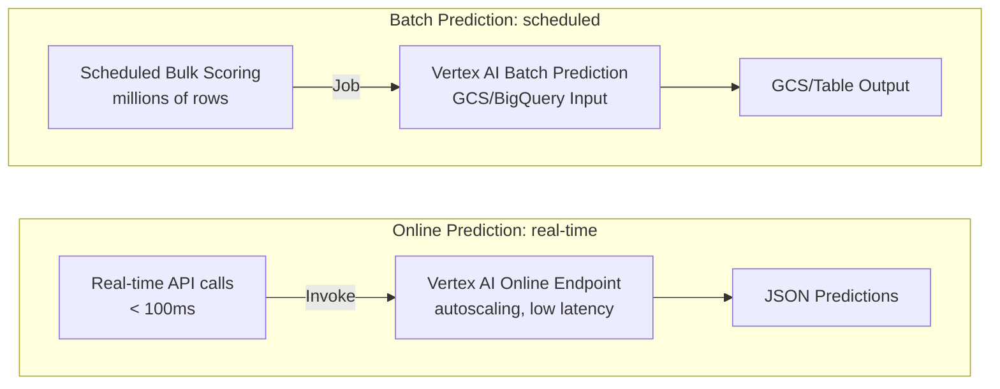

# Tutorial 4.1: Online Endpoints & Batch Prediction

Vertex AI offers two serving modes for models: **Online Prediction** (low-latency, real-time) and **Batch Prediction** (high-throughput, asynchronous). The online endpoint from Tutorial 3.2 uses autoscaling to handle variable traffic. Batch prediction is ideal for scoring millions of records overnight without a persistent endpoint.



**Previous tutorial:** [3.2 Model Registry & Monitoring](../phase3_mlops/02_model_registry_monitoring.md)
**Next tutorial:** [4.2 CI/CD for ML](./02_cicd_gitops.md)

---

## 1. Configure autoscaling on the online endpoint

The endpoint from Tutorial 3.2 has autoscaling enabled via `max-replica-count`. Fine-tune the scaling behavior:

### Console

**Vertex AI > Online Prediction > Endpoints** — click `propensity-endpoint` > **Edit** on the deployed model version:
- **Min replicas**: 1 (always warm — no cold starts)
- **Max replicas**: 10 (burst capacity)
- **Accelerator type**: None (CPU) or T4 GPU for deep learning models

### gcloud CLI

```bash
PROJECT_ID=$(gcloud config get-value project)
ENDPOINT_ID="YOUR_ENDPOINT_ID"
DEPLOYED_MODEL_ID="YOUR_DEPLOYED_MODEL_ID"

# Update traffic split and replica count
gcloud ai endpoints update-traffic-split $ENDPOINT_ID \
  --region=us-central1 \
  --traffic-split=$DEPLOYED_MODEL_ID=100

# Mutate replica counts
gcloud ai endpoints update $ENDPOINT_ID \
  --region=us-central1 \
  --update-labels=env=prod
```

---

## 2. Test the online endpoint at scale

```bash
PROJECT_ID=$(gcloud config get-value project)
ENDPOINT_ID="YOUR_ENDPOINT_ID"

# Create a batch of 100 requests
python3 << 'EOF'
import requests, json, subprocess, random

token = subprocess.check_output(
    ["gcloud", "auth", "print-access-token"], text=True).strip()

PROJECT_ID = subprocess.check_output(
    ["gcloud", "config", "get-value", "project"], text=True).strip()

url = f"https://us-central1-aiplatform.googleapis.com/v1/projects/{PROJECT_ID}/locations/us-central1/endpoints/YOUR_ENDPOINT_ID:predict"

headers = {"Authorization": f"Bearer {token}", "Content-Type": "application/json"}

instances = [[random.randint(18,65), random.randint(0,3),
              random.randint(0,5), random.randint(0,4),
              random.randint(0,10), random.randint(20,60)]
             for _ in range(10)]

resp = requests.post(url, headers=headers, json={"instances": instances})
print(json.dumps(resp.json(), indent=2))
EOF
```

---

## 3. Prepare input data for batch prediction

Batch prediction reads from GCS or BigQuery. Create a JSONL input file:

```bash
PROJECT_ID=$(gcloud config get-value project)
BUCKET="ml-artifacts-$PROJECT_ID"

# Create JSONL file (one instance per line)
python3 << 'EOF'
import json, random

rows = []
for _ in range(10000):
    rows.append([random.randint(18,65), random.randint(0,3),
                 random.randint(0,5), random.randint(0,4),
                 random.randint(0,10), random.randint(20,60)])

with open("batch_input.jsonl", "w") as f:
    for row in rows:
        f.write(json.dumps({"instances": [row]}) + "\n")

print(f"Created batch_input.jsonl with {len(rows)} rows")
EOF

# Upload to GCS
gsutil cp batch_input.jsonl gs://$BUCKET/batch/input/batch_input.jsonl
```

---

## 4. Submit a Batch Prediction Job

### Console

1. **Vertex AI > Batch Predictions > Create**
2. **Job name**: `propensity-batch-001`
3. **Model**: `propensity-model` (latest version)
4. **Input format**: JSON Lines (JSONL)
5. **Input path**: `gs://ml-artifacts-PROJECT/batch/input/`
6. **Output path**: `gs://ml-artifacts-PROJECT/batch/output/`
7. **Machine type**: `n1-standard-4`, **Replicas**: 2
8. Click **Create**

### gcloud CLI

```bash
PROJECT_ID=$(gcloud config get-value project)
BUCKET="ml-artifacts-$PROJECT_ID"
MODEL_ID="YOUR_MODEL_ID"

gcloud ai batch-prediction-jobs create \
  --region=us-central1 \
  --display-name=propensity-batch-001 \
  --model=$MODEL_ID \
  --input-paths=gs://$BUCKET/batch/input/ \
  --input-format=jsonl \
  --output-path=gs://$BUCKET/batch/output/ \
  --dedicated-resources-machine-type=n1-standard-4 \
  --dedicated-resources-starting-replica-count=2 \
  --dedicated-resources-max-replica-count=4
```

---

## 5. Monitor and retrieve batch job results

```bash
# List batch jobs
gcloud ai batch-prediction-jobs list --region=us-central1

# Describe a job
JOB_ID=$(gcloud ai batch-prediction-jobs list --region=us-central1 \
  --format='value(name)' --limit=1 | awk -F/ '{print $NF}')

gcloud ai batch-prediction-jobs describe $JOB_ID --region=us-central1

# View output when complete
PROJECT_ID=$(gcloud config get-value project)
gsutil ls gs://ml-artifacts-$PROJECT_ID/batch/output/
gsutil cat gs://ml-artifacts-$PROJECT_ID/batch/output/predictions_00001.jsonl | head -5
```

---

## 6. Load batch predictions into BigQuery

```bash
PROJECT_ID=$(gcloud config get-value project)
BUCKET="ml-artifacts-$PROJECT_ID"

bq load \
  --source_format=NEWLINE_DELIMITED_JSON \
  --autodetect \
  retail_analytics.propensity_scores \
  gs://$BUCKET/batch/output/*.jsonl
```

---

## 7. What you built

| Serving mode | Use case | Latency | Cost model |
|-------------|----------|---------|-----------|
| Online Endpoint | Real-time API (user-facing) | < 100ms | Per-hour (replicas running) |
| Batch Prediction | Overnight scoring, large datasets | Minutes–hours | Per compute-minute (scales to 0) |

### When to use each

- **Online**: user-facing product recommendations, fraud scoring at checkout, real-time eligibility checks
- **Batch**: daily propensity scoring for email campaigns, monthly risk scoring for all customers, offline model evaluation

---

## Next steps

- [Tutorial 4.2: CI/CD for ML (GitOps)](./02_cicd_gitops.md) — automate pipeline execution when code changes
