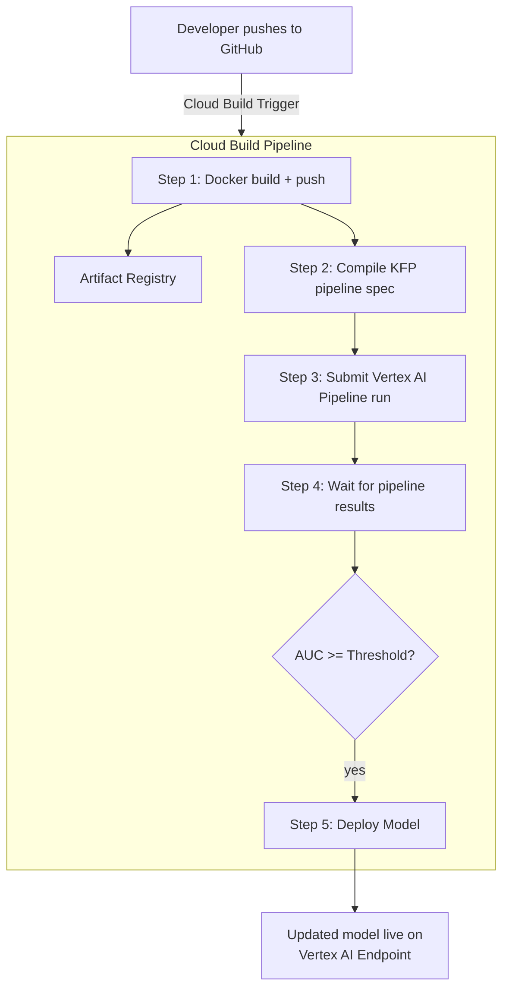

# Tutorial 4.2: CI/CD for ML (GitOps)

Manual pipeline submissions and model deployments don't scale. **GitOps for ML** means that a Git push is the only action a data scientist needs to take — Cloud Build detects the change, builds the training container, runs the Vertex AI Pipeline, and if the model passes evaluation, deploys it automatically.



**Previous tutorial:** [4.1 Endpoints & Batch Prediction](./01_endpoints_batch_prediction.md)
**Next tutorial:** [5.1 Foundation Models & Model Garden](../phase5_genai_agents/01_foundation_models.md)

---

## 1. Connect Cloud Build to GitHub

### Console

1. **Cloud Build > Triggers > Connect Repository**
2. Select **GitHub (Cloud Build GitHub App)**
3. Authenticate and select your `cc-gcp` repository
4. Click **Connect**

### gcloud CLI

```bash
# Install Cloud Build GitHub App first (Console only for OAuth flow),
# then create a trigger pointing at cloudbuild.yaml
gcloud builds triggers create github \
  --repo-name=cc-gcp \
  --repo-owner=YOUR_GITHUB_USERNAME \
  --branch-pattern="^main$" \
  --build-config=ai_ml_gcp/scripts/training/cloudbuild.yaml \
  --name=ml-cicd-trigger \
  --description="Retrain and deploy propensity model on main branch push"
```

---

## 2. Review the cloudbuild.yaml

The CI/CD pipeline config is at [scripts/training/cloudbuild.yaml](../scripts/training/cloudbuild.yaml). It has five steps:

```yaml
steps:
  # 1. Build training container
  - name: 'gcr.io/cloud-builders/docker'
    args: ['build', '-t', '$_IMAGE_URI', 'ai_ml_gcp/scripts/training/']

  # 2. Push to Artifact Registry
  - name: 'gcr.io/cloud-builders/docker'
    args: ['push', '$_IMAGE_URI']

  # 3. Compile and submit KFP pipeline
  - name: 'python:3.10-slim'
    entrypoint: bash
    args:
      - -c
      - |
        pip install kfp google-cloud-aiplatform --quiet
        python3 ai_ml_gcp/scripts/pipelines/run_pipeline.py \
          --project=$PROJECT_ID \
          --bucket=$_BUCKET \
          --image=$_IMAGE_URI \
          --wait
```

Key substitution variables (set in the trigger):
- `_IMAGE_URI` — Artifact Registry image URI (e.g. `us-central1-docker.pkg.dev/PROJECT/ml-repo/trainer:$SHORT_SHA`)
- `_BUCKET` — GCS bucket for artifacts

---

## 3. Grant Cloud Build permissions

Cloud Build's service account needs Vertex AI and Artifact Registry permissions:

```bash
PROJECT_ID=$(gcloud config get-value project)
PROJECT_NUMBER=$(gcloud projects describe $PROJECT_ID --format='value(projectNumber)')
CB_SA="$PROJECT_NUMBER@cloudbuild.gserviceaccount.com"

# Vertex AI permissions
gcloud projects add-iam-policy-binding $PROJECT_ID \
  --member="serviceAccount:$CB_SA" \
  --role="roles/aiplatform.user"

# Artifact Registry writer
gcloud projects add-iam-policy-binding $PROJECT_ID \
  --member="serviceAccount:$CB_SA" \
  --role="roles/artifactregistry.writer"

# Storage object admin (for pipeline artifacts)
gcloud projects add-iam-policy-binding $PROJECT_ID \
  --member="serviceAccount:$CB_SA" \
  --role="roles/storage.objectAdmin"
```

---

## 4. Trigger a build manually (test)

```bash
PROJECT_ID=$(gcloud config get-value project)
BUCKET="ml-artifacts-$PROJECT_ID"
IMAGE_URI="us-central1-docker.pkg.dev/$PROJECT_ID/ml-repo/trainer:manual-test"

gcloud builds submit \
  --config=ai_ml_gcp/scripts/training/cloudbuild.yaml \
  --substitutions=_IMAGE_URI=$IMAGE_URI,_BUCKET=$BUCKET \
  --region=us-central1
```

---

## 5. Monitor the build

### Console

**Cloud Build > History** — click the running build to see step-by-step logs in real time.

### gcloud CLI

```bash
# List recent builds
gcloud builds list --limit=5 --region=us-central1

# Stream logs for the latest build
BUILD_ID=$(gcloud builds list --limit=1 --region=us-central1 \
  --format='value(id)')

gcloud builds log $BUILD_ID --region=us-central1 --stream
```

---

## 6. Add a pull request check (optional)

Add a second trigger for pull requests that runs training on a small data sample and checks AUC without deploying:

```bash
gcloud builds triggers create github \
  --repo-name=cc-gcp \
  --repo-owner=YOUR_GITHUB_USERNAME \
  --pull-request-pattern="^main$" \
  --build-config=ai_ml_gcp/scripts/training/cloudbuild_pr.yaml \
  --name=ml-pr-check \
  --description="Fast model quality check on pull requests"
```

`cloudbuild_pr.yaml` runs training on 10% of the data and fails the build if AUC < 0.75.

---

## 7. What you built

| Component | Role |
|-----------|------|
| GitHub push | Trigger event |
| Cloud Build trigger | Watches repo, starts pipeline |
| `cloudbuild.yaml` | CI/CD pipeline spec (5 steps) |
| Artifact Registry | Versioned training container (tagged with `$SHORT_SHA`) |
| Vertex AI Pipeline | Training, evaluation, conditional deployment |
| IAM bindings | Cloud Build SA with least-privilege access |

### The full GitOps flow

```
git push origin main
  → Cloud Build trigger fires
  → Docker build + push (new tag per commit SHA)
  → KFP pipeline runs (preprocess → train → evaluate)
  → if AUC ≥ 0.80: deploy to propensity-endpoint
  → Cloud Build step succeeds/fails in GitHub Checks
```

---

## Next steps

- [Tutorial 5.1: Foundation Models & Model Garden](../phase5_genai_agents/01_foundation_models.md) — use Gemini for text, vision, and multimodal tasks
