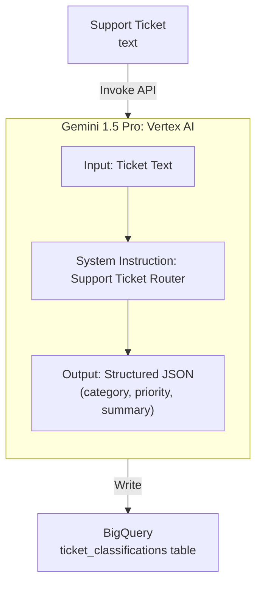

# Tutorial 5.1: Foundation Models & Model Garden

**Model Garden** is Vertex AI's catalog of foundation models — Google's own (Gemini, Imagen, Chirp) and open-source (Llama 3, Mistral, Gemma). You can use them for text generation, vision, code, embeddings, and multimodal tasks without training anything.

In this tutorial you use the **Gemini API** via the Vertex AI SDK to build the first component of the Customer Support System: a classifier that reads incoming support tickets and routes them to the right team.



**Previous tutorial:** [4.2 CI/CD for ML](../phase4_serving/02_cicd_gitops.md)
**Next tutorial:** [5.2 Agent Builder](./02_agent_builder.md)

---

## 1. Enable the Vertex AI API and set up credentials

```bash
gcloud services enable aiplatform.googleapis.com

# Authenticate the SDK
gcloud auth application-default login
```

Install the SDK:

```bash
pip install google-cloud-aiplatform --upgrade
```

---

## 2. Browse Model Garden

### Console

**Vertex AI > Model Garden** — filter by:
- **Task**: Text generation, Image generation, Embeddings, Code
- **Provider**: Google, Meta, Mistral AI, etc.

Click **Gemini 1.5 Pro** and use **Open in Vertex AI Studio** to experiment interactively before writing code.

---

## 3. Text generation with Gemini

```python
import vertexai
from vertexai.generative_models import GenerativeModel, Part

PROJECT_ID = "YOUR_PROJECT_ID"   # replace
REGION     = "us-central1"

vertexai.init(project=PROJECT_ID, location=REGION)

model = GenerativeModel("gemini-1.5-pro")

response = model.generate_content(
    "Explain the difference between supervised and unsupervised learning "
    "in two sentences, suitable for a business audience."
)
print(response.text)
```

---

## 4. System instructions and structured output

For the ticket classification task, use a system instruction to constrain the model's behavior and ask for JSON output:

```python
from vertexai.generative_models import GenerativeModel, GenerationConfig
import json

model = GenerativeModel(
    "gemini-1.5-pro",
    system_instruction="""You are a customer support ticket routing assistant.
    Given a support ticket, respond ONLY with valid JSON in this exact format:
    {
      "category": one of ["billing", "technical", "account", "general"],
      "priority": one of ["low", "medium", "high", "critical"],
      "summary": one sentence summary of the issue,
      "suggested_team": the team that should handle this
    }
    Do not include any other text."""
)

def classify_ticket(ticket_text: str) -> dict:
    response = model.generate_content(
        ticket_text,
        generation_config=GenerationConfig(
            temperature=0.1,     # low temperature for deterministic classification
            max_output_tokens=256,
        )
    )
    return json.loads(response.text)

# Test
ticket = """
I've been charged twice for my subscription this month.
My account number is #A-10293. This is urgent as I need
the extra charge reversed before end of month.
"""

result = classify_ticket(ticket)
print(json.dumps(result, indent=2))
```

Expected output:
```json
{
  "category": "billing",
  "priority": "high",
  "summary": "Customer was charged twice for their subscription and needs the duplicate charge reversed.",
  "suggested_team": "Billing Support"
}
```

---

## 5. Multimodal: vision + text

Gemini 1.5 Pro is natively multimodal — you can include images in the prompt:

```python
import base64, requests

# Load an image (e.g., a screenshot of an error)
with open("error_screenshot.png", "rb") as f:
    image_data = base64.b64encode(f.read()).decode()

response = model.generate_content([
    Part.from_data(data=base64.b64decode(image_data), mime_type="image/png"),
    "Describe the error shown in this screenshot and suggest a fix."
])
print(response.text)
```

---

## 6. Embeddings for semantic search

```python
from vertexai.language_models import TextEmbeddingModel

embed_model = TextEmbeddingModel.from_pretrained("text-embedding-004")

# Embed a list of support tickets
tickets = [
    "My payment failed but I was still charged",
    "I can't log into my account",
    "The dashboard is showing wrong data",
    "How do I cancel my subscription?",
]

embeddings = embed_model.get_embeddings(tickets)
for ticket, emb in zip(tickets, embeddings):
    print(f"{ticket[:50]}... → vector dim: {len(emb.values)}")
```

---

## 7. Batch classify tickets and store in BigQuery

```python
import pandas as pd
from google.cloud import bigquery
import time

# Simulated support tickets
sample_tickets = [
    {"ticket_id": "T001", "text": "Can't reset my password, the link isn't working"},
    {"ticket_id": "T002", "text": "I was overcharged $50 on my last invoice"},
    {"ticket_id": "T003", "text": "The API is returning 500 errors since this morning"},
    {"ticket_id": "T004", "text": "How do I add a new user to my team account?"},
]

results = []
for ticket in sample_tickets:
    classification = classify_ticket(ticket["text"])
    classification["ticket_id"] = ticket["ticket_id"]
    results.append(classification)
    time.sleep(0.5)   # respect API rate limits

df = pd.DataFrame(results)
print(df)

# Write to BigQuery
bq = bigquery.Client(project=PROJECT_ID)
bq.load_table_from_dataframe(
    df,
    f"{PROJECT_ID}.retail_analytics.ticket_classifications",
    job_config=bigquery.LoadJobConfig(write_disposition="WRITE_APPEND")
).result()

print("Classifications written to BigQuery")
```

---

## 8. What you built

| Component | Technology |
|-----------|-----------|
| LLM | Gemini 1.5 Pro (via Vertex AI) |
| Task | Ticket classification → structured JSON |
| Multimodal | Image + text prompts |
| Embeddings | `text-embedding-004` (768-dim vectors) |
| Output sink | BigQuery `ticket_classifications` table |

### Model selection guide

| Model | Best for | Context window |
|-------|---------|---------------|
| `gemini-1.5-flash` | Low latency, high volume tasks | 1M tokens |
| `gemini-1.5-pro` | Complex reasoning, long documents | 2M tokens |
| `gemini-2.0-flash` | Latest capabilities, fast | 1M tokens |
| `text-embedding-004` | Semantic search, similarity | — |

---

## Next steps

- [Tutorial 5.2: Agent Builder](./02_agent_builder.md) — connect Gemini to your data with RAG and tool use
