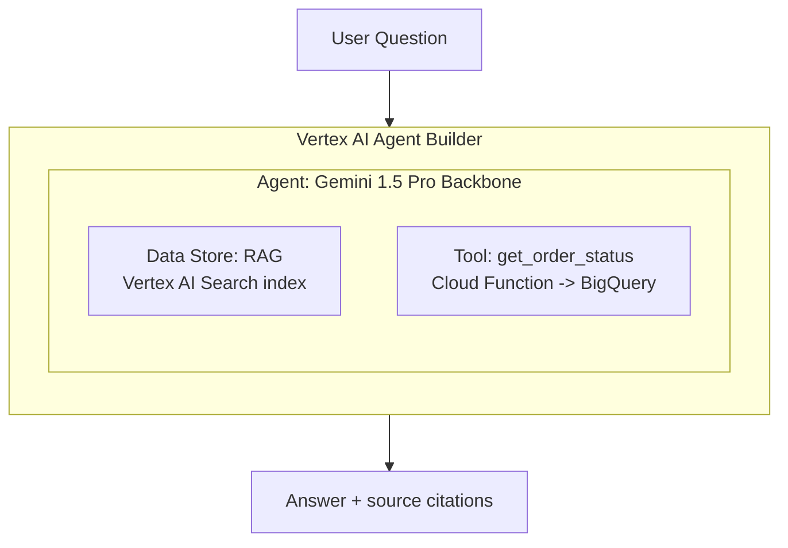

# Tutorial 5.2: Building Agents with Vertex AI Agent Builder

In Tutorial 5.1, Gemini classified tickets using only what was in the prompt. Real agents need access to **your data**: product documentation, order history, customer records. **Vertex AI Agent Builder** (formerly Agent Hub) provides a no-code/low-code interface to create RAG-powered agents that can answer questions over your private documents and call external APIs as tools.

In this tutorial you build a Customer Support Agent that:
1. Searches a GCS-hosted knowledge base (RAG)
2. Calls a BigQuery lookup tool to fetch order status
3. Routes complex cases to a human agent



**Previous tutorial:** [5.1 Foundation Models & Model Garden](./01_foundation_models.md)
**Next tutorial:** [5.3 Agent SDK](./03_agent_sdk.md)

---

## 1. Enable required APIs

```bash
gcloud services enable \
  aiplatform.googleapis.com \
  discoveryengine.googleapis.com \
  cloudfunctions.googleapis.com \
  run.googleapis.com
```

---

## 2. Create a knowledge base Data Store

Upload documents that the agent will use to answer questions (FAQs, product docs, policy PDFs).

```bash
PROJECT_ID=$(gcloud config get-value project)
BUCKET="ml-artifacts-$PROJECT_ID"

# Create sample FAQ document
cat > faq.txt << 'EOF'
# Return Policy
You can return any product within 30 days of purchase for a full refund.
Items must be in their original condition and packaging.
To initiate a return, visit your account page and select "Request Return".

# Shipping Policy
Standard shipping takes 5-7 business days.
Express shipping (2-3 days) is available for an additional $9.99.
Free shipping on orders over $50.

# Subscription Cancellation
You can cancel your subscription at any time from Account Settings > Subscriptions.
Cancellations take effect at the end of the current billing period.
No refunds are issued for partial months.
EOF

gsutil cp faq.txt gs://$BUCKET/knowledge-base/faq.txt
```

### Console — Create Data Store

1. **Vertex AI Agent Builder > Data Stores > Create Data Store**
2. **Data source**: Cloud Storage
3. **GCS path**: `gs://ml-artifacts-PROJECT/knowledge-base/`
4. **Data store name**: `support-knowledge-base`
5. **Location**: `us` (global)
6. Click **Create** — indexing takes 5–10 minutes

---

## 3. Create a tool (Cloud Function for order lookup)

The agent needs a function it can call to look up real data. Deploy a Cloud Function that queries BigQuery:

```bash
PROJECT_ID=$(gcloud config get-value project)

mkdir -p /tmp/order_lookup_fn
cat > /tmp/order_lookup_fn/main.py << 'EOF'
from google.cloud import bigquery
import functions_framework, json

bq = bigquery.Client()

@functions_framework.http
def get_order_status(request):
    order_id = request.get_json().get("order_id", "")
    if not order_id:
        return json.dumps({"error": "order_id is required"}), 400

    query = f"""
        SELECT order_id, status, estimated_delivery, total_amount
        FROM `{PROJECT_ID}.retail_analytics.orders`
        WHERE order_id = @order_id
        LIMIT 1
    """
    job = bq.query(query, job_config=bigquery.QueryJobConfig(
        query_parameters=[bigquery.ScalarQueryParameter("order_id", "STRING", order_id)]
    ))
    rows = list(job.result())
    if not rows:
        return json.dumps({"status": "not_found"})
    row = rows[0]
    return json.dumps({"order_id": row.order_id, "status": row.status,
                       "estimated_delivery": str(row.estimated_delivery),
                       "total_amount": float(row.total_amount)})
EOF

cat > /tmp/order_lookup_fn/requirements.txt << 'EOF'
google-cloud-bigquery
functions-framework
EOF

gcloud functions deploy get-order-status \
  --gen2 \
  --runtime=python311 \
  --region=us-central1 \
  --source=/tmp/order_lookup_fn \
  --entry-point=get_order_status \
  --trigger-http \
  --allow-unauthenticated \
  --project=$PROJECT_ID
```

---

## 4. Create the Agent

### Console

1. **Vertex AI Agent Builder > Agents > Create Agent**
2. **Agent name**: `customer-support-agent`
3. **Model**: `gemini-1.5-pro`
4. **Agent instructions** (paste in the Goal field):

```
You are a friendly and helpful customer support agent for an e-commerce company.

When a customer asks a question:
1. First search the knowledge base for relevant information.
2. If the customer asks about a specific order, use the get_order_status tool.
3. Always cite your sources when answering from the knowledge base.
4. If you cannot answer confidently, politely ask the customer to contact a human agent.

Keep responses concise and professional.
```

5. **Data Stores**: Add `support-knowledge-base`
6. **Tools**: Add OpenAPI tool pointing to the Cloud Function URL

---

## 5. Define the order lookup tool schema

In the Agent Builder UI, add an **OpenAPI tool**:

```yaml
openapi: 3.0.0
info:
  title: Order Status API
  version: 1.0.0
servers:
  - url: https://us-central1-YOUR_PROJECT.cloudfunctions.net
paths:
  /get-order-status:
    post:
      summary: Look up the status of a customer order
      operationId: get_order_status
      requestBody:
        required: true
        content:
          application/json:
            schema:
              type: object
              properties:
                order_id:
                  type: string
                  description: The order ID to look up (e.g. ORD-12345)
              required:
                - order_id
      responses:
        '200':
          description: Order status information
```

---

## 6. Test the agent

### Console

**Vertex AI Agent Builder > Agents** — click the agent and use the **Test Agent** panel on the right:

- "What is your return policy?" → Agent searches knowledge base, cites `faq.txt`
- "What's the status of order ORD-10293?" → Agent calls `get_order_status` tool
- "I need help with something complicated" → Agent suggests contacting human support

### API (for embedding in your app)

```python
import vertexai
from vertexai.preview.generative_models import GenerativeModel, Tool
from vertexai.preview import reasoning_engines

PROJECT_ID = "YOUR_PROJECT_ID"
AGENT_ID   = "YOUR_AGENT_ID"    # from Console > Agent Builder > Agents

# Use the Vertex AI Conversations API to talk to the agent
import requests

session_url = f"https://us-central1-aiplatform.googleapis.com/v1beta1/projects/{PROJECT_ID}/locations/us-central1/reasoningEngines/{AGENT_ID}:query"

headers = {"Authorization": f"Bearer $(gcloud auth print-access-token)"}

response = requests.post(session_url, headers=headers, json={
    "input": {"messages": [{"role": "user", "content": "What is your return policy?"}]}
})
print(response.json())
```

---

## 7. What you built

| Component | Technology |
|-----------|-----------|
| RAG knowledge base | Vertex AI Search (Data Store) |
| Agent backbone | Gemini 1.5 Pro |
| Order lookup tool | Cloud Function → BigQuery |
| Orchestration | Vertex AI Agent Builder |
| Interface | Agent Builder Test Console + REST API |

### RAG vs fine-tuning

| Approach | Best for | Freshness | Cost |
|----------|---------|----------|------|
| RAG (Data Store) | Private documents, frequently updated content | Real-time | Low (no retraining) |
| Fine-tuning | Consistent style/tone, domain-specific tasks | Requires retraining | High (training cost) |
| Prompt engineering | Simple tasks, few examples | Instant | Minimal |

---

## Next steps

- [Tutorial 5.3: Agent SDK](./03_agent_sdk.md) — build a custom agentic loop in Python with function calling
