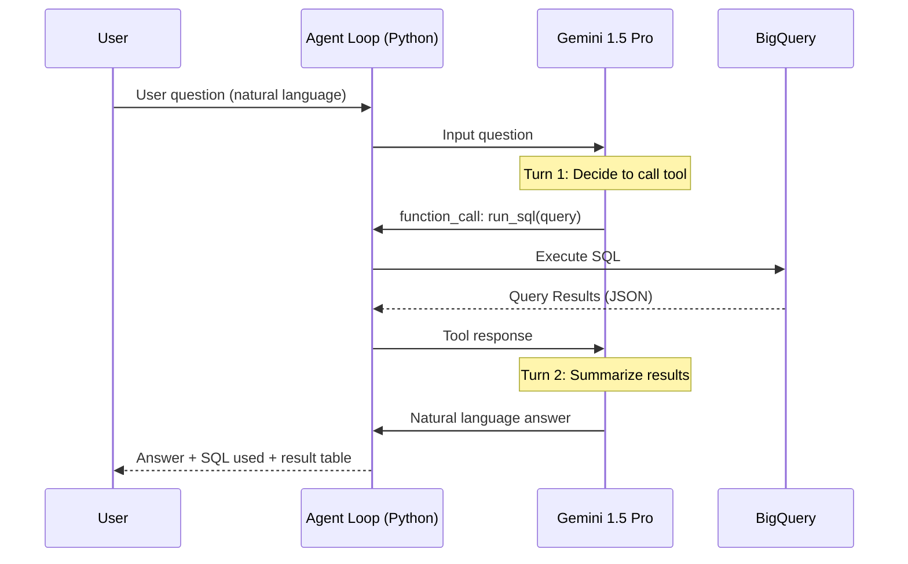

# Tutorial 5.3: Multi-Turn Agents with the Vertex AI SDK

Agent Builder is great for no-code RAG agents, but sometimes you need a fully custom agentic loop: dynamic tool selection, multi-step reasoning, state management between turns, and integration with arbitrary Python code. The **Vertex AI Generative AI SDK** with **function calling** gives you that control.

In this tutorial you build a Data Analytics Agent in Python — it answers natural language questions about the retail dataset by writing and executing BigQuery SQL, then explains the results.



**Previous tutorial:** [5.2 Agent Builder](./02_agent_builder.md)

---

## 1. Install dependencies

```bash
pip install google-cloud-aiplatform google-cloud-bigquery pandas --upgrade
```

---

## 2. Define the tools

Tools are Python functions wrapped with a schema Gemini can understand. The agent can call them during the conversation:

```python
# scripts/agents/analytics_agent.py

import json
from google.cloud import bigquery
from vertexai.generative_models import (
    FunctionDeclaration, GenerativeModel, Part, Tool
)

PROJECT_ID = "YOUR_PROJECT_ID"   # replace
DATASET    = "retail_analytics"

bq_client = bigquery.Client(project=PROJECT_ID)

# ── Tool 1: run a BigQuery SQL query ────────────────────────────────────────

def run_sql(query: str) -> str:
    """Execute a BigQuery SQL query and return results as JSON."""
    try:
        df = bq_client.query(query).to_dataframe()
        return df.head(20).to_json(orient="records")
    except Exception as e:
        return json.dumps({"error": str(e)})

run_sql_declaration = FunctionDeclaration(
    name="run_sql",
    description=(
        "Execute a GoogleSQL query against the retail_analytics BigQuery dataset. "
        "Use this to answer questions about sales, revenue, products, and stores. "
        "Always limit results to 20 rows unless the user asks for more."
    ),
    parameters={
        "type": "object",
        "properties": {
            "query": {
                "type": "string",
                "description": "A valid GoogleSQL query against the retail_analytics dataset."
            }
        },
        "required": ["query"]
    }
)

# ── Tool 2: list available tables ───────────────────────────────────────────

def list_tables() -> str:
    """List all tables in the retail_analytics dataset."""
    tables = list(bq_client.list_tables(f"{PROJECT_ID}.{DATASET}"))
    return json.dumps([t.table_id for t in tables])

list_tables_declaration = FunctionDeclaration(
    name="list_tables",
    description="List all available tables in the retail_analytics BigQuery dataset.",
    parameters={"type": "object", "properties": {}}
)
```

---

## 3. Build the agent loop

```python
import vertexai

vertexai.init(project=PROJECT_ID, location="us-central1")

# Map function names to implementations
TOOL_FUNCTIONS = {
    "run_sql":     run_sql,
    "list_tables": list_tables,
}

analytics_tool = Tool(function_declarations=[
    run_sql_declaration,
    list_tables_declaration,
])

model = GenerativeModel(
    "gemini-1.5-pro",
    tools=[analytics_tool],
    system_instruction=f"""You are a helpful data analytics assistant.
You have access to the '{DATASET}' BigQuery dataset.
When answering questions:
1. First call list_tables() to see what's available (if needed).
2. Write precise GoogleSQL queries using the correct table names.
3. Always explain query results in plain language.
4. If data is insufficient to answer, say so clearly.
Project ID: {PROJECT_ID}. Dataset: {DATASET}."""
)

def run_agent(user_question: str, verbose: bool = True) -> str:
    """Run a single-question agentic loop with Gemini function calling."""
    chat = model.start_chat()
    messages = [user_question]

    while True:
        response = chat.send_message(messages)
        candidate = response.candidates[0]

        # Check if the model wants to call a function
        if candidate.content.parts and candidate.content.parts[0].function_call.name:
            fn_call = candidate.content.parts[0].function_call
            fn_name = fn_call.name
            fn_args = dict(fn_call.args)

            if verbose:
                print(f"\n[Tool call] {fn_name}({fn_args})")

            # Execute the tool
            tool_result = TOOL_FUNCTIONS[fn_name](**fn_args)

            if verbose:
                result_preview = tool_result[:200] + "..." if len(tool_result) > 200 else tool_result
                print(f"[Tool result] {result_preview}")

            # Feed the result back to the model
            messages = [Part.from_function_response(
                name=fn_name,
                response={"content": tool_result}
            )]
        else:
            # Model produced a final text response
            return candidate.content.parts[0].text
```

---

## 4. Run the agent

```python
# Interactive CLI
def main():
    print("Data Analytics Agent (type 'quit' to exit)\n")
    while True:
        question = input("You: ").strip()
        if question.lower() in ("quit", "exit", "q"):
            break
        if not question:
            continue
        print(f"\nAgent: {run_agent(question)}\n")

if __name__ == "__main__":
    main()
```

Run it:

```bash
python3 ai_ml_gcp/scripts/agents/analytics_agent.py
```

Example interaction:

```
You: What were the top 5 products by revenue last month?

[Tool call] run_sql({'query': "SELECT product, SUM(revenue) AS total_revenue ..."})
[Tool result] [{"product": "laptop", "total_revenue": 48200.0}, ...]

Agent: The top 5 products by revenue last month were:
1. Laptop — $48,200
2. Phone — $35,700
3. Tablet — $18,400
4. Monitor — $12,100
5. Keyboard — $5,800

Laptops dominated at 42% of total revenue.
```

---

## 5. Add conversation memory (multi-turn)

The `chat` object maintains history automatically. For persistent sessions, serialize and restore it:

```python
import pickle

# Save session
with open("session.pkl", "wb") as f:
    pickle.dump(chat.history, f)

# Restore session
with open("session.pkl", "rb") as f:
    history = pickle.load(f)

chat = model.start_chat(history=history)
```

---

## 6. Deploy as a Cloud Run service

```bash
PROJECT_ID=$(gcloud config get-value project)

# Create a simple Flask wrapper
cat > main.py << 'EOF'
from flask import Flask, request, jsonify
from analytics_agent import run_agent

app = Flask(__name__)

@app.route("/ask", methods=["POST"])
def ask():
    question = request.json.get("question", "")
    if not question:
        return jsonify({"error": "question required"}), 400
    answer = run_agent(question, verbose=False)
    return jsonify({"answer": answer})

if __name__ == "__main__":
    app.run(host="0.0.0.0", port=8080)
EOF

# Deploy to Cloud Run
gcloud run deploy analytics-agent \
  --source=ai_ml_gcp/scripts/agents/ \
  --region=us-central1 \
  --allow-unauthenticated \
  --set-env-vars=PROJECT_ID=$PROJECT_ID

# Test
SERVICE_URL=$(gcloud run services describe analytics-agent \
  --region=us-central1 --format='value(status.url)')

curl -X POST $SERVICE_URL/ask \
  -H "Content-Type: application/json" \
  -d '{"question": "Which store had the highest revenue this year?"}'
```

---

## 7. What you built

| Component | Technology |
|-----------|-----------|
| LLM backbone | Gemini 1.5 Pro |
| Tool: SQL execution | BigQuery Python client |
| Tool: schema discovery | BigQuery `list_tables` |
| Agentic loop | Vertex AI SDK function calling |
| Deployment | Cloud Run (HTTP service) |

### Agent SDK vs Agent Builder

| | Agent SDK (this tutorial) | Agent Builder (Tutorial 5.2) |
|--|--------------------------|------------------------------|
| Control | Full — custom Python loop | Low-code — console configuration |
| Tool types | Any Python function | OpenAPI tools, Cloud Functions |
| RAG | Manual (call your own search) | Built-in Data Store RAG |
| State management | Custom | Managed sessions |
| Best for | Complex custom workflows | Standard RAG + tool use |

---

## Series complete

You have built the full **Customer Propensity & Support System** on Vertex AI:

| Phase | What you built |
|-------|---------------|
| 1 — Experimentation | Workbench notebook, BQ data pull, local sklearn model |
| 2 — Training | Custom container training, Vizier HP tuning |
| 3 — MLOps | KFP pipeline, Model Registry, drift monitoring |
| 4 — Serving | Online endpoint, batch scoring, CI/CD GitOps |
| 5 — GenAI | Gemini classification, RAG agent, Python agentic loop |
