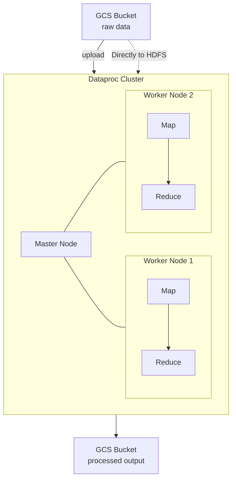

# Tutorial 1.1: Foundations with Dataproc & MapReduce

Before the era of serverless data warehouses, large-scale data processing involved spinning up Hadoop clusters. **Dataproc** is Google Cloud's managed Hadoop/Spark service — it provisions a cluster in ~90 seconds, you submit your job, and tear it down when done.

In this tutorial, you will learn how to:
1.  **Source Data**: Move data from external sources to GCS.
2.  **HDFS vs GCS**: Understand the difference between the legacy Hadoop Distributed File System and modern cloud storage.
3.  **MapReduce**: Execute a parallel processing job using Python & Hadoop Streaming.



---

## 1. Prerequisites (Permissions & API)

Ensure the Dataproc API is enabled and that your default Compute Engine service account has permissions to manage storage buckets.

```bash
# Enable the Dataproc API
gcloud services enable dataproc.googleapis.com

# Get your Project Details
PROJECT_ID=$(gcloud config get-value project)
PROJECT_NUMBER=$(gcloud projects list --filter="project_id:$PROJECT_ID" --format='value(project_number)')

# Ensure permissions (Storage Admin)
gcloud projects add-iam-policy-binding $PROJECT_ID \
    --member="serviceAccount:$PROJECT_NUMBER-compute@developer.gserviceaccount.com" \
    --role="roles/storage.admin"
```

---

## 2. Environment Setup (GCS)

In modern GCP data engineering, we use GCS instead of HDFS for persistence, as GCS is more durable, cheaper, and separates storage from compute.

```bash
BUCKET_NAME="${PROJECT_ID}-data-source"
gsutil mb -l us-central1 gs://$BUCKET_NAME/
```

### Sourcing External Data
Download a classic dataset (Project Gutenberg book) to your cloud shell or local environment, then upload it to your bucket.

```bash
# Download test data
wget https://www.gutenberg.org/cache/epub/20417/pg20417.txt

# Upload to GCS
gsutil cp pg20417.txt gs://$BUCKET_NAME/raw/gutenberg.txt
```

---

## 3. Create the Dataproc Cluster

We will create a cluster with **Component Gateway** enabled to access the HDFS and Spark web interfaces later.

```bash
gcloud dataproc clusters create batch-cluster \
    --region=us-central1 \
    --num-workers=2 \
    --master-machine-type=n1-standard-2 \
    --worker-machine-type=n1-standard-2 \
    --image-version=2.1-debian11 \
    --enable-component-gateway
```

---

## 4. Local File System vs. HDFS vs. GCS

| Feature | Local File System | HDFS | Google Cloud Storage (GCS) |
| :--- | :--- | :--- | :--- |
| **Storage** | Single machine disk | Distributed across cluster nodes | Global multi-tenant storage |
| **Persistence** | Lost if node dies | Lost if cluster is deleted | Persistent and independent of cluster |
| **Access** | `ls /path` | `hdfs dfs -ls /path` | `gsutil ls gs://bucket` |

### Interaction with HDFS
Connect to your master node via SSH to explore the distributed file system:
```bash
gcloud compute ssh batch-cluster-m --zone=us-central1-a
```
Inside the VM, try these commands:
```bash
# List files
hdfs dfs -ls /

# Copy data from GCS to local HDFS (rarely needed, but good for understanding)
gsutil cp gs://$BUCKET_NAME/raw/gutenberg.txt /tmp/gutenberg.txt
hdfs dfs -mkdir -p /user/raw
hdfs dfs -put /tmp/gutenberg.txt /user/raw/
```

---

## 5. MapReduce Explained

MapReduce is the fundamental programming model for Hadoop. It works in three phases:
- **Map**: Filter and sort (e.g., emit word counts).
- **Shuffle & Sort**: Hadoop automatically groups all values with the same key.
- **Reduce**: Aggregate the values (e.g., sum counts per word).

### Simulation (Local Test)
Before submitting a job to the cluster, you can test your mapper and reducer logic using standard Linux pipes:

```bash
# Test using the provided word count script
cat pg20417.txt | python3 scripts/pyspark/word_count.py --mode=mapper | sort -k1,1 | python3 scripts/pyspark/word_count.py --mode=reducer | head -n 5
```

---

## 6. Submit the MapReduce Job

Submit the job to Dataproc using **Hadoop Streaming**. This allows us to use Python scripts as the Mapper and Reducer.

```bash
gcloud dataproc jobs submit hadoop \
  --cluster=batch-cluster \
  --region=us-central1 \
  --jar=file:///usr/lib/hadoop/hadoop-streaming.jar \
  -- \
  -input gs://$BUCKET_NAME/raw/gutenberg.txt \
  -output gs://$BUCKET_NAME/output/wordcount/ \
  -mapper "python3 scripts/pyspark/word_count.py --mode=mapper" \
  -reducer "python3 scripts/pyspark/word_count.py --mode=reducer" \
  -file scripts/pyspark/word_count.py
```

*Note: The `-file` flag ensures your script is distributed to all worker nodes.*

---

## 7. Read the Output

```bash
# View the results stored in GCS
gsutil cat gs://$BUCKET_NAME/output/wordcount/part-00000 | head -n 10
```

---

## 8. Delete the cluster (Cost Control)

Always delete your cluster after the tutorial to avoid incurring costs!

```bash
gcloud dataproc clusters delete batch-cluster --region=us-central1 --quiet
```

---

## 9. Summary Table

| Concept | Hadoop Equivalent | Modern GCP Strategy |
|---------|-------------------|---------------------|
| Storage | HDFS | **GCS** (Decoupled storage) |
| Compute | YARN / MapReduce | **BigQuery** or **Dataflow** |
| Processing | Java MapReduce | **PySpark** or **SQL** |

---

## Next steps

- [Tutorial 1.2: Moving to Spark](./02_spark.md) — replace disk-based MapReduce with in-memory Spark.
