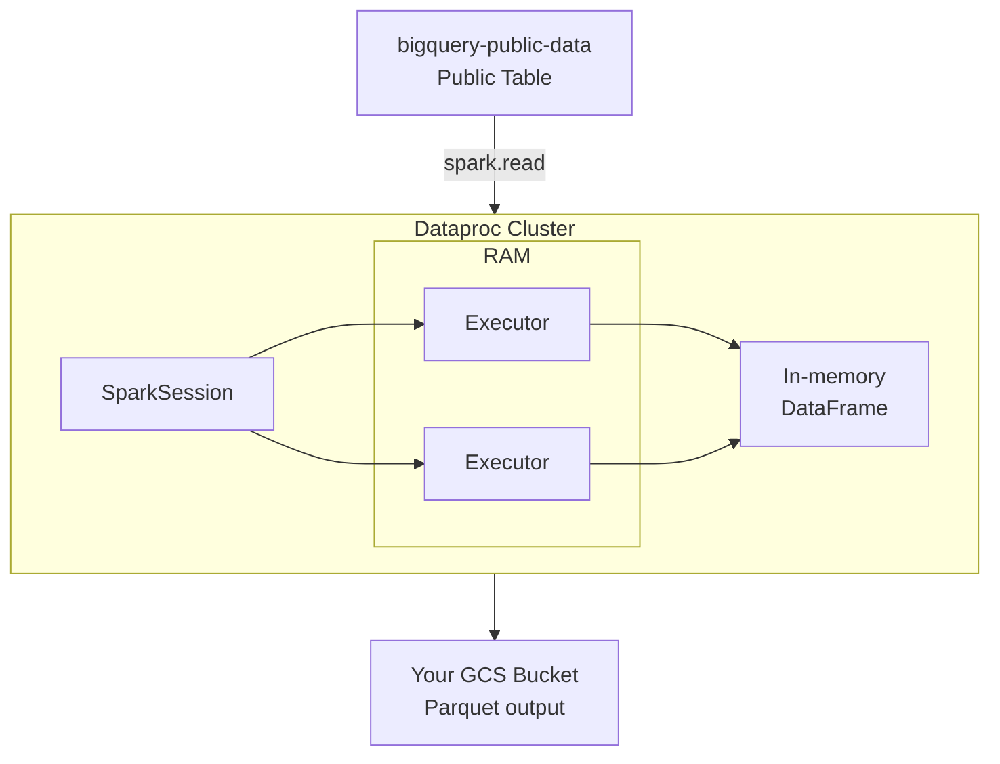

# Tutorial 1.2: Moving to Spark (The Memory Jump)

MapReduce writes intermediate results to disk after every step — on a 10-stage pipeline, your data travels to disk and back 10 times. **Apache Spark** keeps data in memory across stages, making it 10–100× faster for iterative and multi-step workloads.

In this tutorial, you will:
1.  **Access Web UIs**: Use the Component Gateway to access Jupyter.
2.  **Public Data Analysis**: Use Spark to analyze the `austin_bikeshare` public dataset from BigQuery.
3.  **BigQuery Connector**: Learn how Spark interacts natively with BigQuery storage.



---

## 1. Create the Cluster with BigQuery Support

To read from BigQuery, we use the `spark-bigquery-connector`. This is pre-installed on Dataproc, but we need a GCS bucket for temporary data shuffling.

```bash
PROJECT_ID=$(gcloud config get-value project)
BUCKET_NAME="${PROJECT_ID}-spark-temp"
gsutil mb -l us-central1 gs://$BUCKET_NAME/ 2>/dev/null || true

gcloud dataproc clusters create spark-cluster \
  --region=us-central1 \
  --zone=us-central1-a \
  --num-workers=2 \
  --master-machine-type=e2-standard-2 \
  --worker-machine-type=e2-medium \
  --image-version=2.1-debian11 \
  --enable-component-gateway \
  --optional-components=JUPYTER \
  --temp-bucket=$BUCKET_NAME
```

---

## 2. Interactive Analysis in Jupyter

1.  In the GCP Console, go to **Dataproc > Clusters > spark-cluster**.
2.  Click **Web Interfaces > Jupyter**.
3.  Create a new notebook with the **PySpark** kernel.

### Run this to analyze Public Data:
```python
from pyspark.sql import SparkSession

spark = SparkSession.builder \
  .appName("PublicDataAnalysis") \
  .getOrCreate()

# Read from Austin Bikeshare Public Dataset
df = spark.read.format("bigquery") \
  .option("table", "bigquery-public-data.austin_bikeshare.bikeshare_trips") \
  .load()

# Transformation: Count trips per station
station_counts = df.groupBy("start_station_name") \
  .count() \
  .orderBy("count", ascending=False)

station_counts.show(10)
```

---

## 3. Review the PySpark Batch Script

In a real pipeline, you wouldn't use a notebook. You'd submit a script. Check `scripts/pyspark/clean_and_transform.py`. We've updated it to use BigQuery public data.

### Key Logic:
```python
from pyspark.sql import SparkSession, functions as F

spark = SparkSession.builder \
    .appName("TaxiTransform") \
    .getOrCreate()

# Reuse the temp bucket set at cluster creation via --temp-bucket
bucket = spark.conf.get("spark.hadoop.fs.gs.system.bucket")

# Read from public data
df = spark.read.format("bigquery") \
    .option("table", "bigquery-public-data.chicago_taxi_trips.taxi_trips") \
    .load()

# Filter for long trips and standardize payment type
df_filtered = df \
    .filter(F.col("trip_miles") > 5) \
    .filter(F.col("fare") > 0) \
    .withColumn("payment_type", F.lower(F.col("payment_type")))

# Aggregate: avg fare and total tips by payment type
summary = df_filtered.groupBy("payment_type").agg(
    F.round(F.avg("fare"), 2).alias("avg_fare"),
    F.round(F.sum("tips"), 2).alias("total_tips"),
    F.count("*").alias("trip_count")
)

# Write as Parquet to GCS
summary.write.mode("overwrite").parquet(f"gs://{bucket}/processed/taxi_summary/")
```

---

## 4. Submit the PySpark Batch Job

```bash
# Update the script with your bucket name before running
gsutil cp scripts/pyspark/clean_and_transform.py gs://$BUCKET_NAME/scripts/

gcloud dataproc jobs submit pyspark \
  gs://$BUCKET_NAME/scripts/clean_and_transform.py \
  --cluster=spark-cluster \
  --region=us-central1 \
  -- \
  --output=gs://$BUCKET_NAME/processed/taxi_summary/
```

---

## 5. Verify and Load to BigQuery

Once Spark processes the public data, you can load your curated results back into your own BigQuery dataset.

```bash
# Create your own dataset
bq mk --dataset $PROJECT_ID:my_analytics

# Load result from GCS
bq load \
  --source_format=PARQUET \
  my_analytics.taxi_summary \
  "gs://$BUCKET_NAME/processed/taxi_summary/*.parquet"

# Query your processed data
bq query --use_legacy_sql=false \
  "SELECT * FROM my_analytics.taxi_summary ORDER BY total_tips DESC"
```

---

## 6. Summary: Spark vs BigQuery for Public Data

| Task | Use BigQuery SQL | Use Spark on Dataproc |
|---|---|---|
| Simple Aggregations | **Fastest & Cheapest** | Overkill |
| Joining Public Tables | **Best** | More complex setup |
| Complex ML / Logic | Limited (BQML) | **Best** (MLlib, UDFs) |
| Non-SQL transformations | No | **Yes** (Python/Scala/Java) |

---

## Next steps

- [Tutorial 2.1: BigQuery Ingestion](../phase2_warehousing/01_bigquery_ingestion.md) — How to "copy" subsets of public data into your warehouse using SQL alone.
