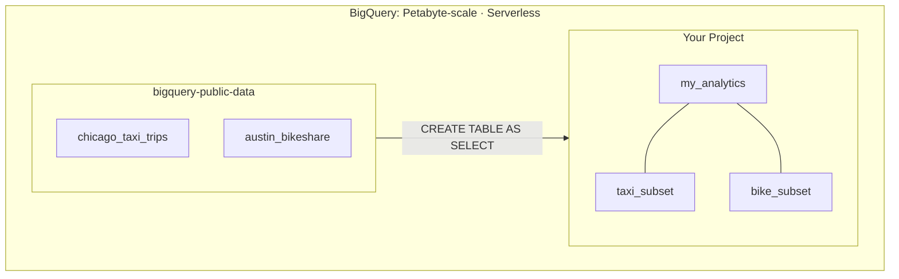

# Tutorial 2.1: BigQuery Ingestion & Public Datasets

Managing a Dataproc cluster — even a short-lived one — adds operational overhead: cluster sizing, version management, and idle costs. **BigQuery** eliminates the cluster entirely. It's a fully serverless data warehouse that scales to petabytes automatically.

In this tutorial, you will:
1.  **Ingest Public Data**: "Copy" a subset of a public dataset into your own project.
2.  **Serverless Analysis**: Query massive datasets without managing any infrastructure.
3.  **Cross-Dataset Joins**: Combine multiple public sources using standard SQL.



---

## 1. Enable the BigQuery API

```bash
gcloud services enable bigquery.googleapis.com
```

---

## 2. Create your own Dataset

BeforeIngesting data, you need a local dataset to hold your tables.

```bash
PROJECT_ID=$(gcloud config get-value project)

bq mk \
  --dataset \
  --location=us-central1 \
  --description="Market research using public data" \
  $PROJECT_ID:my_analytics
```

---

## 3. Ingesting from Public Datasets

Instead of uploading files, you can "ingest" data directly from BigQuery's public library. This is useful for creating a smaller, more cost-effective subset for your own project.

### Create a subset of Chicago Taxi data
We will ingest only trips from 2024 that were paid by credit card.

```sql
-- Run this in the BigQuery Console
CREATE OR REPLACE TABLE `my_analytics.taxi_2024_credit` AS
SELECT
  unique_key,
  trip_start_timestamp,
  trip_miles,
  fare,
  tips,
  tolls
FROM `bigquery-public-data.chicago_taxi_trips.taxi_trips`
WHERE trip_start_timestamp >= '2024-01-01'
  AND payment_type = 'Credit Card'
  AND fare > 0;
```

### Verify your "Ingested" data
```bash
bq show my_analytics.taxi_2024_credit
bq query --use_legacy_sql=false \
  "SELECT COUNT(*) as row_count FROM my_analytics.taxi_2024_credit"
```

---

## 4. Query Public Datasets Directly

You don't always need to copy data. You can query public datasets directly.

### Top 10 pickup areas by revenue (Chicago)
```sql
SELECT
  pickup_community_area,
  COUNT(*) AS total_trips,
  ROUND(AVG(fare), 2) AS avg_fare,
  ROUND(SUM(fare), 0) AS total_revenue
FROM `bigquery-public-data.chicago_taxi_trips.taxi_trips`
WHERE trip_start_timestamp >= '2023-01-01'
  AND fare IS NOT NULL
GROUP BY pickup_community_area
ORDER BY total_revenue DESC
LIMIT 10;
```

---

## 5. Join Two Public Datasets

You can JOIN different datasets (even if they are in different projects) as long as they are in the same region.

```sql
-- Correlating weather with bikeshare trips (Austing)
SELECT
  t.start_station_name,
  w.temp,
  w.prcp,
  COUNT(*) as trip_count
FROM `bigquery-public-data.austin_bikeshare.bikeshare_trips` t
JOIN `bigquery-public-data.noaa_gsod.gsod2023` w
  ON CAST(t.start_time AS DATE) = CAST(FMT_DATE('%Y-%m-%d', w.year, w.mo, w.da) AS DATE)
WHERE w.stn = '722540' -- Austin airport weather station
GROUP BY 1, 2, 3
ORDER BY trip_count DESC
LIMIT 20;
```

---

## 6. Understand Query Costs

BigQuery charges by bytes scanned. Always use **partitioned tables** (covered in Tutorial 2.2) and avoid `SELECT *`.

```bash
# Dry run — check cost before running
bq query \
  --use_legacy_sql=false \
  --dry_run \
  "SELECT unique_key FROM \`bigquery-public-data.chicago_taxi_trips.taxi_trips\` LIMIT 100"
```

---

## 7. Export your subsets to GCS

If you need your data subset in GCS for Spark processing:

```bash
BUCKET_NAME="${PROJECT_ID}-exports"
gsutil mb gs://$BUCKET_NAME/

bq extract \
  --destination_format=PARQUET \
  my_analytics.taxi_2024_credit \
  gs://$BUCKET_NAME/taxi_subset/*.parquet
```

---

## 8. Summary: Personal vs Public Data

| Feature | Public Data Tables | Your Project Tables |
|---|---|---|
| **Owner** | Google / 3rd Party | You |
| **Costs** | You pay for queries | You pay for queries + storage |
| **Modification** | Read-only | Full DML (Insert, Update, Delete) |
| **Optimization** | Fixed | You control Partitioning/Clustering |

---

## Next steps

- [Tutorial 2.2: Partitioning & Clustering](./02_optimization.md) — Learn how to make your ingested public data 90% cheaper to query.
