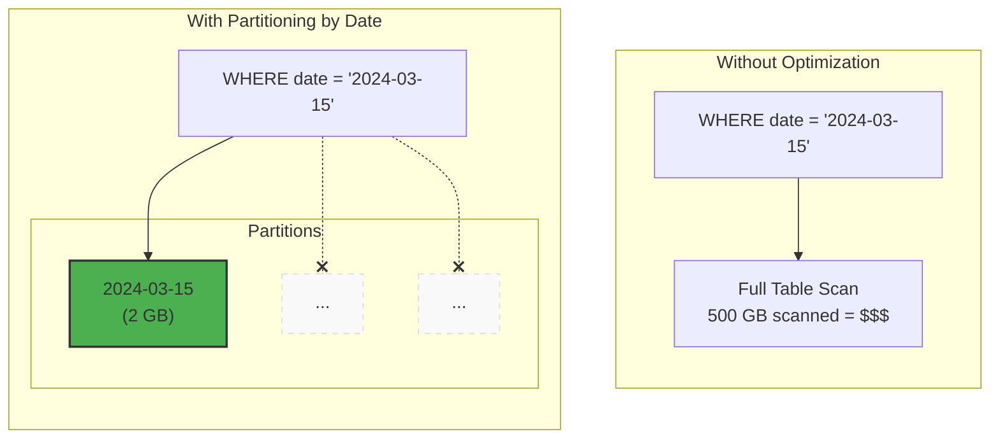

# Tutorial 2.2: Optimization — Partitioning & Clustering

BigQuery charges per bytes scanned. A query against a 500 GB table costs the same whether it returns 1 row or 1 million — unless you use **partitioning** and **clustering** to make BigQuery physically skip the data it doesn't need.



**Previous tutorial:** [2.1 BigQuery Ingestion](./01_bigquery_ingestion.md)
**Next tutorial:** [3.1 Views & Scheduled Queries](../phase3_analytics_ml/01_views_scheduled_queries.md)

---

## 1. Partitioning explained

**Partitioning** divides a table into segments by a column value. BigQuery only reads the partitions that match your `WHERE` clause.

| Partition type | Column type | Example |
|---------------|-------------|---------|
| Time-unit partitioning | DATE, TIMESTAMP, DATETIME | Partition by transaction date |
| Integer-range partitioning | INTEGER | Partition by store_id range |
| Ingestion-time partitioning | (automatic) | Partition by when the row was loaded |

**Rule of thumb:** Partition by the column you filter on most — almost always a date.

---

## 2. Clustering explained

**Clustering** sorts data within each partition by one or more columns. BigQuery skips entire blocks within a partition when the clustering columns don't match your filter.

- Cluster by columns you filter on *after* the partition filter (e.g., `WHERE date = X AND category = Y`)
- Useful for high-cardinality columns (store_id, product_id, user_id)
- Up to 4 clustering columns, ordered by filter selectivity (most selective first)

---

## 3. Create the optimized table from a Public Dataset

The SQL is at [scripts/sql/create_optimized_table.sql](../scripts/sql/create_optimized_table.sql).

```sql
CREATE OR REPLACE TABLE `retail_analytics.optimized_taxi_trips`
PARTITION BY DATE(trip_start_timestamp)
CLUSTER BY pickup_community_area, payment_type
AS
SELECT
  unique_key,
  taxi_id,
  trip_start_timestamp,
  trip_end_timestamp,
  trip_seconds,
  trip_miles,
  pickup_community_area,
  dropoff_community_area,
  fare,
  tips,
  tolls,
  extras,
  trip_total,
  payment_type,
  company
FROM `bigquery-public-data.chicago_taxi_trips.taxi_trips`
WHERE trip_start_timestamp > '2023-01-01';
```

Run it:

```bash
bq query \
  --use_legacy_sql=false \
  --destination_table=retail_analytics.optimized_taxi_trips \
  --replace \
  "$(cat scripts/sql/create_optimized_table.sql)"
```

Or run directly in the BigQuery Console editor.

---

## 4. Compare scan costs: unoptimized vs optimized

### Query on the original (unoptimized) public table

```sql
-- Dry run this first to see bytes scanned
SELECT
  pickup_community_area,
  COUNT(*) AS trips,
  ROUND(AVG(fare), 2) AS avg_fare
FROM `bigquery-public-data.chicago_taxi_trips.taxi_trips`
WHERE
  DATE(trip_start_timestamp) = '2023-06-15'
  AND payment_type = 'Credit Card'
GROUP BY pickup_community_area
ORDER BY trips DESC;
```

### Same query on the optimized (partitioned + clustered) table

```sql
SELECT
  pickup_community_area,
  COUNT(*) AS trips,
  ROUND(AVG(fare), 2) AS avg_fare
FROM `retail_analytics.optimized_taxi_trips`
WHERE
  DATE(trip_start_timestamp) = '2023-06-15'
  AND payment_type = 'Credit Card'
GROUP BY pickup_community_area
ORDER BY trips DESC;
```

Dry-run both and compare:

```bash
# Check bytes scanned for the unoptimized query
bq query --use_legacy_sql=false --dry_run \
  "SELECT pickup_community_area, COUNT(*) FROM \
  \`bigquery-public-data.chicago_taxi_trips.taxi_trips\` \
  WHERE DATE(trip_start_timestamp) = '2023-06-15' \
  GROUP BY 1"

# Check bytes scanned for the optimized query
bq query --use_legacy_sql=false --dry_run \
  "SELECT pickup_community_area, COUNT(*) FROM \
  retail_analytics.optimized_taxi_trips \
  WHERE DATE(trip_start_timestamp) = '2023-06-15' \
  GROUP BY 1"
```

---

## 5. Create your own optimized retail table

Apply the same pattern to your retail data:

```sql
-- Run in BigQuery Console
CREATE OR REPLACE TABLE `retail_analytics.sales_optimized`
PARTITION BY DATE(sale_date)
CLUSTER BY store_id, category
AS
SELECT
  PARSE_DATE('%Y-%m-%d', date) AS sale_date,
  store_id,
  product,
  category,
  quantity,
  unit_price,
  revenue
FROM `retail_analytics.raw_sales`;
```

Now this filter uses partition pruning AND cluster pruning:

```sql
-- This query reads only the March 2024 partition
-- and skips non-electronics blocks within that partition
SELECT
  product,
  SUM(quantity) AS total_units_sold,
  SUM(revenue) AS total_revenue
FROM `retail_analytics.sales_optimized`
WHERE
  sale_date BETWEEN '2024-03-01' AND '2024-03-31'
  AND category = 'electronics'
GROUP BY product
ORDER BY total_revenue DESC;
```

---

## 6. Inspect partition metadata

```bash
# Show partition details for the optimized table
bq query --use_legacy_sql=false \
  "SELECT
     partition_id,
     total_rows,
     total_logical_bytes / POW(1024, 3) AS size_gb
   FROM retail_analytics.INFORMATION_SCHEMA.PARTITIONS
   WHERE table_name = 'optimized_taxi_trips'
   ORDER BY partition_id DESC
   LIMIT 20"
```

---

## 7. Partition expiration (cost control)

Automatically delete old partitions to avoid storing data you no longer need:

```bash
# Set partition expiration to 90 days on a table
bq update \
  --time_partitioning_expiration=7776000 \
  retail_analytics.sales_optimized
```

Or set it at table creation:

```sql
CREATE TABLE retail_analytics.events_partitioned
(
  event_timestamp TIMESTAMP,
  event_type STRING,
  user_id STRING,
  value FLOAT64
)
PARTITION BY DATE(event_timestamp)
OPTIONS(
  partition_expiration_days = 90
);
```

---

## 8. Optimization summary

| Technique | When to use | Expected benefit |
|-----------|-------------|-----------------|
| Partition by date | Time-series data with date filters | 80–99% scan reduction |
| Cluster by filter columns | High-cardinality columns after the date filter | 50–80% further reduction |
| `SELECT` specific columns | Always | Proportional to columns skipped |
| `LIMIT` in exploration | Ad-hoc queries during development | Fast and cheap exploration |
| Materialized Views | Pre-aggregate expensive GROUP BY queries | Zero scan cost at query time |

---

## Next steps

- [Tutorial 3.1: Views, Materialized Views & Scheduled Queries](../phase3_analytics_ml/01_views_scheduled_queries.md) — build a multi-layer data warehouse with SQL abstractions
