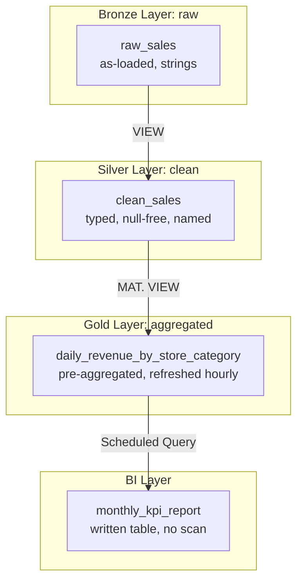

# Tutorial 3.1: Views, Materialized Views & Scheduled Queries

Raw data in BigQuery is messy — wrong types, nulls, inconsistent naming. Analysts shouldn't query raw tables directly. The **Bronze/Silver/Gold** pattern (also called Medallion Architecture) solves this with layered SQL abstractions:



**Previous tutorial:** [2.2 Partitioning & Clustering](../phase2_warehousing/02_optimization.md)
**Next tutorial:** [3.2 BigQuery ML](./02_bigquery_ml.md)

---

## 1. Bronze Layer — ingest raw sales data

To build our multi-layered data warehouse, we first need a dataset to hold our tables, followed by ingesting a raw sales dataset (Bronze layer). We will ingest transaction data from the fictitious e-commerce public dataset `thelook_ecommerce` into our own `retail_analytics` dataset.

### Create the 'retail_analytics' dataset:
Before loading any tables, create the `retail_analytics` dataset using the `bq` command-line tool:

```bash
PROJECT_ID=$(gcloud config get-value project)

bq mk \
  --dataset \
  --location=US \
  --description="Retail Sales Analytics Warehouse" \
  ${PROJECT_ID}:retail_analytics
```

### Load data into the `raw_sales` table:
Run this query in the BigQuery Console or using the `bq` command-line tool. It selects transactional data from March 2024, mapping store IDs and categories to fit our retail warehouse requirements:

```sql
-- Run in the BigQuery Console
CREATE OR REPLACE TABLE `retail_analytics.raw_sales` AS
SELECT
  FORMAT_TIMESTAMP('%Y-%m-%d', o.created_at) AS date,
  CONCAT('store_00', CAST(MOD(p.distribution_center_id, 3) + 1 AS STRING)) AS store_id,
  p.name AS product,
  CASE WHEN p.category = 'Accessories' THEN 'accessories' ELSE 'electronics' END AS category,
  1 AS quantity,
  o.sale_price AS unit_price,
  o.sale_price AS revenue
FROM `bigquery-public-data.thelook_ecommerce.order_items` o
JOIN `bigquery-public-data.thelook_ecommerce.products` p ON o.product_id = p.id
WHERE o.created_at >= '2024-03-01' AND o.created_at < '2024-04-01';
```

View the raw table schema:

```bash
bq show --schema retail_analytics.raw_sales
```

---

## 2. Silver Layer — a cleaning View

A **View** is a saved SQL query. It's virtual — no data is stored, and every query against it re-runs the underlying SQL. Use views for cleaning and standardization.

The SQL is at [scripts/sql/bronze_silver_gold.sql](../scripts/sql/bronze_silver_gold.sql).

```sql
-- Silver: clean and typed view
CREATE OR REPLACE VIEW `retail_analytics.clean_sales` AS
SELECT
  PARSE_DATE('%Y-%m-%d', date)  AS sale_date,
  TRIM(LOWER(store_id))         AS store_id,
  TRIM(LOWER(product))          AS product,
  TRIM(LOWER(category))         AS category,
  SAFE_CAST(quantity AS INT64)  AS quantity,
  SAFE_CAST(unit_price AS FLOAT64) AS unit_price,
  SAFE_CAST(revenue AS FLOAT64)  AS revenue
FROM `retail_analytics.raw_sales`
WHERE
  date IS NOT NULL
  AND quantity IS NOT NULL
  AND revenue IS NOT NULL
  AND SAFE_CAST(revenue AS FLOAT64) > 0
  AND SAFE_CAST(quantity AS INT64) > 0;
```

Run in the BigQuery Console or:

```bash
bq query --use_legacy_sql=false \
  "$(cat scripts/sql/bronze_silver_gold.sql)"
```

Test the view:

```sql
SELECT * FROM retail_analytics.clean_sales LIMIT 10;
```

---

## 3. Gold Layer — a Materialized View

A **Materialized View** is a precomputed query result stored as a real table. BigQuery refreshes it automatically (up to every 5 minutes) when the base table changes. Unlike a regular view, queries against a materialized view read cached data — zero scan cost.

```sql
-- Gold: materialized aggregation
CREATE MATERIALIZED VIEW `retail_analytics.daily_revenue_by_store`
OPTIONS (enable_refresh = true, refresh_interval_minutes = 60)
AS
SELECT
  sale_date,
  store_id,
  category,
  SUM(quantity)   AS total_units,
  SUM(revenue)    AS total_revenue,
  COUNT(*)        AS transaction_count,
  AVG(unit_price) AS avg_unit_price
FROM `retail_analytics.clean_sales`
GROUP BY sale_date, store_id, category;
```

Query it — this reads the precomputed result, not the raw table:

```sql
SELECT
  store_id,
  SUM(total_revenue) AS monthly_revenue
FROM retail_analytics.daily_revenue_by_store
WHERE sale_date BETWEEN '2024-01-01' AND '2024-01-31'
GROUP BY store_id
ORDER BY monthly_revenue DESC;
```

---

## 4. Scheduled Queries — automate the Gold layer update

**Scheduled Queries** run on a cron schedule and write results to a destination table. Use them for daily/weekly KPI reports that downstream tools (Looker, Sheets) read from.

### Console

1. **BigQuery > Scheduled Queries > Create Scheduled Query**
2. Paste the SQL:

```sql
SELECT
  DATE_TRUNC(sale_date, MONTH) AS month,
  store_id,
  SUM(total_revenue)           AS monthly_revenue,
  SUM(total_units)             AS monthly_units
FROM `retail_analytics.daily_revenue_by_store`
GROUP BY month, store_id
ORDER BY month DESC, monthly_revenue DESC
```

3. Set:
   - **Destination table**: `retail_analytics.monthly_kpi_report`
   - **Write preference**: Overwrite table
   - **Schedule**: Every 24 hours (or `every 1 hours`)
4. Click **Save**

### gcloud CLI

```bash
bq query \
  --use_legacy_sql=false \
  --destination_table=retail_analytics.monthly_kpi_report \
  --replace \
  --schedule='every 24 hours' \
  --display_name='Monthly KPI Report' \
  "SELECT
     DATE_TRUNC(sale_date, MONTH) AS month,
     store_id,
     SUM(total_revenue) AS monthly_revenue,
     SUM(total_units) AS monthly_units
   FROM \`retail_analytics.daily_revenue_by_store\`
   GROUP BY month, store_id
   ORDER BY month DESC, monthly_revenue DESC"
```

---

## 5. Query the final KPI table

Once the scheduled query has run at least once:

```bash
bq query --use_legacy_sql=false \
  "SELECT * FROM retail_analytics.monthly_kpi_report ORDER BY month DESC LIMIT 20"
```

---

## 6. List and manage scheduled queries

```bash
# List all scheduled queries in the project
bq ls --transfer_config --transfer_location=US

# Run a scheduled query immediately (for testing)
TRANSFER_CONFIG_NAME=$(bq ls --transfer_config \
  --transfer_location=US \
  --format=json | python3 -c "
import json, sys
configs = json.load(sys.stdin)
print(configs[0]['name'])
")

bq mk --transfer_run \
  --run_time=$(date -u +%Y-%m-%dT%H:%M:%SZ) \
  $TRANSFER_CONFIG_NAME

# Delete the scheduled query
bq rm -f --transfer_config $TRANSFER_CONFIG_NAME
```

### Delete via Google Cloud Console:
1. In the Google Cloud Console, go to **BigQuery** > **Scheduled Queries**.
2. Select the checkbox next to **Monthly KPI Report** (or your scheduled query).
3. Click **Delete** at the top of the page and confirm.

---

## 7. Architecture summary

| Layer | Object type | Data stored? | Refresh | Use for |
|-------|-------------|-------------|---------|---------|
| Bronze | Table | Yes (raw) | On load | Audit, reprocessing |
| Silver | View | No (virtual) | Every query | Cleaning, standardization |
| Gold | Materialized View | Yes (cached) | Auto (~60 min) | Dashboard queries |
| Reports | Scheduled Query → Table | Yes | Cron | KPIs, exports to BI tools |

---

## Next steps

- [Tutorial 3.2: BigQuery ML](./02_bigquery_ml.md) — train a regression model in SQL, no separate ML infrastructure
