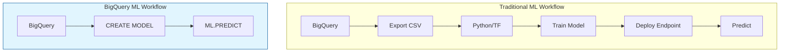

# Tutorial 3.2: BigQuery ML — Machine Learning in SQL

Traditionally, ML requires exporting data to Python, training in TensorFlow or scikit-learn, and hosting a prediction server. **BigQuery ML** collapses this into pure SQL: you `CREATE MODEL` in BigQuery, and predictions run where the data already lives — no data movement, no separate infrastructure.



**Previous tutorial:** [3.1 Views & Scheduled Queries](./01_views_scheduled_queries.md)
**Next tutorial:** [4.1 Streaming with Dataflow](../phase4_realtime_orchestration/01_streaming_dataflow.md)

---

## 1. What BigQuery ML supports

| Model type | SQL keyword | Use case |
|-----------|-------------|---------|
| Linear regression | `linear_reg` | Predict a continuous value (fare, revenue) |
| Logistic regression | `logistic_reg` | Binary classification (churn, fraud) |
| K-means clustering | `kmeans` | Segment customers/stores |
| Matrix factorization | `matrix_factorization` | Recommendations |
| Time series forecasting | `arima_plus` | Forecast future demand |
| Boosted trees | `boosted_tree_regressor` / `classifier` | General-purpose, high accuracy |
| Imported TF/PyTorch model | `tensorflow` | Bring your own model |

---

## 2. Prepare training data

Use the Chicago taxi public dataset — it has millions of rows with known labels (trip duration):

```sql
-- Preview the features we'll use
SELECT
  trip_miles,
  trip_seconds,
  pickup_community_area,
  dropoff_community_area,
  fare,
  payment_type
FROM `bigquery-public-data.chicago_taxi_trips.taxi_trips`
WHERE
  trip_start_timestamp > '2023-01-01'
  AND trip_seconds > 0
  AND trip_miles > 0
  AND fare > 0
LIMIT 20;
```

---

## 3. Create a training dataset (Silver layer)

```sql
CREATE OR REPLACE TABLE `retail_analytics.taxi_training_data` AS
SELECT
  trip_miles,
  trip_seconds AS label,          -- What we want to predict
  IFNULL(pickup_community_area, 0)  AS pickup_area,
  IFNULL(dropoff_community_area, 0) AS dropoff_area,
  fare,
  CASE payment_type
    WHEN 'Credit Card' THEN 1
    WHEN 'Cash'        THEN 2
    ELSE 0
  END AS payment_type_encoded
FROM `bigquery-public-data.chicago_taxi_trips.taxi_trips`
WHERE
  trip_start_timestamp BETWEEN '2023-01-01' AND '2023-12-31'
  AND trip_seconds BETWEEN 60 AND 7200   -- 1 min to 2 hours
  AND trip_miles BETWEEN 0.1 AND 50
  AND fare BETWEEN 2.5 AND 200
```

---

## 4. Train a Linear Regression model

The SQL is at [scripts/sql/bqml_model.sql](../scripts/sql/bqml_model.sql).

```sql
CREATE OR REPLACE MODEL `retail_analytics.trip_duration_model`
OPTIONS (
  model_type = 'linear_reg',
  input_label_cols = ['label'],
  data_split_method = 'auto_split'    -- automatic 80/20 train/test split
) AS
SELECT
  trip_miles,
  pickup_area,
  dropoff_area,
  fare,
  payment_type_encoded,
  label
FROM `retail_analytics.taxi_training_data`;
```

Run in the BigQuery Console. Training takes 1–3 minutes for this dataset.

You can also run via CLI:

```bash
bq query --use_legacy_sql=false \
  "$(cat scripts/sql/bqml_model.sql)"
```

---

## 5. Evaluate the model

```sql
SELECT
  *
FROM ML.EVALUATE(
  MODEL `retail_analytics.trip_duration_model`,
  (
    SELECT
      trip_miles,
      pickup_area,
      dropoff_area,
      fare,
      payment_type_encoded,
      label
    FROM `retail_analytics.taxi_training_data`
  )
);
```

Key metrics for regression:
- **mean_absolute_error**: average prediction error in seconds
- **r2_score**: 0 to 1 — how well the model explains variance (0.7+ is good)
- **mean_squared_error**: penalizes large errors more

---

## 6. Inspect feature weights

```sql
-- See how much each feature contributes to the prediction
SELECT
  processed_input,
  weight
FROM ML.WEIGHTS(MODEL `retail_analytics.trip_duration_model`)
ORDER BY ABS(weight) DESC;
```

---

## 7. Generate predictions

```sql
-- Predict trip duration for new (hypothetical) trips
SELECT
  trip_miles,
  fare,
  predicted_label AS predicted_duration_seconds,
  ROUND(predicted_label / 60, 1) AS predicted_duration_minutes
FROM ML.PREDICT(
  MODEL `retail_analytics.trip_duration_model`,
  (
    SELECT 2.5 AS trip_miles, 1 AS pickup_area, 8 AS dropoff_area,
           12.50 AS fare, 1 AS payment_type_encoded
    UNION ALL
    SELECT 8.0, 6, 22, 28.00, 2
    UNION ALL
    SELECT 0.8, 32, 32, 5.50, 1
  )
);
```

---

## 8. Train a time-series forecast (ARIMA+)

Forecast future daily revenue using your retail data:

```sql
CREATE OR REPLACE MODEL `retail_analytics.revenue_forecast`
OPTIONS (
  model_type = 'arima_plus',
  time_series_timestamp_col = 'sale_date',
  time_series_data_col = 'daily_revenue',
  auto_arima = TRUE,
  data_frequency = 'DAILY',
  decompose_time_series = TRUE
) AS
SELECT
  sale_date,
  SUM(total_revenue) AS daily_revenue
FROM `retail_analytics.daily_revenue_by_store`
GROUP BY sale_date
ORDER BY sale_date;
```

Generate a 30-day forecast:

```sql
SELECT
  forecast_timestamp,
  ROUND(forecast_value, 2) AS predicted_revenue,
  ROUND(prediction_interval_lower_bound, 2) AS lower_bound,
  ROUND(prediction_interval_upper_bound, 2) AS upper_bound
FROM ML.FORECAST(
  MODEL `retail_analytics.revenue_forecast`,
  STRUCT(30 AS horizon, 0.9 AS confidence_level)
)
ORDER BY forecast_timestamp;
```

---

## 9. Export the model (optional)

Export the trained model to GCS for use outside BigQuery:

```bash
PROJECT_ID=$(gcloud config get-value project)
BUCKET_NAME=retail-data-$PROJECT_ID

bq extract \
  --destination_format=ML_TF_SAVED_MODEL \
  retail_analytics.trip_duration_model \
  gs://$BUCKET_NAME/models/trip_duration/
```

The exported TensorFlow SavedModel can be deployed to Vertex AI or used in Python.

---

## 10. BigQuery ML vs traditional ML

| | BigQuery ML | Traditional (Vertex AI / custom) |
|--|-------------|--------------------------------|
| Setup | Zero (SQL only) | Environment, dependencies, GPU quota |
| Data movement | None (train where data lives) | Export to CSV or TF Records |
| Supported models | ~15 types | Unlimited (custom code) |
| Max training data | Tens of billions of rows | Depends on hardware |
| Best for | Quick experimentation, SQL-familiar teams | Custom architectures, deep learning |
| Serving | `ML.PREDICT` in SQL | REST endpoint (Vertex AI) |

---

## Next steps

- [Tutorial 4.1: Streaming with Pub/Sub & Dataflow](../phase4_realtime_orchestration/01_streaming_dataflow.md) — move from batch to real-time event processing
