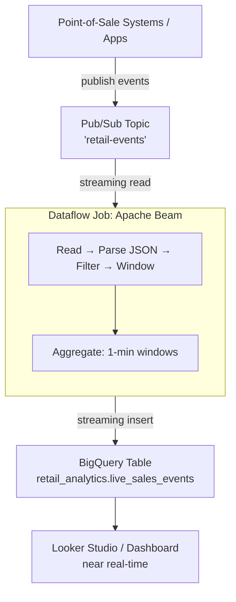

# Tutorial 4.1: Streaming with Pub/Sub & Dataflow

Every pipeline so far has been **batch** — you collect data, then process it on a schedule. But what if you need to act on events *as they happen*? A retail system might need to detect fraud in real time, update inventory immediately, or show live dashboards.

**Pub/Sub** ingests the event stream. **Dataflow** processes it continuously and writes to BigQuery with sub-minute latency.



**Previous tutorial:** [3.2 BigQuery ML](../phase3_analytics_ml/02_bigquery_ml.md)
**Next tutorial:** [4.2 Orchestration with Cloud Composer](./02_composer_airflow.md)

---

## 1. Enable APIs

```bash
gcloud services enable \
  dataflow.googleapis.com \
  pubsub.googleapis.com
```

---

## 2. Create the Pub/Sub Topic and Subscription

### Console

1. **Pub/Sub > Topics > Create Topic**
   - **Topic ID**: `retail-events`
2. **Pub/Sub > Subscriptions > Create Subscription** (optional — Dataflow creates its own)

### gcloud CLI

```bash
gcloud pubsub topics create retail-events

# Create a pull subscription for testing
gcloud pubsub subscriptions create retail-events-sub \
  --topic=retail-events \
  --ack-deadline=60
```

---

## 3. Create the BigQuery target table

The Dataflow job writes to this table. Schema must exist before the job starts:

```bash
bq query --use_legacy_sql=false "
CREATE TABLE IF NOT EXISTS \`retail_analytics.live_sales_events\`
(
  event_timestamp  TIMESTAMP,
  store_id         STRING,
  product          STRING,
  category         STRING,
  quantity         INT64,
  revenue          FLOAT64,
  ingested_at      TIMESTAMP
)
PARTITION BY DATE(event_timestamp)
CLUSTER BY store_id, category
OPTIONS (
  partition_expiration_days = 30
)
"
```

---

## 4. Deploy the Dataflow streaming job

Use the **Pub/Sub to BigQuery** managed template — no code needed:

### Console

1. **Dataflow > Jobs > Create Job from Template**
2. **Job name**: `stream-retail-events`
3. **Template**: `Pub/Sub Topic to BigQuery`
4. **Required parameters**:
   - Input Pub/Sub topic: `projects/PROJECT_ID/topics/retail-events`
   - BigQuery output table: `PROJECT_ID:retail_analytics.live_sales_events`
5. Click **Run Job**

### gcloud CLI

```bash
PROJECT_ID=$(gcloud config get-value project)
BUCKET_NAME=retail-data-$PROJECT_ID

gcloud dataflow jobs run stream-retail-events \
  --region=us-central1 \
  --gcs-location=gs://dataflow-templates/latest/PubSub_to_BigQuery \
  --parameters=\
"inputTopic=projects/$PROJECT_ID/topics/retail-events,\
outputTableSpec=$PROJECT_ID:retail_analytics.live_sales_events,\
outputDeadletterTable=$PROJECT_ID:retail_analytics.live_sales_events_errors" \
  --staging-location=gs://$BUCKET_NAME/dataflow-staging/ \
  --temp-location=gs://$BUCKET_NAME/dataflow-temp/
```

---

## 5. Publish test events

Simulate point-of-sale events being published to the topic:

```bash
PROJECT_ID=$(gcloud config get-value project)

# Publish a batch of test sale events
for i in {1..10}; do
  STORE="store_00$(( (RANDOM % 3) + 1 ))"
  PRODUCTS=("laptop" "phone" "tablet" "monitor" "keyboard")
  CATEGORIES=("electronics" "electronics" "electronics" "electronics" "accessories")
  IDX=$(( RANDOM % 5 ))
  PRODUCT=${PRODUCTS[$IDX]}
  CATEGORY=${CATEGORIES[$IDX]}
  QTY=$(( (RANDOM % 5) + 1 ))
  PRICE=$(( (RANDOM % 500) + 100 ))
  REVENUE=$(( QTY * PRICE ))

  MESSAGE=$(cat << EOF
{
  "event_timestamp": "$(date -u +%Y-%m-%dT%H:%M:%SZ)",
  "store_id": "$STORE",
  "product": "$PRODUCT",
  "category": "$CATEGORY",
  "quantity": $QTY,
  "revenue": $REVENUE.00,
  "ingested_at": "$(date -u +%Y-%m-%dT%H:%M:%SZ)"
}
EOF
)

  gcloud pubsub topics publish retail-events \
    --message="$MESSAGE"

  echo "Published event $i: $STORE / $PRODUCT / qty=$QTY / revenue=$REVENUE"
  sleep 1
done
```

---

## 6. Monitor the Dataflow job

### Console

**Dataflow > Jobs > stream-retail-events** — the job graph shows:
- Elements processed per second
- Throughput per step
- Lag between publish time and processing time

### gcloud CLI

```bash
# List running jobs
gcloud dataflow jobs list --region=us-central1 --status=active

# View job details
JOB_ID=$(gcloud dataflow jobs list \
  --region=us-central1 \
  --status=active \
  --format='get(id)' \
  --limit=1)

gcloud dataflow jobs describe $JOB_ID --region=us-central1
```

---

## 7. Query the live data in BigQuery

After ~30–60 seconds, events appear in BigQuery:

```sql
-- Latest events
SELECT *
FROM retail_analytics.live_sales_events
ORDER BY event_timestamp DESC
LIMIT 20;

-- Real-time revenue by store (last 5 minutes)
SELECT
  store_id,
  SUM(revenue) AS revenue_last_5_min,
  COUNT(*) AS transaction_count
FROM retail_analytics.live_sales_events
WHERE event_timestamp >= TIMESTAMP_SUB(CURRENT_TIMESTAMP(), INTERVAL 5 MINUTE)
GROUP BY store_id
ORDER BY revenue_last_5_min DESC;
```

---

## 8. Custom Dataflow pipeline with Apache Beam (optional)

The managed template handles simple pass-through. For transformations (field enrichment, deduplication, windowed aggregations), write a **Beam pipeline** in Python:

```python
# See scripts/dataflow/streaming_pipeline.py for the full example
import apache_beam as beam
from apache_beam.options.pipeline_options import PipelineOptions
from apache_beam.transforms.window import FixedWindows

def parse_event(message):
    import json
    return json.loads(message.decode('utf-8'))

def run():
    options = PipelineOptions(
        runner='DataflowRunner',
        project='YOUR_PROJECT',
        region='us-central1',
        streaming=True,
        temp_location='gs://BUCKET/temp/'
    )

    with beam.Pipeline(options=options) as p:
        events = (
            p
            | 'ReadFromPubSub' >> beam.io.ReadFromPubSub(
                topic='projects/PROJECT/topics/retail-events')
            | 'ParseJSON' >> beam.Map(parse_event)
            | 'Window' >> beam.WindowInto(FixedWindows(60))  # 1-minute windows
            | 'WriteToBigQuery' >> beam.io.WriteToBigQuery(
                'PROJECT:retail_analytics.live_sales_events',
                write_disposition=beam.io.BigQueryDisposition.WRITE_APPEND)
        )
```

---

## 9. Cancel the Dataflow job (cost control)

Streaming Dataflow jobs run continuously and incur ongoing costs:

```bash
JOB_ID=$(gcloud dataflow jobs list \
  --region=us-central1 \
  --status=active \
  --format='get(id)' \
  --limit=1)

gcloud dataflow jobs cancel $JOB_ID --region=us-central1
```

---

## 10. Batch vs Streaming

| | Batch (Dataproc/BigQuery Load) | Streaming (Pub/Sub + Dataflow) |
|--|-------------------------------|-------------------------------|
| Latency | Minutes to hours | Seconds |
| Cost | Low (run on schedule) | Higher (continuous compute) |
| Throughput | Very high (petabytes/run) | High (millions/sec sustained) |
| Complexity | Low (run and stop) | Higher (state, windows, retries) |
| Use cases | Nightly ETL, historical analysis | Fraud detection, live dashboards, alerting |

---

## Next steps

- [Tutorial 4.2: Orchestration with Cloud Composer](./02_composer_airflow.md) — tie all pipeline stages together with a managed Apache Airflow DAG
