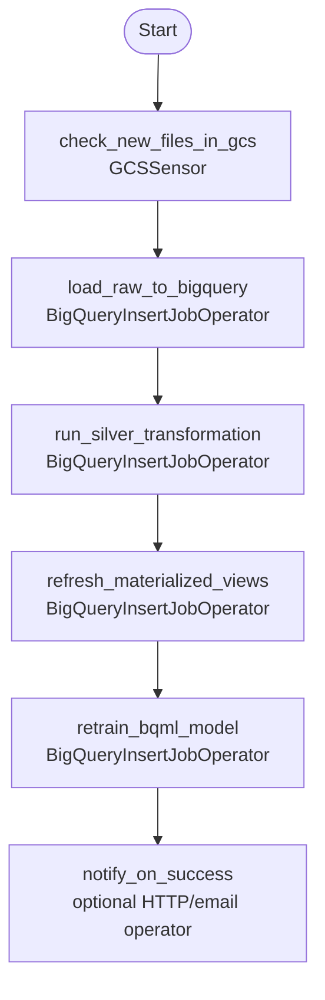
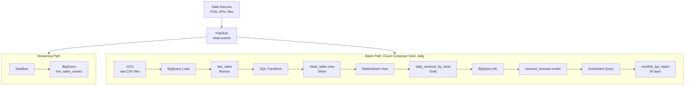

# Tutorial 4.2: Orchestration with Cloud Composer (Airflow)

You now have four pipeline components — Dataproc batch jobs, BigQuery loads, SQL transformations, and ML retraining. Running them manually in the right order, handling failures, and retrying is unsustainable. **Apache Airflow** is the industry standard for orchestrating data pipelines.

**Cloud Composer** is fully managed Airflow on GCP. You write Python **DAGs** (Directed Acyclic Graphs) and upload them to a GCS bucket. Composer schedules and monitors execution automatically.



**Previous tutorial:** [4.1 Streaming with Dataflow](./01_streaming_dataflow.md)

---

## 1. Enable APIs and Configure IAM Permissions

Enable the Cloud Composer and Cloud Storage APIs:

```bash
gcloud services enable \
  composer.googleapis.com \
  storage.googleapis.com
```

### Grant Required IAM Roles

Cloud Composer 2 requires the environment's service account to have the `Composer Worker` role. Additionally, the Cloud Composer Service Agent requires specific permissions to manage GKE clusters on your behalf.

Run the following commands to retrieve your project's default Compute Engine service account and configure these permissions:

```bash
PROJECT_ID=$(gcloud config get-value project)
PROJECT_NUMBER=$(gcloud projects describe $PROJECT_ID --format="value(projectNumber)")
COMPUTE_SA="${PROJECT_NUMBER}-compute@developer.gserviceaccount.com"

# 1. Grant Composer Worker role to the Compute Engine default SA
gcloud projects add-iam-policy-binding $PROJECT_ID \
  --member="serviceAccount:${COMPUTE_SA}" \
  --role="roles/composer.worker"

# 2. Grant Composer API Service Agent Extension role to Composer Service Agent
gcloud projects add-iam-policy-binding $PROJECT_ID \
  --member="serviceAccount:service-${PROJECT_NUMBER}@cloudcomposer-accounts.iam.gserviceaccount.com" \
  --role="roles/composer.ServiceAgentV2Ext"

# 3. Grant Service Account User role to Composer Service Agent on the Compute Engine default SA
gcloud iam service-accounts add-iam-policy-binding ${COMPUTE_SA} \
  --member="serviceAccount:service-${PROJECT_NUMBER}@cloudcomposer-accounts.iam.gserviceaccount.com" \
  --role="roles/iam.serviceAccountUser"
```

---

## 2. Create a Cloud Composer Environment

**This takes 20–30 minutes.** It provisions a GKE cluster running Airflow, a GCS bucket for DAGs, and a Cloud SQL instance for the Airflow metadata database.

### Console

1. **Composer > Create Environment**
2. **Environment name**: `retail-pipeline-env`
3. **Location**: `us-central1`
4. **Image version**: `composer-2-airflow-2` (latest)
5. **Node count**: 3 (minimum)
6. **Service Account**: Select your default Compute Engine service account (ensure it has the `Composer Worker` role)
7. Click **Create**

### gcloud CLI

```bash
PROJECT_ID=$(gcloud config get-value project)
PROJECT_NUMBER=$(gcloud projects describe $PROJECT_ID --format="value(projectNumber)")
COMPUTE_SA="${PROJECT_NUMBER}-compute@developer.gserviceaccount.com"

gcloud composer environments create retail-pipeline-env \
  --location=us-central1 \
  --image-version=composer-2-airflow-2 \
  --service-account="${COMPUTE_SA}"
```


Monitor creation:

```bash
gcloud composer environments describe retail-pipeline-env \
  --location=us-central1 \
  --format='get(state)'
```

---

## 3. Get the DAGs bucket

Every file in the environment's GCS `dags/` folder is automatically picked up by Airflow:

```bash
# Get the GCS bucket name for this Composer environment
DAGS_BUCKET=$(gcloud composer environments describe retail-pipeline-env \
  --location=us-central1 \
  --format='get(config.dagGcsPrefix)')

echo "DAGs bucket: $DAGS_BUCKET"
```

---

## 4. Review the DAG

The DAG is at [scripts/dags/retail_pipeline_dag.py](../scripts/dags/retail_pipeline_dag.py).

Key structure:

```python
from datetime import datetime, timedelta

from airflow import DAG
from airflow.providers.google.cloud.operators.bigquery import BigQueryInsertJobOperator
from airflow.providers.google.cloud.sensors.gcs import GCSObjectExistenceSensor

PROJECT_ID = "YOUR_PROJECT_ID"   # replace with your GCP project ID
DATASET    = "retail_analytics"
TAXI_DATASET = "my_analytics"
BUCKET     = f"retail-data-{PROJECT_ID}"

default_args = {
    "owner":            "data-team",
    "depends_on_past":  False,
    "retries":          2,
    "retry_delay":      timedelta(minutes=5),
    "email_on_failure": False,
    "email_on_retry":   False,
}

with DAG(
    dag_id          = "retail_daily_pipeline",
    default_args    = default_args,
    description     = "Daily retail sales ETL: GCS → BigQuery → ML retraining",
    schedule_interval = "0 6 * * *",    # daily at 06:00 UTC
    start_date      = datetime(2024, 1, 1),
    catchup         = False,
    max_active_runs = 1,
    tags            = ["retail", "daily", "bigquery"],
) as dag:

    # Step 1: Wait for today's sales file to land in GCS
    check_new_file = GCSObjectExistenceSensor(
        task_id      = "check_new_files",
        bucket       = BUCKET,
        object       = "raw/daily_sales_{{ ds }}.csv",
        timeout      = 3600,          # wait up to 1 hour
        poke_interval = 60,           # check every 60 seconds
        mode         = "reschedule",  # release worker slot while waiting
    )

    # Step 2: Load raw CSV into BigQuery (Bronze table)
    load_raw = BigQueryInsertJobOperator(
        task_id = "load_raw_to_bigquery",
        configuration = {
            "load": {
                "sourceUris": [f"gs://{BUCKET}/raw/daily_sales_{{{{ ds }}}}.csv"],
                "destinationTable": {
                    "projectId": PROJECT_ID,
                    "datasetId": DATASET,
                    "tableId":   "raw_sales",
                },
                "sourceFormat":     "CSV",
                "writeDisposition": "WRITE_APPEND",
                "skipLeadingRows":  1,
                "autodetect":       True,
            }
        },
    )

    # Step 3: Silver layer transformation — insert cleaned rows
    run_silver = BigQueryInsertJobOperator(
        task_id = "run_silver_transformation",
        configuration = {
            "query": {
                "query": f"""
                    -- Re-create the Silver view to pick up schema changes
                    CREATE OR REPLACE VIEW `{PROJECT_ID}.{DATASET}.clean_sales` AS
                    SELECT
                        PARSE_DATE('%Y-%m-%d', date)  AS sale_date,
                        TRIM(LOWER(store_id))         AS store_id,
                        TRIM(LOWER(product))          AS product,
                        TRIM(LOWER(category))         AS category,
                        SAFE_CAST(quantity  AS INT64)      AS quantity,
                        SAFE_CAST(unit_price AS FLOAT64)   AS unit_price,
                        SAFE_CAST(revenue   AS FLOAT64)    AS revenue
                    FROM `{PROJECT_ID}.{DATASET}.raw_sales`
                    WHERE date IS NOT NULL
                      AND SAFE_CAST(quantity AS INT64) > 0
                      AND SAFE_CAST(revenue AS FLOAT64) > 0
                """,
                "useLegacySql": False,
            }
        },
    )

    # Step 4: Refresh Gold layer — rebuild daily aggregation table
    refresh_gold = BigQueryInsertJobOperator(
        task_id = "refresh_gold_summary",
        configuration = {
            "query": {
                "query": f"""
                    CREATE OR REPLACE TABLE `{PROJECT_ID}.{DATASET}.monthly_kpi_report`
                    PARTITION BY month
                    AS
                    SELECT
                        DATE_TRUNC(sale_date, MONTH)  AS month,
                        store_id,
                        category,
                        SUM(revenue)                  AS monthly_revenue,
                        SUM(quantity)                 AS monthly_units,
                        COUNT(*)                      AS transactions
                    FROM `{PROJECT_ID}.{DATASET}.clean_sales`
                    GROUP BY month, store_id, category
                    ORDER BY month DESC, monthly_revenue DESC
                """,
                "useLegacySql": False,
            }
        },
    )

    # Step 5: Retrain the BigQuery ML model on fresh data
    retrain_model = BigQueryInsertJobOperator(
        task_id = "retrain_bqml_model",
        configuration = {
            "query": {
                "query": f"""
                    CREATE OR REPLACE MODEL `{PROJECT_ID}.{TAXI_DATASET}.trip_duration_model`
                    OPTIONS (
                        model_type        = 'linear_reg',
                        input_label_cols  = ['label'],
                        data_split_method = 'auto_split'
                    ) AS
                    SELECT
                        CAST(trip_miles AS FLOAT64)                      AS trip_miles,
                        IFNULL(CAST(pickup_community_area  AS INT64), 0) AS pickup_area,
                        IFNULL(CAST(dropoff_community_area AS INT64), 0) AS dropoff_area,
                        CAST(fare AS FLOAT64)                            AS fare,
                        CASE payment_type WHEN 'Credit Card' THEN 1
                                          WHEN 'Cash'        THEN 2
                                          ELSE 0 END                     AS payment_type_encoded,
                        CAST(trip_seconds AS INT64)                      AS label
                    FROM `bigquery-public-data.chicago_taxi_trips.taxi_trips`
                    WHERE trip_start_timestamp > TIMESTAMP_SUB(
                               CURRENT_TIMESTAMP(), INTERVAL 365 DAY)
                      AND trip_seconds BETWEEN 60 AND 7200
                      AND trip_miles   BETWEEN 0.1 AND 50
                      AND fare         BETWEEN 2.5 AND 200
                """,
                "useLegacySql": False,
            }
        },
    )

    # Define execution order
    check_new_file >> load_raw >> run_silver >> refresh_gold >> retrain_model
```

---

## 5. Upload the DAG to Composer

```bash
PROJECT_ID=$(gcloud config get-value project)

# Replace placeholder in the DAG
sed "s/YOUR_PROJECT_ID/$PROJECT_ID/g" \
  scripts/dags/retail_pipeline_dag.py > /tmp/retail_pipeline_dag.py

# Upload to the DAGs bucket
gsutil cp /tmp/retail_pipeline_dag.py $DAGS_BUCKET/retail_pipeline_dag.py
```

Airflow picks up the file within ~30 seconds. No restart required.

---

## 6. Open the Airflow UI

```bash
# Get the Airflow web UI URL
gcloud composer environments describe retail-pipeline-env \
  --location=us-central1 \
  --format='get(config.airflowUri)'
```

1. Navigate to the URL in your browser
2. **DAGs > retail_daily_pipeline** — you should see the DAG graph
3. Toggle the DAG **On** (it's paused by default)

---

## 7. Trigger a manual run

```bash
# Trigger the DAG from the CLI
gcloud composer environments run retail-pipeline-env \
  --location=us-central1 \
  dags trigger \
  -- retail_daily_pipeline
```

Or click **Trigger DAG** in the Airflow UI.

---

## 8. Monitor execution

### Console (Airflow UI)

- **DAGs > retail_daily_pipeline > Graph View** — real-time status of each task (green = success, red = failed, yellow = running)
- **DAGs > retail_daily_pipeline > Grid View** — historical runs at a glance

### gcloud CLI

```bash
# List recent DAG runs
gcloud composer environments run retail-pipeline-env \
  --location=us-central1 \
  dags list-runs \
  -- -d retail_daily_pipeline

# View task logs
gcloud composer environments run retail-pipeline-env \
  --location=us-central1 \
  tasks log \
  -- retail_daily_pipeline load_raw_to_bigquery $(date +%Y-%m-%dT%H:%M:%S)
```

---

## 9. Add an SLA and alerting

```python
# Add to the DAG definition:
from airflow.models import SlaMiss

def sla_miss_callback(dag, task_list, blocking_task_list, slas, blocking_tis):
    print(f"SLA missed for tasks: {task_list}")
    # Send to Slack, PagerDuty, etc.

with DAG(
    dag_id='retail_daily_pipeline',
    sla_miss_callback=sla_miss_callback,
    ...
) as dag:
    load_raw = BigQueryInsertJobOperator(
        ...,
        sla=timedelta(hours=2),   # alert if task takes > 2 hours
    )
```

---

## 10. Delete the Composer environment (cost control)

Composer environments cost ~$300+/month even when idle. Delete when done with the tutorial:

```bash
gcloud composer environments delete retail-pipeline-env \
  --location=us-central1 \
  --quiet
```

---

## 11. Complete pipeline architecture



---

## Congratulations

You have completed the full data engineering roadmap:

| Phase | What you built |
|-------|---------------|
| 1.1 | Dataproc cluster + Hadoop MapReduce job |
| 1.2 | PySpark ETL writing Parquet to GCS |
| 2.1 | BigQuery dataset + Public Dataset queries |
| 2.2 | Partitioned + clustered tables (90%+ cost reduction) |
| 3.1 | Bronze/Silver/Gold with Views, Materialized Views, Scheduled Queries |
| 3.2 | BigQuery ML: linear regression + ARIMA time-series forecast |
| 4.1 | Streaming pipeline: Pub/Sub → Dataflow → BigQuery |
| 4.2 | Cloud Composer DAG orchestrating the full batch pipeline |

The platform evolved from a cluster-based batch job requiring hours to spin up, to a fully serverless, real-time analytics platform capable of processing millions of events per second and training ML models at the scale of the data itself.
