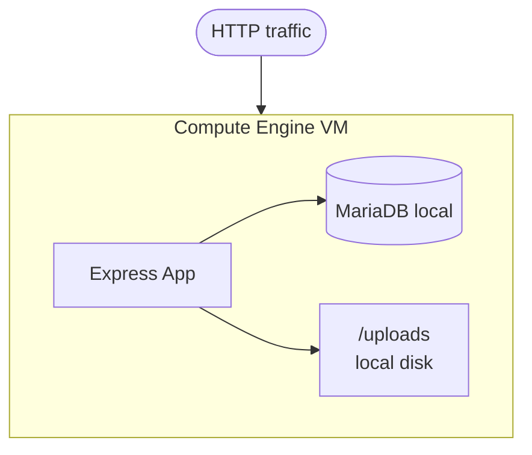

# Tutorial 1.1: The Single Server Setup

In this tutorial you deploy the first version of the **Image Processing & Storage App** on a single Compute Engine VM. The web server, application logic, and database all run on the same machine — the classic monolith.



**App version:** `v1`
**Next tutorial:** [1.2 Decoupling the Database](./02_decoupling_database.md)

---

## 1. Create the Compute Engine VM

### Console

> **API**: If prompted, enable the **Compute Engine API**.

1. **Compute Engine > VM Instances > Create Instance**
2. Set **Name**: `monolith-server`
3. **Region / Zone**: `us-central1` / `us-central1-a`
4. **Machine type**: `e2-micro` (free tier eligible)
5. **Boot disk**: Debian 12 (Bookworm), 20 GB standard persistent disk
6. Under **Firewall**, check **Allow HTTP traffic**
7. Click **Create**

### gcloud CLI

```bash
gcloud compute instances create monolith-server \
  --zone=us-central1-a \
  --machine-type=e2-micro \
  --image-family=debian-12 \
  --image-project=debian-cloud \
  --boot-disk-size=20GB \
  --tags=http-server \
  --metadata=startup-script='#! /bin/bash
    apt-get update'
```

---

## 2. SSH into the VM

### Console

Click **SSH** next to the VM in the VM Instances list.

### gcloud CLI

```bash
gcloud compute ssh monolith-server --zone=us-central1-a
```

All subsequent commands in this tutorial are run **inside the VM**.

---

## 3. Install Node.js 18

```bash
curl -fsSL https://deb.nodesource.com/setup_18.x | sudo -E bash -
sudo apt-get install -y nodejs
node --version   # should print v18.x.x
```

---

## 4. Install and secure MariaDB

```bash
sudo apt-get install -y mariadb-server
sudo systemctl enable mariadb
sudo systemctl start mariadb
sudo mysql_secure_installation
```

When prompted:
- Set root password: **yes**
- Remove anonymous users: **yes**
- Disallow root login remotely: **yes**
- Remove test database: **yes**
- Reload privilege tables: **yes**

---

## 5. Create the database and user

```bash
sudo mysql -u root -p
```

```sql
CREATE DATABASE IF NOT EXISTS app_db;
CREATE USER IF NOT EXISTS 'app_user'@'localhost' IDENTIFIED BY 'password';
GRANT ALL PRIVILEGES ON app_db.* TO 'app_user'@'localhost';
FLUSH PRIVILEGES;

USE app_db;

CREATE TABLE images (
  id            INT AUTO_INCREMENT PRIMARY KEY,
  filename      VARCHAR(255)  NOT NULL,
  original_name VARCHAR(255)  NOT NULL,
  url           VARCHAR(500)  NOT NULL,
  size          INT           NOT NULL,
  mime_type     VARCHAR(100),
  created_at    TIMESTAMP DEFAULT CURRENT_TIMESTAMP
);

EXIT;
```

---

## 6. Deploy the Node.js app

```bash
# Install git and clone the repo
sudo apt-get install -y git
git clone https://github.com/ulises-jimenez07/cc-gcp.git
cd cc-gcp/app/v1

# Install dependencies
npm install

# Set environment variables (edit values as needed)
export DB_HOST=localhost
export DB_USER=app_user
export DB_PASS=password
export DB_NAME=app_db
export PORT=3000
```

### Keep the app running with pm2

```bash
sudo npm install -g pm2

pm2 start app.js --name image-app
pm2 startup systemd    # follow the printed instructions to persist across reboots
pm2 save
```

---

## 7. Expose port 3000 via a firewall rule

By default, only port 80 is open. The app listens on 3000, so either open the port or redirect traffic:

### Option A — Open port 3000 (good for dev)

#### Console

1. **VPC Network > Firewall > Create Firewall Rule**
2. **Name**: `allow-app-3000`
3. **Direction of traffic**: Ingress
4. **Targets**: Specified target tags → `http-server`
5. **Source filter**: IPv4 ranges → `0.0.0.0/0`
6. **Protocols and ports**: Specified protocols and ports → TCP → `3000`
7. Click **Create**

#### gcloud CLI

```bash
gcloud compute firewall-rules create allow-app-3000 \
  --allow=tcp:3000 \
  --target-tags=http-server \
  --description="Allow Node.js app traffic on port 3000"
```

### Option B — Redirect port 80 → 3000 with iptables (no firewall rule needed)

```bash
sudo iptables -t nat -A PREROUTING -p tcp --dport 80 -j REDIRECT --to-port 3000
```

---

## 8. Test the API

Get the VM's external IP:

```bash
gcloud compute instances describe monolith-server \
  --zone=us-central1-a \
  --format='get(networkInterfaces[0].accessConfigs[0].natIP)'
```

```bash
EXTERNAL_IP=<YOUR_VM_IP>

# Health check
curl http://$EXTERNAL_IP:3000/health

# Upload an image
curl -X POST http://$EXTERNAL_IP:3000/upload \
  -F "image=@/path/to/local/photo.jpg"

# List uploaded images
curl http://$EXTERNAL_IP:3000/images
```

Expected response for `/health`:

```json
{ "status": "ok", "version": "v1" }
```

---

## 9. What you built

| Component | Technology | Location |
|-----------|-----------|----------|
| Web server | Express.js | Same VM |
| Database | MariaDB | Same VM |
| File storage | Local disk (`/uploads`) | Same VM |

### Limitations of this architecture

- **Single point of failure**: if the VM goes down, everything goes down.
- **No horizontal scaling**: you cannot add more servers without moving the database and storage.
- **Disk storage is ephemeral**: images live on the VM's disk and are lost if the disk is deleted.

These are exactly the problems we solve in the next tutorials.

---

## Next steps

- [Tutorial 1.2: Decoupling the Database](./02_decoupling_database.md) — move the DB to Cloud SQL
