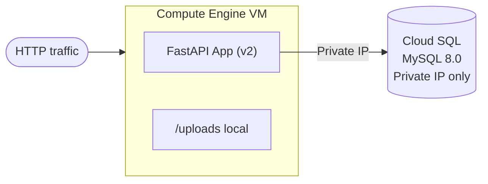

# Tutorial 1.2: Decoupling the Database

The monolith stores both the application and the database on the same VM. This means a single failure takes everything down, and you can't scale the two tiers independently.

In this tutorial you migrate the database to **Cloud SQL (MySQL)** and connect to it over a **Private IP** — no public internet exposure, no Cloud SQL Auth Proxy needed.



**App version:** `v2`
**Previous tutorial:** [1.1 Single Server Setup](./01_single_server_setup.md)
**Next tutorial:** [1.3 Horizontal Scaling](./03_horizontal_scaling.md)

---

## 1. Enable Private Service Access (prerequisite for Private IP)

Cloud SQL instances with Private IP live inside **Google's managed services VPC**, not your own VPC. To route traffic between the two without leaving Google's network, you need **VPC Network Peering** — this is what Private Service Access sets up.

The process has two parts:

1. **Allocate an IP range** — reserve a block of private IP addresses in your VPC that Google can use for its managed services (Cloud SQL, Memorystore, etc.). This range must not overlap with any existing subnets.
2. **Create the peering connection** — establish the VPC peering between your `default` network and `servicenetworking.googleapis.com`, using the range you just allocated.

Both steps are required. You only need to do this once per VPC; all future Cloud SQL Private IP instances in the same VPC reuse this peering.

### Console

> **API**: If prompted, enable the **Cloud SQL Admin API** and **Service Networking API**.

**Step 1 — Allocate an IP range:**

1. **VPC Network > Private Service Access**
2. Click **Allocate IP Range**
   - Name: `google-managed-services-default`
   - IP range: **Custom** — enter a prefix length of **16** (this allocates a `/16` block, e.g. `10.100.0.0/16`)
3. Click **Create**

**Step 2 — Create the peering connection:**

4. Click **Create Connection**
5. Select the range you just created (`google-managed-services-default`)
6. Click **Connect**

### gcloud CLI

```bash
# Step 1: Allocate a /16 range in the default VPC for Google-managed services
gcloud compute addresses create google-managed-services-default \
  --global \
  --purpose=VPC_PEERING \
  --prefix-length=16 \
  --network=default

# Step 2: Create the VPC peering connection to Google's service networking
gcloud services vpc-peerings connect \
  --service=servicenetworking.googleapis.com \
  --ranges=google-managed-services-default \
  --network=default
```

---

## 2. Create the Cloud SQL instance (Private IP only)

### Console

1. **SQL > Create Instance > Choose MySQL**
2. **Instance ID**: `app-db-instance`
3. **Password** (root): set a strong password
4. **Database version**: MySQL 8.0
5. **Region**: `us-central1`
6. **Machine type**: Shared core, 1 vCPU, 3.75 GB (or `db-f1-micro` for dev)
7. Under **Connections**:
   - Uncheck **Public IP**
   - Check **Private IP**, select the `default` network
8. Click **Create Instance** (takes ~5 minutes)

### gcloud CLI

```bash
gcloud sql instances create app-db-instance \
  --database-version=MYSQL_8_0 \
  --tier=db-f1-micro \
  --region=us-central1 \
  --no-assign-ip \
  --network=default
```

---

## 3. Create the database and application user

### Console

1. **SQL > app-db-instance > Databases > Create Database**
   - Name: `app_db`
2. **SQL > app-db-instance > Users > Add User Account**
   - Username: `app_user`
   - Password: `StrongPassword123!`
   - Host: `%` (allow from any private IP)

### gcloud CLI

```bash
gcloud sql databases create app_db --instance=app-db-instance

gcloud sql users create app_user \
  --instance=app-db-instance \
  --password='StrongPassword123!'
```

---

## 4. Create the schema

Get the Private IP of the Cloud SQL instance:

```bash
gcloud sql instances describe app-db-instance \
  --format='get(ipAddresses[0].ipAddress)'
```

SSH into your VM and connect to Cloud SQL:

```bash
gcloud compute ssh monolith-server --zone=us-central1-a
```

```bash
# Install mysql client if not already present
sudo apt-get install -y default-mysql-client

CLOUD_SQL_IP=<PRIVATE_IP_FROM_ABOVE>
mysql -h $CLOUD_SQL_IP -u app_user -p
```

```sql
USE app_db;

CREATE TABLE IF NOT EXISTS images (
  id            INT AUTO_INCREMENT PRIMARY KEY,
  filename      VARCHAR(255)  NOT NULL,
  original_name VARCHAR(255)  NOT NULL,
  url           VARCHAR(500)  NOT NULL,
  size          INT           NOT NULL,
  mime_type     VARCHAR(100),
  created_at    TIMESTAMP DEFAULT CURRENT_TIMESTAMP
);

EXIT;
```

*Note: you can also run this via Cloud SQL Studio in the Console under **SQL > app-db-instance > Cloud SQL Studio**.*

---

## 5. Update the app configuration

On the VM, update the systemd service to point to Cloud SQL and switch to v2:

```bash
# Switch to v2
cd ~/cc-gcp/web_app_gcp/app/v2
python3.11 -m venv venv
source venv/bin/activate
pip install -r requirements.txt
```

Update the systemd service file with the new working directory and Cloud SQL IP:

```bash
sudo tee /etc/systemd/system/image-app.service > /dev/null <<EOF
[Unit]
Description=Image App (FastAPI)
After=network.target

[Service]
User=$USER
WorkingDirectory=/home/$USER/cc-gcp/web_app_gcp/app/v2
Environment=DB_HOST=<CLOUD_SQL_PRIVATE_IP>
Environment=DB_USER=app_user
Environment=DB_PASS=StrongPassword123!
Environment=DB_NAME=app_db
Environment=PORT=3000
ExecStart=/home/$USER/cc-gcp/web_app_gcp/app/v2/venv/bin/uvicorn \
  --host 0.0.0.0 --port 3000 app:app
Restart=always

[Install]
WantedBy=multi-user.target
EOF

sudo systemctl daemon-reload
sudo systemctl restart image-app
sudo systemctl status image-app
```

---

## 6. Verify the connection

```bash
EXTERNAL_IP=<YOUR_VM_IP>

curl http://$EXTERNAL_IP:3000/health
```

Expected response:

```json
{ "status": "ok", "version": "v2", "db": "cloud-sql" }
```

---

## 7. (Optional) Migrate existing data

If you had images uploaded in v1, export from local MariaDB and import to Cloud SQL:

```bash
# On the VM: dump from local MariaDB
mysqldump -u app_user -p app_db images > images_backup.sql

# Import into Cloud SQL
mysql -h $CLOUD_SQL_IP -u app_user -p app_db < images_backup.sql
```

---

## 8. What changed

| | v1 (monolith) | v2 (decoupled DB) |
|--|--|--|
| Database | Local MariaDB on VM | Cloud SQL MySQL (managed) |
| DB connection | `localhost` | Private IP in VPC |
| DB backups | Manual | Automatic (Cloud SQL) |
| DB scaling | None | Vertical (change tier) |
| Images | Local disk `/uploads` | Still local disk (fixed in v3) |

The database is now a **managed, independently scalable service**. You can resize it, take point-in-time backups, and run read replicas without touching the app VM.

---

## Next steps

- [Tutorial 1.3: Horizontal Scaling](./03_horizontal_scaling.md) — replace the single VM with a MIG and load balancer
