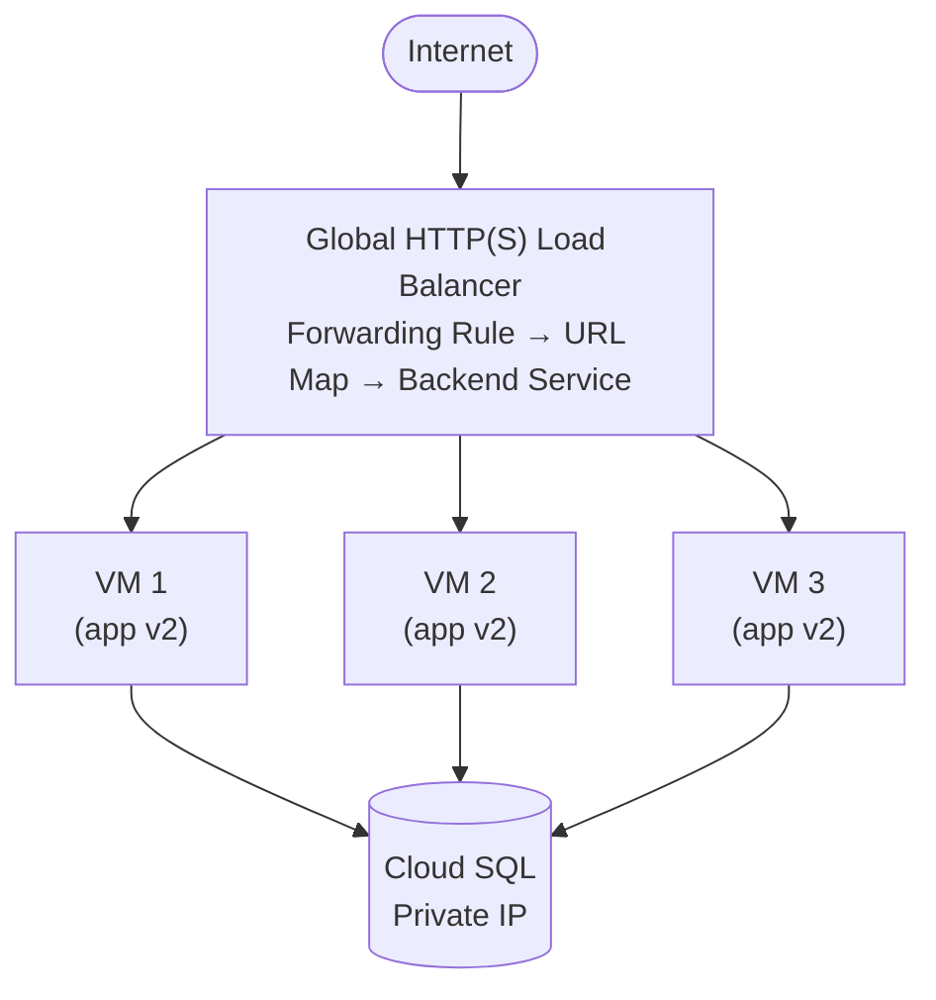

# Tutorial 1.3: Horizontal Scaling (MIGs & Load Balancing)

A single VM cannot handle unlimited traffic. In this tutorial you replace the monolith VM with a **Managed Instance Group (MIG)** — a fleet of identical VMs that scales automatically — and place a **Global HTTP Load Balancer** in front of it.



**App version:** `v2` (running on each VM in the MIG)
**Previous tutorial:** [1.2 Decoupling the Database](./02_decoupling_database.md)
**Next tutorial:** [2.1 Caching with Memorystore](../phase2_performance/01_caching_memorystore.md)

---

## 1. Prepare the VM for imaging

Before creating an image, make sure the app starts automatically on boot and the configuration is correct.

SSH into `monolith-server`:

```bash
gcloud compute ssh monolith-server --zone=us-central1-a
```

Create a systemd service so the app starts on boot (more reliable than pm2 for machine images):

```bash
sudo tee /etc/systemd/system/image-app.service > /dev/null << 'EOF'
[Unit]
Description=Image App Node.js Service
After=network.target

[Service]
Type=simple
User=www-data
WorkingDirectory=/home/<YOUR_USER>/cc-gcp/app/v2
ExecStart=/usr/bin/node app.js
Restart=on-failure
Environment=PORT=3000
Environment=DB_HOST=<CLOUD_SQL_PRIVATE_IP>
Environment=DB_USER=app_user
Environment=DB_PASS=StrongPassword123!
Environment=DB_NAME=app_db

[Install]
WantedBy=multi-user.target
EOF

sudo systemctl daemon-reload
sudo systemctl enable image-app
sudo systemctl start image-app
sudo systemctl status image-app
```

---

## 2. Create a Custom Machine Image

### Console

1. **Compute Engine > Images > Create Image**
   - **Name**: `app-v2-image`
   - **Source**: Disk
   - **Source disk**: `monolith-server` (the boot disk)
2. Click **Create**

### gcloud CLI

```bash
# Stop the VM first so the image is consistent
gcloud compute instances stop monolith-server --zone=us-central1-a

gcloud compute images create app-v2-image \
  --source-disk=monolith-server \
  --source-disk-zone=us-central1-a

# Restart the VM after imaging
gcloud compute instances start monolith-server --zone=us-central1-a
```

---

## 3. Create an Instance Template

The template defines what every VM in the MIG looks like.

### Console

1. **Compute Engine > Instance Templates > Create Instance Template**
   - **Name**: `app-template-v2`
   - **Machine type**: `e2-small`
   - **Boot disk**: Click "Change", select **Custom images**, choose `app-v2-image`
   - **Firewall**: Allow HTTP traffic
2. Click **Create**

### gcloud CLI

```bash
gcloud compute instance-templates create app-template-v2 \
  --machine-type=e2-small \
  --image=app-v2-image \
  --image-project=$(gcloud config get-value project) \
  --tags=http-server
```

---

## 4. Create the Managed Instance Group (MIG)

### Console

1. **Compute Engine > Instance Groups > Create Instance Group**
   - **Type**: Managed instance group (stateless)
   - **Name**: `app-mig`
   - **Instance template**: `app-template-v2`
   - **Location**: Single zone → `us-central1-a`
   - **Autoscaling**: On, Min: 1, Max: 5
   - **Autoscaling signal**: CPU utilization at 60%
2. Click **Create**

### gcloud CLI

```bash
gcloud compute instance-groups managed create app-mig \
  --template=app-template-v2 \
  --size=2 \
  --zone=us-central1-a

# Enable autoscaling
gcloud compute instance-groups managed set-autoscaling app-mig \
  --zone=us-central1-a \
  --min-num-replicas=1 \
  --max-num-replicas=5 \
  --target-cpu-utilization=0.6 \
  --cool-down-period=60
```

---

## 5. Create an HTTP Load Balancer

The load balancer is built from several components. Follow these steps in order.

### 5a. Create a Named Port on the MIG

```bash
gcloud compute instance-groups managed set-named-ports app-mig \
  --named-ports=http:3000 \
  --zone=us-central1-a
```

### 5b. Create a Health Check

```bash
gcloud compute health-checks create http app-health-check \
  --port=3000 \
  --request-path=/health \
  --check-interval=10s \
  --healthy-threshold=2 \
  --unhealthy-threshold=3
```

### 5c. Create a Backend Service

```bash
gcloud compute backend-services create app-backend \
  --protocol=HTTP \
  --port-name=http \
  --health-checks=app-health-check \
  --global

gcloud compute backend-services add-backend app-backend \
  --instance-group=app-mig \
  --instance-group-zone=us-central1-a \
  --global
```

### 5d. Create a URL Map

```bash
gcloud compute url-maps create app-url-map \
  --default-service=app-backend
```

### 5e. Create an HTTP Proxy and Forwarding Rule

```bash
gcloud compute target-http-proxies create app-http-proxy \
  --url-map=app-url-map

gcloud compute forwarding-rules create app-forwarding-rule \
  --address-type=EXTERNAL \
  --global \
  --target-http-proxy=app-http-proxy \
  --ports=80
```

### Console shortcut (all in one flow)

1. **Network Services > Load Balancing > Create Load Balancer**
2. Select **HTTP(S) Load Balancing**, then **From Internet to my VMs or serverless services**
3. **Backend configuration**: Create a backend service → add the `app-mig` MIG → attach `app-health-check`
4. **Frontend configuration**: Protocol HTTP, Port 80, Ephemeral IP
5. Click **Create**

---

## 6. Test the Load Balancer

```bash
# Get the load balancer's IP (may take 1-2 minutes to provision)
LB_IP=$(gcloud compute forwarding-rules describe app-forwarding-rule \
  --global \
  --format='get(IPAddress)')

echo "Load Balancer IP: $LB_IP"

curl http://$LB_IP/health
```

Expected response:

```json
{ "status": "ok", "version": "v2", "db": "cloud-sql" }
```

---

## 7. Test autoscaling

Generate load to trigger scale-out:

```bash
# Install stress tool on any VM (or use Apache Bench from your machine)
sudo apt-get install -y apache2-utils

ab -n 10000 -c 100 http://$LB_IP/images
```

Monitor the MIG in the Console:
**Compute Engine > Instance Groups > app-mig > Monitoring**

You should see CPU utilization rise and new instances spin up automatically.

---

## 8. What you built

| Component | Before | After |
|-----------|--------|-------|
| Web tier | 1 VM | MIG (1–5 VMs, autoscaling) |
| Traffic distribution | N/A | Global HTTP Load Balancer |
| Fault tolerance | None | LB routes around failed VMs |
| Capacity | Fixed | Elastic |

### Remaining limitations

- Images are still stored on local disk — each VM has its own copies. If a new VM spins up, it won't have the images uploaded to another VM.

This is solved in [Tutorial 2.2 (CDN + GCS)](../phase2_performance/02_cdn.md).

---

## Next steps

- [Tutorial 2.1: Caching with Memorystore](../phase2_performance/01_caching_memorystore.md) — reduce DB load with Redis
