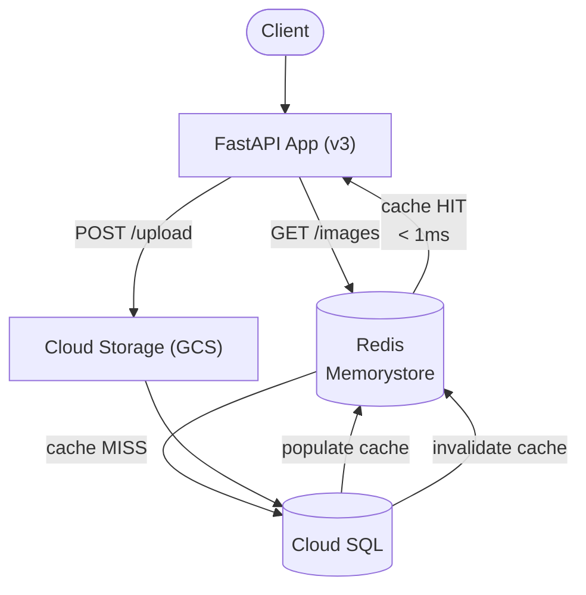

# Tutorial 2.1: Caching for Speed (Memorystore Redis)

As traffic grows, the same database queries run over and over — "list all images" is called on every page load. Without a cache, every request hits Cloud SQL, adding latency and increasing DB load.

In this tutorial you provision a **Memorystore (Redis)** instance and implement the **Cache-Aside** pattern in the app: check Redis first, fall back to Cloud SQL on a miss, then populate the cache for next time.



**App version:** `v3`
**Previous tutorial:** [1.3 Horizontal Scaling](../phase1_monolith/03_horizontal_scaling.md)
**Next tutorial:** [2.2 CDN with Cloud Storage](./02_cdn.md)

---

## 1. The Cache-Aside Pattern

Cache-Aside (also called *lazy loading*) is the most common caching strategy:

1. **On read:** check the cache. If found (HIT), return it. If not (MISS), query the DB, write the result to cache, return it.
2. **On write/delete:** update the DB and **invalidate** (delete) the corresponding cache key.

This ensures the cache is never stale for long and is only populated with data that is actually being requested.

*Note: the TTL (time-to-live) you set on cache entries acts as a safety net — even if an invalidation is missed, the cache will expire on its own.*

---

## 2. Create a Memorystore Redis Instance

The Redis instance must be on the same VPC as your MIG VMs so it's reachable via Private IP.

### Console

> **API**: If prompted, enable the **Memorystore for Redis API**.

1. **Memorystore > Redis > Create Instance**
   - **Instance ID**: `metadata-cache`
   - **Tier**: Basic (for dev/small workloads)
   - **Capacity**: 1 GB
   - **Region**: `us-central1`
   - **Zone**: `us-central1-a`
   - **Connect mode**: Private Service Access (same VPC as your VMs)
2. Click **Create** (takes ~2 minutes)

### gcloud CLI

```bash
gcloud redis instances create metadata-cache \
  --size=1 \
  --region=us-central1 \
  --zone=us-central1-a \
  --redis-version=redis_7_0 \
  --connect-mode=PRIVATE_SERVICE_ACCESS \
  --network=default
```

---

## 3. Get the Redis Private IP

### Console

**Memorystore > Redis > metadata-cache** — note the **Primary endpoint** (e.g., `10.68.1.5:6379`).

### gcloud CLI

```bash
gcloud redis instances describe metadata-cache \
  --region=us-central1 \
  --format='get(host)'
```

---

## 4. Deploy v3 to the MIG

### 4a. Prepare v3 on `monolith-server`

SSH in, install v3 dependencies, and update the systemd service with both `REDIS_HOST` and `GCS_BUCKET`:

```bash
gcloud compute ssh monolith-server --zone=us-central1-a
```

```bash
CLOUD_SQL_IP=$(gcloud sql instances describe app-db-instance --format='get(ipAddresses[0].ipAddress)')
REDIS_HOST=$(gcloud redis instances describe metadata-cache --region=us-central1 --format='get(host)')
BUCKET_NAME=my-app-images-$(gcloud config get-value project)

cd ~/cc-gcp/web_app_gcp/app/v3
python3.11 -m venv venv
source venv/bin/activate
pip install -r requirements.txt

sudo tee /etc/systemd/system/image-app.service > /dev/null <<EOF
[Unit]
Description=Image App (FastAPI v3)
After=network.target

[Service]
Type=simple
User=$USER
WorkingDirectory=/home/$USER/cc-gcp/web_app_gcp/app/v3
ExecStart=/home/$USER/cc-gcp/web_app_gcp/app/v3/venv/bin/uvicorn \
  --host 0.0.0.0 --port 3000 app:app
Restart=on-failure
Environment=PORT=3000
Environment=DB_HOST=$CLOUD_SQL_IP
Environment=DB_USER=app_user
Environment=DB_PASS=StrongPassword123!
Environment=DB_NAME=app_db
Environment=GCS_BUCKET=$BUCKET_NAME
Environment=REDIS_HOST=$REDIS_HOST

[Install]
WantedBy=multi-user.target
EOF

sudo systemctl daemon-reload
sudo systemctl enable image-app   # auto-start on boot — required before imaging
sudo systemctl restart image-app
```

Verify the service is healthy before imaging:

```bash
curl localhost:3000/health
# { "status": "ok", "version": "v3", "db": "cloud-sql", "cache": "memorystore", "storage": "gcs" }
exit
```

### 4b. Create the v3 machine image

```bash
# Stop the VM for a consistent snapshot
gcloud compute instances stop monolith-server --zone=us-central1-a

gcloud compute images create app-v3-image \
  --source-disk=monolith-server \
  --source-disk-zone=us-central1-a

# Restart the original VM
gcloud compute instances start monolith-server --zone=us-central1-a
```

### 4c. Create instance template v3

```bash
gcloud compute instance-templates create app-template-v3 \
  --machine-type=e2-small \
  --image=app-v3-image \
  --image-project=$(gcloud config get-value project) \
  --tags=http-server \
  --scopes=cloud-platform
```

### 4d. MIG update strategies

Before rolling out, understand your options:

| Strategy | Command | Downtime | When to use |
|---|---|---|---|
| **Rolling update** | `rolling-action start-update` | None | Default for production — replaces instances one batch at a time |
| **Canary deployment** | `start-update --canary-version` | None | Validate the new version on a small slice of traffic before full rollout |
| **Restart** | `rolling-action restart` | None | Same image, restart processes — for config-only changes |
| **Replace** | `rolling-action replace` | Brief | Force-delete and immediately recreate all instances |

**Rolling update** is the safest default. Two parameters control the pace:

- `--max-surge=N` — extra instances to create *above* the current size during the update (default: 1). Higher = faster rollout, more cost.
- `--max-unavailable=N` — instances that may be down simultaneously (default: 1). Set to `0` for strict zero-downtime.

**Canary deployment** keeps the old version on most instances while the new version handles a fixed percentage. Once you've confirmed the new version behaves correctly, you complete the rollout:

```bash
# Phase 1 — send 20 % of traffic to v3, keep 80 % on v2
gcloud compute instance-groups managed rolling-action start-update app-mig \
  --version=template=app-template-v2 \
  --canary-version=template=app-template-v3,target-size=20% \
  --zone=us-central1-a

# Phase 2 — complete the rollout once v3 looks healthy
gcloud compute instance-groups managed rolling-action start-update app-mig \
  --version=template=app-template-v3 \
  --zone=us-central1-a
```

### 4e. Apply the rolling update

```bash
gcloud compute instance-groups managed rolling-action start-update app-mig \
  --version=template=app-template-v3 \
  --max-surge=1 \
  --max-unavailable=0 \
  --zone=us-central1-a
```

Monitor progress:

```bash
# Returns "true" once all instances have reached the new version
gcloud compute instance-groups managed describe app-mig \
  --zone=us-central1-a \
  --format='get(status.versionTarget.isReached)'

# Watch each instance's currentAction in real time

# Linux (watch is built-in)
watch -n5 "gcloud compute instance-groups managed list-instances app-mig --zone=us-central1-a"

# macOS — install watch via Homebrew, then use the same command
brew install watch
watch -n5 "gcloud compute instance-groups managed list-instances app-mig --zone=us-central1-a"

# macOS / Linux — no dependencies (shell loop fallback)
while true; do
  gcloud compute instance-groups managed list-instances app-mig --zone=us-central1-a
  sleep 5
done

# Windows (PowerShell)
while ($true) {
  gcloud compute instance-groups managed list-instances app-mig --zone=us-central1-a
  Start-Sleep 5
}
```

---

## 5. How the Cache-Aside code works

The key logic in `app/v3/app.py`:

```python
import redis as redis_lib

# REDIS_HOST is injected as an Environment= line in the systemd service (see §4a)
redis = redis_lib.Redis(
    host=os.environ.get('REDIS_HOST', '127.0.0.1'),
    port=6379,
    decode_responses=True,
)

CACHE_KEY = 'images:all'
CACHE_TTL = 60  # seconds

# GET /images — Cache-Aside
@app.get('/images')
def list_images(db = Depends(get_db)):
    cached = redis.get(CACHE_KEY)
    if cached:
        return {'source': 'cache', 'data': json.loads(cached)}

    # Cache miss: query the DB
    with db.cursor() as cur:
        cur.execute('SELECT * FROM images ORDER BY created_at DESC')
        rows = cur.fetchall()

    # Populate cache with 60-second TTL
    redis.setex(CACHE_KEY, CACHE_TTL, json.dumps(rows, default=str))
    return {'source': 'db', 'data': rows}

# POST /upload — after writing to DB, invalidate the cache
redis.delete(CACHE_KEY)
```

---

## 6. Verify caching behavior

```bash
LB_IP=<YOUR_LB_IP>

# First call — cache miss, queries Cloud SQL
curl http://$LB_IP/images
# Response: { "source": "db", "data": [...] }

# Second call — cache hit, returns from Redis instantly
curl http://$LB_IP/images
# Response: { "source": "cache", "data": [...] }

# Upload a new image — invalidates the cache
curl -X POST http://$LB_IP/upload -F "image=@photo.jpg"

# Next call — cache miss again (invalidated), re-queries Cloud SQL
curl http://$LB_IP/images
# Response: { "source": "db", "data": [...] }
```

---

## 7. Connect to Redis directly for debugging

From a VM on the same VPC:

```bash
# Install redis-cli
sudo apt-get install -y redis-tools

REDIS_IP=<MEMORYSTORE_PRIVATE_IP>

redis-cli -h $REDIS_IP ping          # PONG
redis-cli -h $REDIS_IP keys '*'      # list all keys
redis-cli -h $REDIS_IP ttl images:all  # check remaining TTL
redis-cli -h $REDIS_IP get images:all  # see the raw cached JSON
```

---

## 8. What changed

| | v2 | v3 |
|--|--|--|
| Images | Local disk | GCS (see Tutorial 2.2) |
| DB queries on every `/images` | Yes | Only on cache miss |
| Cache TTL | N/A | 60 seconds |
| Cache invalidation | N/A | On upload and delete |

---

## Next steps

- [Tutorial 2.2: CDN with Cloud Storage](./02_cdn.md) — fix the local disk storage problem and serve images from edge locations
