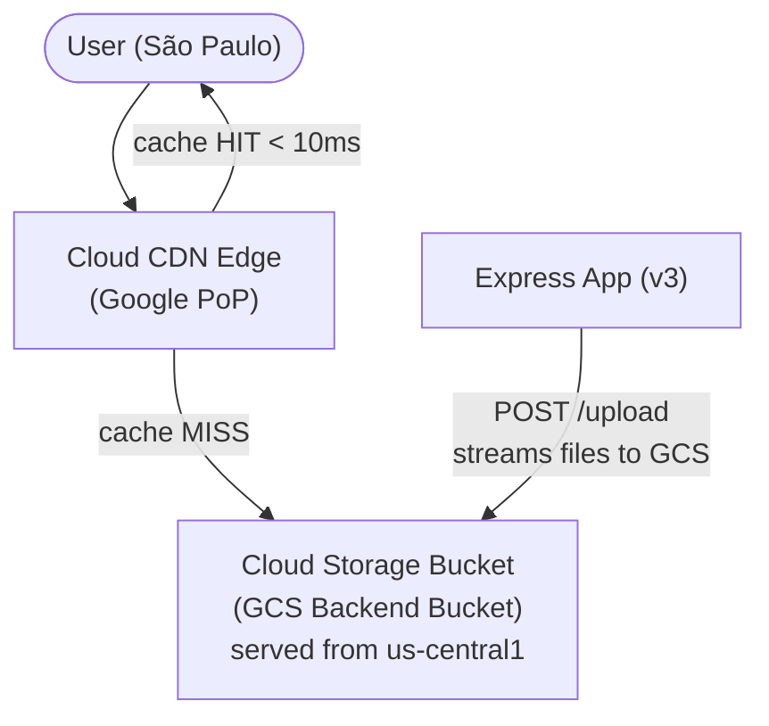

# Tutorial 2.2: Content Delivery Network (CDN)

Images stored on VM local disks create two problems:
1. **Each VM has its own files** — images uploaded to VM-1 are not on VM-2.
2. **Images are served from a single region** — users far from `us-central1` experience high latency.

In this tutorial you solve both by:
- Uploading images to **Cloud Storage (GCS)** — a single, shared, globally durable object store.
- Enabling **Cloud CDN** on the GCS bucket — files are cached at Google's edge nodes worldwide.



**App version:** `v3` (already written in Tutorial 2.1)
**Previous tutorial:** [2.1 Caching with Memorystore](./01_caching_memorystore.md)
**Next tutorial:** [3.1 Async Workers](../phase3_event_driven/01_async_workers_pubsub.md)

---

## 1. Create a Cloud Storage Bucket

The bucket must be **publicly readable** so CDN can serve files without authentication.

### Console

1. **Cloud Storage > Buckets > Create**
   - **Name**: `my-app-images` *(must be globally unique — append your project ID if needed)*
   - **Location type**: Multi-region → `us`
   - **Storage class**: Standard
   - **Access control**: Uniform
2. Click **Create**
3. After creation: **Permissions > Grant Access**
   - Principal: `allUsers`
   - Role: `Storage Object Viewer`
4. Click **Save** (this makes all objects publicly readable)

### gcloud CLI

```bash
BUCKET_NAME=my-app-images-$(gcloud config get-value project)

# Create the bucket
gsutil mb -l us gs://$BUCKET_NAME

# Make all objects publicly readable
gsutil iam ch allUsers:objectViewer gs://$BUCKET_NAME

echo "Bucket created: gs://$BUCKET_NAME"
```

---

## 2. Test manual upload to GCS

```bash
# Upload a test file
echo "hello" > test.txt
gsutil cp test.txt gs://$BUCKET_NAME/test.txt

# Verify it's publicly accessible
curl https://storage.googleapis.com/$BUCKET_NAME/test.txt

# Clean up
gsutil rm gs://$BUCKET_NAME/test.txt
```

---

## 3. Grant the VM's service account access to GCS

Your VM uses its default service account to authenticate with GCS. Grant it the necessary role.

First, find the VM's service account email:

1. **Compute Engine > VM Instances > monolith-server**
2. Under **Service accounts**, note the email — it looks like `PROJECT_NUMBER-compute@developer.gserviceaccount.com`

### Console

1. **Cloud Storage > Buckets > `my-app-images-PROJECT_ID` > Permissions > Grant Access**
2. **New principals**: paste the service account email
3. **Role**: Storage > Storage Object Admin
4. Click **Save**

### gcloud CLI

```bash
PROJECT_ID=$(gcloud config get-value project)

# Get the service account email used by the VM
SA_EMAIL=$(gcloud compute instances describe monolith-server \
  --zone=us-central1-a \
  --format='get(serviceAccounts[0].email)')

echo "VM service account: $SA_EMAIL"

# Grant Storage Object Admin on the specific bucket
gsutil iam ch serviceAccount:$SA_EMAIL:objectAdmin gs://$BUCKET_NAME
```

*Note: if you're using a MIG, all VMs share the same service account defined in the instance template.*

---

## 4. Deploy v3 with GCS storage

The v3 app already handles GCS uploads (see [app/v3/app.js](../app/v3/app.js)). Update the `GCS_BUCKET` environment variable on the VM:

```bash
gcloud compute ssh monolith-server --zone=us-central1-a
```

```bash
# Edit the systemd service
sudo nano /etc/systemd/system/image-app.service

# Update/add this line:
# Environment=GCS_BUCKET=my-app-images-YOUR_PROJECT_ID

sudo systemctl daemon-reload
sudo systemctl restart image-app
```

Test an upload:

```bash
LB_IP=<YOUR_LB_IP>

curl -X POST http://$LB_IP/upload \
  -F "image=@/path/to/photo.jpg"
```

The response should include a GCS URL:

```json
{
  "message": "Image uploaded successfully",
  "url": "https://storage.googleapis.com/my-app-images-PROJECT_ID/1712345678-photo.jpg"
}
```

---

## 5. Add a Backend Bucket to the Load Balancer

To serve GCS files through the load balancer (and enable CDN), add a **Backend Bucket** alongside your existing Backend Service.

### Console

1. **Network Services > Load Balancing > app-url-map > Edit**
2. **Backend configuration > Add Backend > Backend Bucket**
   - Name: `img-backend-bucket`
   - Cloud Storage bucket: `my-app-images-PROJECT_ID`
   - Check **Enable Cloud CDN**
   - Cache mode: **Cache static content**
3. **Routing rules**: Add a new rule:
   - Match: path prefix `/images/storage/*`
   - Route to: `img-backend-bucket`
4. Click **Save**

### gcloud CLI

```bash
# Create the backend bucket with CDN enabled
gcloud compute backend-buckets create img-backend-bucket \
  --gcs-bucket-name=$BUCKET_NAME \
  --enable-cdn \
  --cache-mode=CACHE_ALL_STATIC

# Add a path matcher to the URL map
gcloud compute url-maps import app-url-map --global << 'EOF'
defaultService: https://www.googleapis.com/compute/v1/projects/PROJECT_ID/global/backendServices/app-backend
name: app-url-map
hostRules:
- hosts:
  - '*'
  pathMatcher: app-paths
pathMatchers:
- name: app-paths
  defaultService: https://www.googleapis.com/compute/v1/projects/PROJECT_ID/global/backendServices/app-backend
  pathRules:
  - paths:
    - /storage/*
    service: https://www.googleapis.com/compute/v1/projects/PROJECT_ID/global/backendBuckets/img-backend-bucket
EOF
```

*Note: the simpler approach is to use the Console to edit the URL map — the import format can be complex.*

---

## 6. Verify CDN is working

Upload a new image and request it via the load balancer URL:

```bash
LB_IP=<YOUR_LB_IP>

# Upload
curl -X POST http://$LB_IP/upload -F "image=@photo.jpg"
# Note the returned GCS URL, e.g.: https://storage.googleapis.com/BUCKET/filename.jpg

# Access via CDN (first request — cache miss, served from GCS)
curl -I https://storage.googleapis.com/$BUCKET_NAME/filename.jpg
```

Look for the `x-goog-cache-status` header:
- `MISS` on the first request (fetched from GCS and cached at the edge)
- `HIT` on subsequent requests (served from the nearest CDN node)

---

## 7. Storage classes and lifecycle

For images that aren't accessed frequently, reduce storage costs with a lifecycle rule:

```bash
# Move objects not accessed in 30 days to Nearline storage
cat > lifecycle.json << 'EOF'
{
  "rule": [
    {
      "action": { "type": "SetStorageClass", "storageClass": "NEARLINE" },
      "condition": { "daysSinceLastContainedInActiveMigration": 30 }
    }
  ]
}
EOF

gsutil lifecycle set lifecycle.json gs://$BUCKET_NAME
```

---

## 8. What changed

| | Before (v1/v2) | After (v3 + CDN) |
|--|--|--|
| Image storage | Local VM disk | Cloud Storage (GCS) |
| Image availability | Per-VM | Shared across all VMs |
| Image serving | From app VM | From CDN edge nodes |
| Latency (global users) | High | Low (nearest PoP) |
| Storage durability | VM disk (11 nines if PD) | GCS (11 nines) |
| Bandwidth cost | VM egress | CDN (typically cheaper) |

---

## Next steps

- [Tutorial 3.1: Async Workers (Pub/Sub & Functions)](../phase3_event_driven/01_async_workers_pubsub.md) — offload thumbnail generation to a background worker
