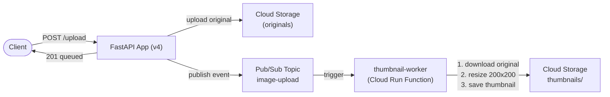

# Tutorial 3.1: Async Workers (Pub/Sub & Cloud Run Functions)

Image resizing is CPU-intensive. If the web app generates a thumbnail synchronously on upload, every upload is slow and the VM wastes CPU that should be handling HTTP requests.

**Event-driven architecture** solves this: the web app publishes a lightweight event to a **Pub/Sub topic** and returns immediately. A separate **Cloud Run Function** subscribes to the topic and performs the thumbnail generation in the background.



**App version:** `v4`
**Function:** `app/v4/functions/thumbnail-worker/` (Python)
**Previous tutorial:** [2.2 CDN with Cloud Storage](../phase2_performance/02_cdn.md)
**Next tutorial:** [4.1 Containerization & Cloud Run](../phase4_containers/01_containerization_cloud_run.md)

---

## 1. Create the Pub/Sub Topic

### Console

> **API**: If prompted, enable the **Cloud Pub/Sub API**.

1. **Pub/Sub > Topics > Create Topic**
   - **Topic ID**: `image-upload`
   - Leave defaults
2. Click **Create**

### gcloud CLI

```bash
gcloud pubsub topics create image-upload
```

---

## 2. Create a Service Account for the Function

The Cloud Run Function needs permission to read and write objects in GCS.

### Console

1. **IAM & Admin > Service Accounts > Create Service Account**
   - **Name**: `thumbnail-worker-sa`
   - **Display name**: `Thumbnail Worker Service Account`
   - Click **Create and Continue**
2. **Grant this service account access to project**:
   - Role 1: Storage > **Storage Object Admin**
   - Role 2: Cloud Run > **Cloud Run Invoker** (required for Eventarc to trigger the function)
   - Click **Continue**, then **Done**

### gcloud CLI

```bash
PROJECT_ID=$(gcloud config get-value project)

# Create a dedicated service account
gcloud iam service-accounts create thumbnail-worker-sa \
  --display-name="Thumbnail Worker Service Account"

# Grant Storage Object Admin (read originals + write thumbnails)
gcloud projects add-iam-policy-binding $PROJECT_ID \
  --member="serviceAccount:thumbnail-worker-sa@$PROJECT_ID.iam.gserviceaccount.com" \
  --role="roles/storage.objectAdmin"

# Grant Cloud Run Invoker (allow Eventarc/PubSub to trigger the function)
gcloud projects add-iam-policy-binding $PROJECT_ID \
  --member="serviceAccount:thumbnail-worker-sa@$PROJECT_ID.iam.gserviceaccount.com" \
  --role="roles/run.invoker"
```

---

## 3. Deploy the Cloud Run Function

The function code is in [app/v4/functions/thumbnail-worker/](../app/v4/functions/thumbnail-worker/).

### Console

> **API**: If prompted, enable the **Cloud Functions API**, **Cloud Run API**, and **Cloud Build API** (required to deploy functions).

1. **Cloud Run Functions > Create Function**
2. **Environment**: 2nd gen
3. **Function name**: `thumbnail-worker`
4. **Region**: `us-central1`
5. **Trigger type**: Cloud Pub/Sub → select topic `image-upload`
6. **Runtime**: Python 3.11
7. **Entry point**: `generate_thumbnail`
8. Upload the source code (or paste from `main.py` and `requirements.txt`)
9. Under **Runtime, build, connections and security settings**:
   - **Service account**: `thumbnail-worker-sa`
   - **Memory**: 512 MB (Pillow is memory-intensive)
10. Click **Deploy**

### gcloud CLI

```bash
gcloud services enable \
  cloudfunctions.googleapis.com \
  run.googleapis.com \
  cloudbuild.googleapis.com
```

```bash
PROJECT_ID=$(gcloud config get-value project)
BUCKET_NAME=my-app-images-$PROJECT_ID

gcloud functions deploy thumbnail-worker \
  --gen2 \
  --runtime=python311 \
  --region=us-central1 \
  --source=web_app_gcp/app/v4/functions/thumbnail-worker \
  --entry-point=generate_thumbnail \
  --trigger-topic=image-upload \
  --service-account=thumbnail-worker-sa@$PROJECT_ID.iam.gserviceaccount.com \
  --memory=512MB \
  --timeout=60s
```

---

## 4. Update the app to v4

The v4 app ([app/v4/app.py](../app/v4/app.py)) is identical to v3 with one addition: after uploading to GCS and recording in Cloud SQL, it publishes a Pub/Sub message.

The published message format:
```json
{
  "imageId": 42,
  "bucketName": "my-app-images-PROJECT_ID",
  "filename": "1712345678-photo.jpg",
  "mimetype": "image/jpeg"
}
```

### 4a. Prepare v4 on `monolith-server`

First, grant the VM's service account the `roles/pubsub.publisher` role. All MIG instances share this service account, so the permission applies to every VM in the group.

#### Console

1. **IAM & Admin > IAM > Grant Access**
2. **New principals**: `PROJECT_NUMBER-compute@developer.gserviceaccount.com`
   *(find your project number under **IAM & Admin > Settings**)*
3. **Role**: Pub/Sub > **Pub/Sub Publisher**
4. Click **Save**

#### gcloud CLI

```bash
PROJECT_ID=$(gcloud config get-value project)

SA_EMAIL=$(gcloud compute instance-templates describe app-template-v3 \
  --format='get(properties.serviceAccounts[0].email)')

if [ "$SA_EMAIL" = "default" ]; then
  PROJECT_NUMBER=$(gcloud projects describe "$(gcloud config get-value project)" \
    --format='get(projectNumber)')
  SA_EMAIL="${PROJECT_NUMBER}-compute@developer.gserviceaccount.com"
fi

gcloud projects add-iam-policy-binding $PROJECT_ID \
  --member="serviceAccount:$SA_EMAIL" \
  --role="roles/pubsub.publisher"
```

SSH in, install v4 dependencies, and update the systemd service:

```bash
gcloud compute ssh monolith-server --zone=us-central1-a
```

```bash
CLOUD_SQL_IP=$(gcloud sql instances describe app-db-instance --format='get(ipAddresses[0].ipAddress)')
REDIS_HOST=$(gcloud redis instances describe metadata-cache --region=us-central1 --format='get(host)')
PROJECT_ID=$(gcloud config get-value project)
BUCKET_NAME=my-app-images-$PROJECT_ID

cd ~/cc-gcp/web_app_gcp/app/v4
python3.11 -m venv venv
source venv/bin/activate
pip install -r requirements.txt

sudo tee /etc/systemd/system/image-app.service > /dev/null <<EOF
[Unit]
Description=Image App (FastAPI v4)
After=network.target

[Service]
Type=simple
User=$USER
WorkingDirectory=/home/$USER/cc-gcp/web_app_gcp/app/v4
ExecStart=/home/$USER/cc-gcp/web_app_gcp/app/v4/venv/bin/uvicorn \
  --host 0.0.0.0 --port 3000 app:app
Restart=on-failure
Environment=PORT=3000
Environment=DB_HOST=$CLOUD_SQL_IP
Environment=DB_USER=app_user
Environment=DB_PASS=StrongPassword123!
Environment=DB_NAME=app_db
Environment=GCS_BUCKET=$BUCKET_NAME
Environment=REDIS_HOST=$REDIS_HOST
Environment=PUBSUB_TOPIC=image-upload
Environment=GOOGLE_CLOUD_PROJECT=$PROJECT_ID

[Install]
WantedBy=multi-user.target
EOF

sudo systemctl daemon-reload
sudo systemctl enable image-app   # auto-start on boot — required before imaging
sudo systemctl restart image-app
```

Verify the service is healthy before imaging:

```bash
curl localhost:3000/health
# { "status": "ok", "version": "v4", "db": "cloud-sql", "cache": "memorystore", "storage": "gcs" }
exit
```

### 4b. Create the v4 machine image

```bash
# Stop the VM for a consistent snapshot
gcloud compute instances stop monolith-server --zone=us-central1-a

gcloud compute images create app-v4-image \
  --source-disk=monolith-server \
  --source-disk-zone=us-central1-a

# Restart the original VM
gcloud compute instances start monolith-server --zone=us-central1-a
```

### 4c. Create instance template v4

```bash
gcloud compute instance-templates create app-template-v4 \
  --machine-type=e2-small \
  --image=app-v4-image \
  --image-project=$(gcloud config get-value project) \
  --tags=http-server \
  --scopes=cloud-platform
```

### 4d. MIG update strategies

See [Tutorial 2.1 §4d](../phase2_performance/01_caching_memorystore.md#4d-mig-update-strategies) for a full description of Rolling update, Canary deployment, Restart, and Replace strategies.

### 4e. Apply the rolling update

```bash
gcloud compute instance-groups managed rolling-action start-update app-mig \
  --version=template=app-template-v4 \
  --max-surge=1 \
  --max-unavailable=0 \
  --zone=us-central1-a
```

Monitor progress:

```bash
# Returns "true" once all instances have reached the new version
gcloud compute instance-groups managed describe app-mig \
  --zone=us-central1-a \
  --format='get(status.versionTarget.isReached)'

# Watch each instance's currentAction in real time

# Linux (watch is built-in)
watch -n5 "gcloud compute instance-groups managed list-instances app-mig --zone=us-central1-a"

# macOS — install watch via Homebrew, then use the same command
brew install watch
watch -n5 "gcloud compute instance-groups managed list-instances app-mig --zone=us-central1-a"

# macOS / Linux — no dependencies (shell loop fallback)
while true; do
  gcloud compute instance-groups managed list-instances app-mig --zone=us-central1-a
  sleep 5
done

# Windows (PowerShell)
while ($true) {
  gcloud compute instance-groups managed list-instances app-mig --zone=us-central1-a
  Start-Sleep 5
}
```

---

## 5. Test end-to-end

```bash
LB_IP=$(gcloud compute forwarding-rules describe app-forwarding-rule --global --format='get(IPAddress)')
BUCKET_NAME=my-app-images-$(gcloud config get-value project)

# Upload an image
curl -X POST http://$LB_IP/upload \
  -F "image=@/tmp/demo-photo.jpg"
```

Expected response (returns immediately, before the thumbnail is ready):

```json
{
  "message": "Image uploaded, thumbnail generation queued",
  "url": "https://storage.googleapis.com/BUCKET/1712345678-photo.jpg"
}
```

Wait a few seconds, then check for the thumbnail:

```bash
# List thumbnails directory in GCS
gsutil ls gs://$BUCKET_NAME/thumbnails/

# The thumbnail URL follows the pattern:
# https://storage.googleapis.com/BUCKET/thumbnails/thumb-1712345678-photo.jpg
curl -I https://storage.googleapis.com/$BUCKET_NAME/thumbnails/thumb-1712345678-photo.jpg
# Should return HTTP 200
```

---

## 6. Monitor the function

### Console

**Cloud Run Functions > thumbnail-worker > Logs** — you should see entries like:

```
Processing imageId=42, file=1712345678-photo.jpg
Thumbnail created: https://storage.googleapis.com/...
```

### gcloud CLI

```bash
gcloud functions logs read thumbnail-worker \
  --gen2 \
  --region=us-central1 \
  --limit=20
```

---

## 7. Manually publish a test message

You can test the function without uploading through the app:

```bash
BUCKET_NAME=my-app-images-$(gcloud config get-value project)

# Publish a test Pub/Sub message
gcloud pubsub topics publish image-upload \
  --message='{
    "imageId": 1,
    "bucketName": "'$BUCKET_NAME'",
    "filename": "EXISTING_FILENAME.jpg",
    "mimetype": "image/jpeg"
  }'
```

Replace `EXISTING_FILENAME.jpg` with a file that actually exists in your bucket.

---

## 8. Dead-letter topics (optional)

If the function fails repeatedly (e.g., the source file is missing), Pub/Sub will retry indefinitely. A **dead-letter topic** captures failed messages after a configurable number of retries:

```bash
# Create a dead-letter topic
gcloud pubsub topics create image-upload-dlq

# Create a subscription with dead-lettering
gcloud pubsub subscriptions create image-upload-sub \
  --topic=image-upload \
  --dead-letter-topic=image-upload-dlq \
  --max-delivery-attempts=5
```

---

## 9. What changed

| | Before | After |
|--|--|--|
| Thumbnail generation | Synchronous (blocks upload) | Asynchronous (background) |
| Upload response time | Slow (resize + save) | Fast (< 100ms) |
| Processing failures | Fail the upload | Retry via Pub/Sub, DLQ for inspection |
| Scaling | Tied to web tier | Independent (Cloud Run Functions scale to 0) |

---

## Next steps

- [Tutorial 3.2: Destroy Infrastructure](02_destroy_infrastructure.md) — clean up all VMs and infrastructure created up to this point before moving to containers.
