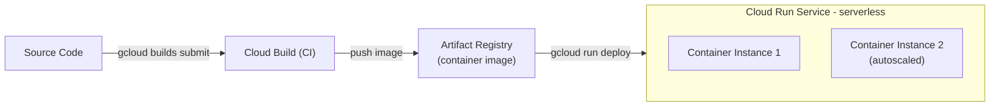

# Tutorial 4.1: Containerization & Cloud Run

Managing VMs — installing Node.js, configuring pm2, creating machine images — is manual and error-prone. **Containers** package the app and all its dependencies into a single, reproducible unit that runs identically everywhere.

**Cloud Run** is a fully managed platform that runs containers without you managing any servers. It scales to zero when idle (no cost) and scales out automatically on traffic.



**App version:** `v5`
**Previous tutorial:** [3.1 Async Workers](../phase3_event_driven/01_async_workers_pubsub.md)
**Next tutorial:** [4.2 Kubernetes Engine](./02_kubernetes_gke.md)

---

## 1. Review the Dockerfile

The Dockerfile is at [app/v5/Dockerfile](../app/v5/Dockerfile):

```dockerfile
FROM python:3.11-slim

# Create a non-root user for security
RUN groupadd -r appgroup && useradd -r -g appgroup appuser

WORKDIR /app

COPY requirements.txt .
RUN pip install --no-cache-dir -r requirements.txt

COPY app.py .

USER appuser

# Cloud Run injects PORT; default to 8080
ENV PORT=8080
EXPOSE 8080

CMD ["gunicorn", "-k", "uvicorn.workers.UvicornWorker", "--bind", "0.0.0.0:8080", "--workers", "2", "--timeout", "60", "app:app"]
```

Key points:
- `python:3.11-slim` is a minimal Debian-based image (~50 MB base)
- A non-root user (`appuser`) runs the process — never run as root in production
- `gunicorn` with `uvicorn.workers.UvicornWorker` is the recommended way to run a FastAPI (ASGI) app in production; FastAPI's built-in `uvicorn` server is for development only
- Cloud Run injects the `PORT` env var; the app listens on it (`8080` by default)

---

## 2. Create an Artifact Registry repository

Artifact Registry stores your Docker images.

### Console

> **APIs**: If prompted, enable the **Artifact Registry API** and **Cloud Build API**.

1. **Artifact Registry > Repositories > Create Repository**
   - **Name**: `python-app-repo`
   - **Format**: Docker
   - **Mode**: Standard
   - **Location type**: Region → `us-central1`
2. Click **Create**

### gcloud CLI

```bash
gcloud artifacts repositories create python-app-repo \
  --repository-format=docker \
  --location=us-central1 \
  --description="Python image app container images"
```

---

## 3. Configure Docker authentication

```bash
gcloud auth configure-docker us-central1-docker.pkg.dev
```

---

## 4. Build and push the image with Cloud Build

Cloud Build runs the Docker build in the cloud — no need to have Docker installed locally.

```bash
PROJECT_ID=$(gcloud config get-value project)
IMAGE_PATH=us-central1-docker.pkg.dev/$PROJECT_ID/python-app-repo/image-app

# Build and push (run from the repo root)
gcloud builds submit web_app_gcp/app/v5 \
  --tag=$IMAGE_PATH:v5
```

*Note: Cloud Build uploads the `web_app_gcp/app/v5/` directory as the build context. Make sure `.dockerignore` excludes `__pycache__/` and `*.pyc`.*

### Verify the image was pushed

```bash
gcloud artifacts docker images list \
  us-central1-docker.pkg.dev/$PROJECT_ID/python-app-repo
```

---

## 5. Deploy to Cloud Run

```bash
PROJECT_ID=$(gcloud config get-value project)
IMAGE_PATH=us-central1-docker.pkg.dev/$PROJECT_ID/python-app-repo/image-app:v5
CLOUD_SQL_IP=<CLOUD_SQL_PRIVATE_IP>
REDIS_IP=<MEMORYSTORE_PRIVATE_IP>
BUCKET_NAME=my-app-images-$PROJECT_ID

gcloud run deploy image-app \
  --image=$IMAGE_PATH \
  --region=us-central1 \
  --platform=managed \
  --allow-unauthenticated \
  --port=8080 \
  --min-instances=0 \
  --max-instances=10 \
  --memory=512Mi \
  --cpu=1 \
  --set-env-vars="DB_HOST=$CLOUD_SQL_IP,DB_USER=app_user,DB_NAME=app_db,GCS_BUCKET=$BUCKET_NAME,REDIS_HOST=$REDIS_IP,PUBSUB_TOPIC=image-upload" \
  --set-secrets="DB_PASS=db-password:latest"
```

*Note: storing `DB_PASS` in a Secret Manager secret is best practice — see Step 6.*

### Console

1. **Cloud Run > Create Service**
2. Select the image from Artifact Registry
3. Set region, min/max instances, memory, and environment variables
4. Click **Create**

---

## 6. Store secrets in Secret Manager

Never pass passwords as plain env vars. Use **Secret Manager** instead:

```bash
# Create the secret
echo -n "StrongPassword123!" | \
  gcloud secrets create db-password \
    --data-file=- \
    --replication-policy=automatic

# Grant Cloud Run's service account access
PROJECT_NUMBER=$(gcloud projects describe $PROJECT_ID --format='get(projectNumber)')

gcloud secrets add-iam-policy-binding db-password \
  --member="serviceAccount:$PROJECT_NUMBER-compute@developer.gserviceaccount.com" \
  --role="roles/secretmanager.secretAccessor"
```

Then reference the secret in the deploy command with `--set-secrets`:

```bash
--set-secrets="DB_PASS=db-password:latest"
```

---

## 7. Test the Cloud Run service

```bash
# Get the service URL
SERVICE_URL=$(gcloud run services describe image-app \
  --region=us-central1 \
  --format='get(status.url)')

echo "Service URL: $SERVICE_URL"

# Health check
curl $SERVICE_URL/health

# Upload an image
curl -X POST $SERVICE_URL/upload \
  -F "image=@photo.jpg"

# List images
curl $SERVICE_URL/images
```

---

## 8. Connect Cloud Run to the VPC (for Cloud SQL and Memorystore)

Cloud Run is serverless and runs outside your VPC by default. To reach Cloud SQL's private IP and Memorystore, enable **VPC Access**.

### Step 8a — Create a VPC connector

#### Console

1. **VPC Network > Serverless VPC Access > Create Connector**
   - **Name**: `app-connector`
   - **Region**: `us-central1`
   - **Network**: `default`
   - **Subnet**: Custom IP range → `10.8.0.0/28`
2. Click **Create**

#### gcloud CLI

```bash
gcloud compute networks vpc-access connectors create app-connector \
  --region=us-central1 \
  --network=default \
  --range=10.8.0.0/28
```

### Step 8b — Attach the connector to Cloud Run

#### Console

1. **Cloud Run > image-app > Edit & Deploy New Revision**
2. Under **Connections** tab → **VPC**:
   - **Connect to a VPC for outbound traffic**: select `app-connector`
   - **Traffic routing**: Route only requests to private IPs through the VPC
3. Click **Deploy**

#### gcloud CLI

```bash
gcloud run services update image-app \
  --region=us-central1 \
  --vpc-connector=app-connector \
  --vpc-egress=private-ranges-only
```

---

## 9. Compare VM vs Cloud Run

| | VM (MIG) | Cloud Run |
|--|--|--|
| Setup | Configure, image, template, MIG | `gcloud run deploy` |
| Scaling | Autoscale (minutes to add VMs) | Autoscale (seconds) |
| Scale to zero | No (min 1 VM) | Yes (pay per request) |
| OS patching | Your responsibility | Managed by Google |
| Persistent connections | Yes (long-lived DB pools) | Yes (with min-instances=1) |
| Port | Any | Must listen on `$PORT` |

---

## Next steps

- [Tutorial 4.2: Kubernetes Engine (GKE)](./02_kubernetes_gke.md) — full orchestration for more complex deployments
