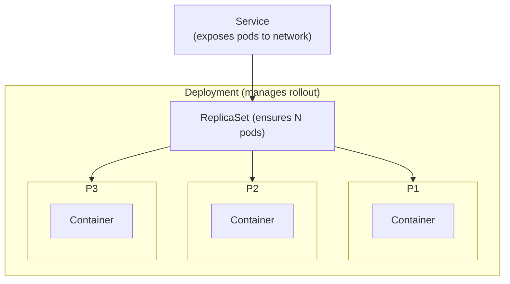

# Tutorial 4.1b: Kubernetes Fundamentals on Minikube (GCP VM)

Before deploying to a managed GKE cluster, it's essential to understand the core Kubernetes building blocks: Pods, ReplicaSets, Deployments, and Services. This tutorial walks through each concept from scratch using **Minikube** running on a GCP VM — a low-cost, disposable environment for learning.



**Next tutorial:** [4.2 Kubernetes Engine (GKE)](./02_kubernetes_gke.md)

---

## 0. Provision a GCP VM

Minikube needs a machine with enough RAM and CPU to run a local cluster. An `e2-standard-4` (4 vCPU, 16 GB) on Ubuntu is a reliable baseline.

```bash
export PROJECT_ID=your-gcp-project-id
export ZONE=us-central1-a

# Create the VM
gcloud compute instances create minikube-lab \
  --project=$PROJECT_ID \
  --zone=$ZONE \
  --machine-type=e2-standard-4 \
  --image-family=ubuntu-2204-lts \
  --image-project=ubuntu-os-cloud \
  --boot-disk-type=pd-ssd \
  --boot-disk-size=50GB \
  --scopes=https://www.googleapis.com/auth/cloud-platform

# Open NodePort range so you can reach services from your laptop
gcloud compute firewall-rules create allow-minikube-nodeport \
  --project=$PROJECT_ID \
  --direction=INGRESS \
  --rules=tcp:30000-32767 \
  --source-ranges=0.0.0.0/0 \
  --target-tags=minikube-lab

gcloud compute instances add-tags minikube-lab \
  --project=$PROJECT_ID --zone=$ZONE --tags=minikube-lab

# SSH in
gcloud compute ssh minikube-lab --project=$PROJECT_ID --zone=$ZONE
```

---

## 1. Install Docker, Minikube, and kubectl

Run the following block inside the VM:

```bash
# ── Docker ──────────────────────────────────────────────────────────────────
sudo apt-get update
sudo apt-get install -y apt-transport-https ca-certificates curl gnupg lsb-release

curl -fsSL https://download.docker.com/linux/ubuntu/gpg \
  | sudo gpg --dearmor -o /usr/share/keyrings/docker-archive-keyring.gpg

echo "deb [arch=amd64 signed-by=/usr/share/keyrings/docker-archive-keyring.gpg] \
  https://download.docker.com/linux/ubuntu $(lsb_release -cs) stable" \
  | sudo tee /etc/apt/sources.list.d/docker.list > /dev/null

sudo apt-get update
sudo apt-get install -y docker-ce docker-ce-cli containerd.io

sudo usermod -aG docker $USER
newgrp docker           # apply group without re-logging

# ── kubectl ──────────────────────────────────────────────────────────────────
curl -LO "https://dl.k8s.io/release/$(curl -Ls https://dl.k8s.io/release/stable.txt)/bin/linux/amd64/kubectl"
sudo install -o root -g root -m 0755 kubectl /usr/local/bin/kubectl

# ── Minikube ─────────────────────────────────────────────────────────────────
curl -LO https://storage.googleapis.com/minikube/releases/latest/minikube-linux-amd64
sudo install minikube-linux-amd64 /usr/local/bin/minikube

# Start the cluster (uses Docker as the VM driver)
minikube start --driver=docker --cpus=4 --memory=8g --disk-size=20g

# Verify
kubectl get nodes
minikube status
```

Expected output:

```
NAME       STATUS   ROLES           AGE   VERSION
minikube   Ready    control-plane   1m    v1.28.x
```

---

## 2. What is a Pod?

A **Pod** is the smallest deployable unit in Kubernetes. It wraps one or more containers and gives them a shared execution environment.

Think of a Pod as a logical host:
- All containers in a Pod share the **same network namespace** — they can reach each other on `localhost`.
- All containers in a Pod share the **same storage volumes** — they can read and write the same mounted directories.
- All containers in a Pod are **scheduled together** on the same node and live or die as a unit.

### 2.1 Single-container Pod

`pod.yaml`

```yaml
apiVersion: v1
kind: Pod
metadata:
  name: podtest2
spec:
  containers:
    - name: cont1
      image: nginx:alpine
```

Apply it and inspect:

```bash
kubectl apply -f pod.yaml

# List pods
kubectl get pods

# Stream its logs
kubectl logs podtest2

# Open a shell inside the container
kubectl exec -it podtest2 -- sh
```

Expected:

```
NAME       READY   STATUS    RESTARTS   AGE
podtest2   1/1     Running   0          15s
```

Delete when done:

```bash
kubectl delete pod podtest2
```

---

## 3. What do containers in a Pod share?

When a Pod has **multiple containers**, they are co-located on the same node and share:

| Resource | What it means |
|---|---|
| **Network namespace** | Same IP address and port space — they communicate via `localhost` |
| **Volumes** | Any mounted volume is visible to all containers in the Pod |
| **Lifecycle** | Created and destroyed together |

This pattern is called a **sidecar**: one container handles the main work, another handles a supporting concern (logging, proxy, config reload, etc.).

### 3.1 Multi-container Pod

`doscont.yaml`

```yaml
apiVersion: v1
kind: Pod
metadata:
  name: doscont
spec:
  containers:
    - name: cont1
      image: python:3.6-alpine
      command: ['sh', '-c', 'echo cont1 > index.html && python -m http.server 8082']
    - name: cont2
      image: python:3.6-alpine
      command: ['sh', '-c', 'echo cont2 > index.html && python -m http.server 8081']
```

Both containers run different HTTP servers on different ports **within the same Pod IP**. From inside either container, `localhost:8081` reaches cont2 and `localhost:8082` reaches cont1.

```bash
kubectl apply -f doscont.yaml

# Confirm both containers are ready (2/2)
kubectl get pod doscont

# Reach cont2's server from inside cont1 (they share localhost)
kubectl exec -it doscont -c cont1 -- sh -c "wget -qO- localhost:8081"
# → cont2

# Reach cont1's server from inside cont2
kubectl exec -it doscont -c cont2 -- sh -c "wget -qO- localhost:8082"
# → cont1

kubectl delete pod doscont
```

---

## 4. ReplicaSet

A **ReplicaSet** ensures that a specified number of identical Pod copies (replicas) are running at all times. If a Pod crashes or is deleted, the ReplicaSet creates a replacement automatically.

Key fields:
- `replicas` — desired number of Pods
- `selector.matchLabels` — how the ReplicaSet identifies the Pods it owns
- `template` — the Pod spec that will be used for every replica

`rs.yaml`

```yaml
apiVersion: apps/v1
kind: ReplicaSet
metadata:
  name: rs-test
  labels:
    app: rs-test
spec:
  replicas: 5
  selector:
    matchLabels:
      app: pod-label
  template:
    metadata:
      labels:
        app: pod-label    # must match selector.matchLabels
    spec:
      containers:
        - name: cont1
          image: python:3.6-alpine
          command: ['sh', '-c', 'echo cont1 > index.html && python -m http.server 8082']
        - name: cont2
          image: python:3.6-alpine
          command: ['sh', '-c', 'echo cont2 > index.html && python -m http.server 8081']
```

```bash
kubectl apply -f rs.yaml

# Should show 5 pods
kubectl get pods -l app=pod-label

# Manually delete one — the ReplicaSet recreates it immediately
kubectl delete pod <any-pod-name>
kubectl get pods -l app=pod-label   # still 5

# Scale to 3
kubectl scale rs rs-test --replicas=3
kubectl get pods -l app=pod-label

kubectl delete rs rs-test
```

> **Why not use ReplicaSets directly?** A ReplicaSet can't roll out a new image version safely on its own. That's what Deployments are for.

---

## 5. Deployment

A **Deployment** sits on top of a ReplicaSet and adds:

- **Declarative rollouts** — update the image and Kubernetes replaces Pods gradually (rolling update).
- **Rollback** — revert to a previous version with one command.
- **History** — Kubernetes keeps a revision log.

In practice, you almost always use Deployments instead of bare ReplicaSets.

`deployment.yaml`

```yaml
apiVersion: apps/v1
kind: Deployment
metadata:
  name: deployment-test
  labels:
    app: front
spec:
  replicas: 3
  selector:
    matchLabels:
      app: front
  template:
    metadata:
      labels:
        app: front
    spec:
      containers:
        - name: nginx
          image: nginx:alpine
```

```bash
kubectl apply -f deployment.yaml

# Watch the rollout
kubectl rollout status deployment/deployment-test

# 3 pods managed by the deployment
kubectl get pods -l app=front

# The deployment created a ReplicaSet under the hood
kubectl get replicasets
```

### 5.1 Rolling update

```bash
# Update the image (triggers a rolling update — no downtime)
kubectl set image deployment/deployment-test nginx=nginx:1.25-alpine

kubectl rollout status deployment/deployment-test

# View revision history
kubectl rollout history deployment/deployment-test

# Roll back to the previous revision
kubectl rollout undo deployment/deployment-test
```

### 5.2 Observe the relationship

```bash
# Deployment → ReplicaSet → Pods
kubectl get all -l app=front
```

```
NAME                                   READY   STATUS    RESTARTS   AGE
pod/deployment-test-7d9b4c8f6-abc12    1/1     Running   0          2m
pod/deployment-test-7d9b4c8f6-def34    1/1     Running   0          2m
pod/deployment-test-7d9b4c8f6-ghi56    1/1     Running   0          2m

NAME                                         DESIRED   CURRENT   READY
replicaset.apps/deployment-test-7d9b4c8f6   3         3         3

NAME                              READY   UP-TO-DATE   AVAILABLE
deployment.apps/deployment-test   3/3     3            3
```

---

## 6. Service

Pods are ephemeral — they get new IP addresses every time they restart. A **Service** provides a stable network endpoint (a fixed IP + DNS name) that load-balances traffic across all matching Pods, regardless of churn.

| Service type | Reachable from | When to use |
|---|---|---|
| `ClusterIP` | Inside the cluster only | Internal microservice communication |
| `NodePort` | VM's external IP + a high port | Development / Minikube testing |
| `LoadBalancer` | Internet via a cloud load balancer | Production on GKE/GCP |

The Service finds its Pods using a **label selector** — it routes to any Pod whose labels match.

### 6.1 NodePort Service (Minikube-friendly)

`service.yaml`

```yaml
apiVersion: v1
kind: Service
metadata:
  name: front-service
spec:
  type: NodePort
  selector:
    app: front          # routes to all pods with label app=front
  ports:
    - protocol: TCP
      port: 80          # port exposed inside the cluster
      targetPort: 80    # port on the Pod's container
      nodePort: 30080   # port exposed on every node (30000–32767)
```

```bash
kubectl apply -f service.yaml

# Confirm the service is up
kubectl get service front-service

# Get the Minikube node IP
minikube ip

# Hit the app (replace with actual minikube IP)
curl http://$(minikube ip):30080
```

### 6.2 Shortcut: minikube service

```bash
# Minikube opens the service URL for you
minikube service front-service --url
```

---

## 7. How the objects relate

```
Deployment
  └── ReplicaSet  (one per revision)
        └── Pod   (one per replica)
              └── Container(s)

Service
  └── selects Pods by label  →  load-balances traffic to them
```

- Delete a **Pod** → ReplicaSet creates a new one.
- Update the **Deployment** image → new ReplicaSet is created, old one scales to 0.
- **Service** always points to whichever Pods are currently healthy.

---

## 8. Useful commands cheatsheet

```bash
# Apply / delete any manifest
kubectl apply -f <file.yaml>
kubectl delete -f <file.yaml>

# List resources
kubectl get pods
kubectl get pods -l app=front        # filter by label
kubectl get all

# Inspect
kubectl describe pod <name>
kubectl logs <pod-name> -c <container-name>
kubectl exec -it <pod-name> -- sh

# Deployment management
kubectl rollout status deployment/<name>
kubectl rollout history deployment/<name>
kubectl rollout undo deployment/<name>
kubectl scale deployment <name> --replicas=5

# Minikube
minikube ip
minikube service <svc-name> --url
minikube dashboard          # web UI (opens a proxy tunnel)
```

---

## 9. Cleanup

```bash
# Delete everything created in this tutorial
kubectl delete -f service.yaml
kubectl delete deployment deployment-test

# Stop Minikube
minikube stop

# (Optional) Delete the GCP VM when done
gcloud compute instances delete minikube-lab \
  --project=$PROJECT_ID --zone=$ZONE
```

---

## What you learned

| Concept | Object | Key idea |
|---|---|---|
| Smallest runnable unit | `Pod` | One or more containers with shared network + storage |
| Container co-location | Multi-container Pod | Containers share `localhost` and volumes |
| Self-healing replicas | `ReplicaSet` | Maintains desired Pod count automatically |
| Zero-downtime deploys | `Deployment` | Rolling updates + rollback on top of ReplicaSet |
| Stable network endpoint | `Service` | Fixed IP/DNS that load-balances to healthy Pods |

---

## Next steps

- [Tutorial 4.2: Kubernetes Engine (GKE)](./02_kubernetes_gke.md) — take the same concepts to a production-grade managed cluster on GCP
