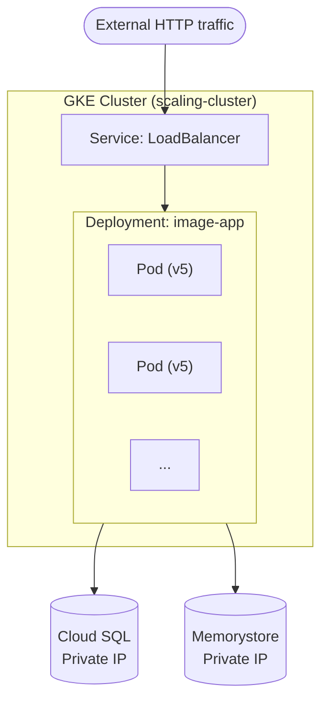

# Tutorial 4.2: Kubernetes Engine (GKE)

Cloud Run is great for simple, stateless services. But for complex systems — multiple services, custom networking, sidecar containers, fine-grained resource control — **Kubernetes (GKE)** gives you full orchestration power.

In this tutorial you deploy the containerized app to a GKE cluster using `kubectl` and Kubernetes manifests.



**App version:** `v5`
**Previous tutorial:** [4.1 Containerization & Cloud Run](./01_containerization_cloud_run.md)
**Next tutorial:** [4.3 Automated CI/CD](./03_automated_cicd.md)

---

## 1. Create the GKE Cluster

### Console

> **API**: If prompted, enable the **Kubernetes Engine API**.

1. **Kubernetes Engine > Clusters > Create**
2. Select **Standard** cluster (for full control)
3. **Name**: `scaling-cluster`
4. **Location**: Zonal → `us-central1-a`
5. **Node pools > default-pool**:
   - Number of nodes: 3
   - Machine type: `e2-medium`
6. Under **Networking**: select the `default` VPC so nodes can reach Cloud SQL and Memorystore
7. Click **Create** (takes ~3-5 minutes)

### gcloud CLI

```bash
gcloud container clusters create scaling-cluster \
  --zone=us-central1-a \
  --num-nodes=3 \
  --machine-type=e2-medium \
  --network=default \
  --enable-autoscaling \
  --min-nodes=1 \
  --max-nodes=5
```

---

## 2. Get cluster credentials

```bash
gcloud container clusters get-credentials scaling-cluster \
  --zone=us-central1-a

# Verify connection
kubectl get nodes
```

Expected output:

```
NAME                                            STATUS   ROLES    AGE   VERSION
gke-scaling-cluster-default-pool-xxxxx-xxxx     Ready    <none>   2m    v1.28.x
gke-scaling-cluster-default-pool-xxxxx-xxxx     Ready    <none>   2m    v1.28.x
gke-scaling-cluster-default-pool-xxxxx-xxxx     Ready    <none>   2m    v1.28.x
```

---

## 3. Create the Kubernetes Secret

Secrets store sensitive values (DB password, connection details) separately from your manifests.

```bash
CLOUD_SQL_IP=<CLOUD_SQL_PRIVATE_IP>
REDIS_IP=<MEMORYSTORE_PRIVATE_IP>
BUCKET_NAME=my-app-images-$(gcloud config get-value project)

kubectl create secret generic app-secrets \
  --from-literal=DB_HOST=$CLOUD_SQL_IP \
  --from-literal=DB_USER=app_user \
  --from-literal=DB_PASS='StrongPassword123!' \
  --from-literal=DB_NAME=app_db \
  --from-literal=GCS_BUCKET=$BUCKET_NAME \
  --from-literal=REDIS_HOST=$REDIS_IP
```

Verify:

```bash
kubectl get secret app-secrets
kubectl describe secret app-secrets
```

*Note: the YAML version of this secret is at [app/v5/k8s/secret.yaml](../app/v5/k8s/secret.yaml) — fill in the base64 values before applying.*

---

## 4. Deploy the app

The Deployment manifest is at [app/v5/k8s/deployment.yaml](../app/v5/k8s/deployment.yaml).

Replace the image path before applying:

```bash
PROJECT_ID=$(gcloud config get-value project)
IMAGE_TAG=v5

# Substitute PROJECT_ID and IMAGE_TAG into the manifest
sed -e "s/PROJECT_ID/$PROJECT_ID/g" \
    -e "s/IMAGE_TAG/$IMAGE_TAG/g" \
    app/v5/k8s/deployment.yaml | kubectl apply -f -
```

Check rollout status:

```bash
kubectl rollout status deployment/image-app
kubectl get pods
```

Expected:

```
NAME                          READY   STATUS    RESTARTS   AGE
image-app-6d8f9c7b9-abc12     1/1     Running   0          30s
image-app-6d8f9c7b9-def34     1/1     Running   0          30s
```

---

## 5. Expose the app with a LoadBalancer Service

Apply the Service manifest:

```bash
kubectl apply -f app/v5/k8s/service.yaml
```

Get the external IP (takes ~1 minute to provision):

```bash
kubectl get service image-app-service --watch
```

Once `EXTERNAL-IP` is populated:

```bash
EXTERNAL_IP=$(kubectl get service image-app-service \
  -o jsonpath='{.status.loadBalancer.ingress[0].ip}')

echo "External IP: $EXTERNAL_IP"
curl http://$EXTERNAL_IP/health
```

---

## 6. Liveness and Readiness Probes

The deployment manifest configures two probes:

```yaml
livenessProbe:
  httpGet:
    path: /health      # returns 200 if the app is running
    port: 8080
  initialDelaySeconds: 10
  periodSeconds: 15

readinessProbe:
  httpGet:
    path: /ready       # returns 200 only when DB connection is verified
    port: 8080
  initialDelaySeconds: 5
  periodSeconds: 10
```

- **Liveness**: if this fails, Kubernetes restarts the container.
- **Readiness**: if this fails, Kubernetes stops sending traffic to the pod until it recovers.

Test by checking pod events:

```bash
kubectl describe pod <POD_NAME>
```

---

## 7. Rolling Update

To deploy a new image version without downtime:

```bash
# Build and push a new image
NEW_TAG=v5.1
gcloud builds submit app/v5 \
  --tag=us-central1-docker.pkg.dev/$PROJECT_ID/python-app-repo/image-app:$NEW_TAG

# Update the deployment image
kubectl set image deployment/image-app \
  image-app=us-central1-docker.pkg.dev/$PROJECT_ID/python-app-repo/image-app:$NEW_TAG

# Monitor rollout
kubectl rollout status deployment/image-app
```

To roll back:

```bash
kubectl rollout undo deployment/image-app
```

---

## 8. Scale manually and with HPA

```bash
# Manual scale
kubectl scale deployment image-app --replicas=4

# Horizontal Pod Autoscaler (auto-scale based on CPU)
kubectl autoscale deployment image-app \
  --cpu-percent=60 \
  --min=2 \
  --max=10

kubectl get hpa
```

---

## 9. Useful kubectl commands

```bash
# Pod logs
kubectl logs -l app=image-app --tail=50 --follow

# Exec into a running pod
kubectl exec -it <POD_NAME> -- sh

# View all resources
kubectl get all

# Describe a deployment for events and conditions
kubectl describe deployment image-app

# Delete everything (for cleanup)
kubectl delete -f app/v5/k8s/
```

---

## 10. What you built

| Concept | Kubernetes Object |
|---------|------------------|
| Run N copies of the app | `Deployment` |
| Restart crashed containers | `livenessProbe` |
| Traffic only to healthy pods | `readinessProbe` |
| External load balancer | `Service (type: LoadBalancer)` |
| Secrets management | `Secret` |
| Autoscaling | `HorizontalPodAutoscaler` |

---

## Next steps

- [Tutorial 4.3: Automated CI/CD](./03_automated_cicd.md) — push code to GitHub and have it deploy automatically
