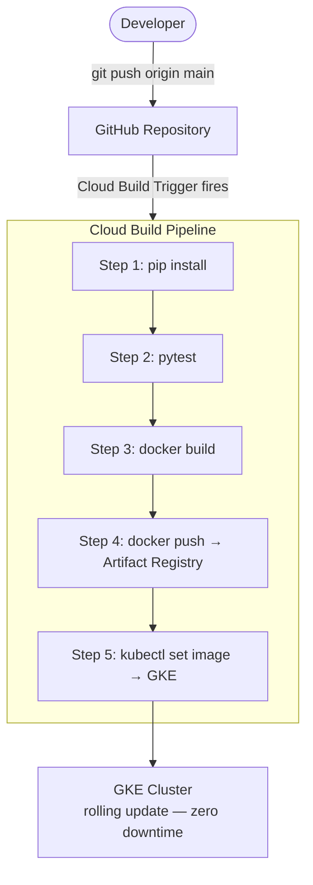
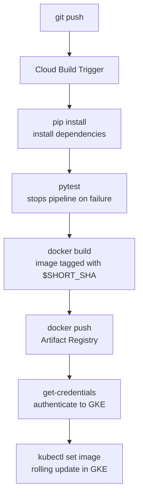

# Tutorial 4.3: Automated CI/CD with Cloud Build

Right now, deploying a new version of the app requires running several manual commands. **CI/CD (Continuous Integration / Continuous Deployment)** automates this: every push to the `main` branch triggers a pipeline that tests, builds, and deploys the new version automatically.



**Previous tutorial:** [4.2 Kubernetes Engine (GKE)](./02_kubernetes_gke.md)

---

## 1. Review the cloudbuild.yaml

The pipeline is defined in [app/v5/cloudbuild.yaml](../app/v5/cloudbuild.yaml):

```yaml
steps:
  # Install dependencies
  - name: 'python:3.11-slim'
    entrypoint: pip
    args: ['install', '-r', 'requirements.txt', '--quiet']
    dir: 'app/v5'

  # Build the Docker image (tagged with the short commit SHA)
  - name: 'gcr.io/cloud-builders/docker'
    args: [build, -t, '${_REGION}-docker.pkg.dev/$PROJECT_ID/${_REPO}/${_IMAGE}:$SHORT_SHA', 'app/v5']

  # Push to Artifact Registry
  - name: 'gcr.io/cloud-builders/docker'
    args: [push, '--all-tags', '${_REGION}-docker.pkg.dev/$PROJECT_ID/${_REPO}/${_IMAGE}']

  # Get GKE credentials
  - name: 'gcr.io/cloud-builders/kubectl'
    args: [get-credentials, '${_CLUSTER_NAME}', '--zone=${_CLUSTER_ZONE}']

  # Rolling update
  - name: 'gcr.io/cloud-builders/kubectl'
    args: [set, image, deployment/image-app,
           'image-app=${_REGION}-docker.pkg.dev/$PROJECT_ID/${_REPO}/${_IMAGE}:$SHORT_SHA']
```

`$SHORT_SHA` is the first 7 characters of the commit hash — Cloud Build injects it automatically. This means every deployment is traceable back to a specific commit.

---

## 2. Grant Cloud Build permissions

Cloud Build runs as a service account. It needs permission to:
- Push images to Artifact Registry
- Deploy to GKE

```bash
PROJECT_ID=$(gcloud config get-value project)
PROJECT_NUMBER=$(gcloud projects describe $PROJECT_ID --format='get(projectNumber)')

CLOUD_BUILD_SA="$PROJECT_NUMBER@cloudbuild.gserviceaccount.com"

# Allow pushing to Artifact Registry
gcloud projects add-iam-policy-binding $PROJECT_ID \
  --member="serviceAccount:$CLOUD_BUILD_SA" \
  --role="roles/artifactregistry.writer"

# Allow deploying to GKE
gcloud projects add-iam-policy-binding $PROJECT_ID \
  --member="serviceAccount:$CLOUD_BUILD_SA" \
  --role="roles/container.developer"

# Allow getting GKE credentials
gcloud projects add-iam-policy-binding $PROJECT_ID \
  --member="serviceAccount:$CLOUD_BUILD_SA" \
  --role="roles/container.clusterViewer"
```

---

## 3. Connect GitHub to Cloud Build

### Console

1. **Cloud Build > Repositories > Connect Repository**
2. Select **GitHub (Cloud Build GitHub App)**
3. Authenticate with GitHub and select your repository
4. Click **Connect**

### gcloud CLI

```bash
# Install the Cloud Build GitHub App and create a connection
# (The console flow is recommended for GitHub OAuth)
gcloud builds connections create github cc-gcp-connection \
  --region=us-central1
```

---

## 4. Create the Build Trigger

### Console

1. **Cloud Build > Triggers > Create Trigger**
   - **Name**: `deploy-on-push`
   - **Region**: `us-central1`
   - **Event**: Push to a branch
   - **Source**: your GitHub repo, branch `^main$`
   - **Configuration**: Cloud Build configuration file
   - **Location**: Repository, `/app/v5/cloudbuild.yaml`
2. **Substitution variables** (optional, override defaults from cloudbuild.yaml):
   - `_REGION` = `us-central1`
   - `_REPO` = `python-app-repo`
   - `_IMAGE` = `image-app`
   - `_CLUSTER_NAME` = `scaling-cluster`
   - `_CLUSTER_ZONE` = `us-central1-a`
3. Click **Create**

### gcloud CLI

```bash
PROJECT_ID=$(gcloud config get-value project)

gcloud builds triggers create github \
  --name=deploy-on-push \
  --region=us-central1 \
  --repo-name=cc-gcp \
  --repo-owner=YOUR_GITHUB_USERNAME \
  --branch-pattern='^main$' \
  --build-config=app/v5/cloudbuild.yaml \
  --substitutions='_REGION=us-central1,_REPO=python-app-repo,_IMAGE=image-app,_CLUSTER_NAME=scaling-cluster,_CLUSTER_ZONE=us-central1-a'
```

---

## 5. Trigger a deployment

Make any change to the app and push to `main`:

```bash
# Example: update the health endpoint response
# Edit app/v5/app.py, change the version string

git add app/v5/app.py
git commit -m "chore: bump version to v5.1"
git push origin main
```

Watch the pipeline run:

```bash
# List recent builds
gcloud builds list --region=us-central1 --limit=5

# Stream logs of the latest build
BUILD_ID=$(gcloud builds list --region=us-central1 --limit=1 --format='get(id)')
gcloud builds log $BUILD_ID --region=us-central1 --stream
```

### Console

**Cloud Build > Build History** — each row shows the commit SHA, branch, trigger, status, and duration.

---

## 6. Verify the deployment

```bash
EXTERNAL_IP=$(kubectl get service image-app-service \
  -o jsonpath='{.status.loadBalancer.ingress[0].ip}')

curl http://$EXTERNAL_IP/health
```

Check the rollout:

```bash
kubectl rollout status deployment/image-app
kubectl get pods
```

---

## 7. Rollback a bad deployment

If a build deploys broken code, roll back via Git or Kubernetes:

```bash
# Option A: roll back Kubernetes deployment to previous revision
kubectl rollout undo deployment/image-app
kubectl rollout status deployment/image-app

# Option B: revert the Git commit, push again, let CI/CD re-deploy
git revert HEAD
git push origin main
```

*Note: Option B is preferred because it keeps the deployment state in sync with the Git history.*

---

## 8. Add tests to the pipeline

The pipeline has a commented-out test step in `cloudbuild.yaml`. To activate it, add tests to your app and uncomment:

```yaml
# Uncomment in app/v5/cloudbuild.yaml:
- name: 'python:3.11-slim'
  entrypoint: python
  args: ['-m', 'pytest', 'tests/']
  dir: 'app/v5'
```

With tests in place, a failing test blocks the build from proceeding to the Docker build and deploy steps — preventing broken code from reaching production.

---

## 9. Complete CI/CD pipeline summary



Every production deployment is:
- **Traceable** — linked to a specific Git commit via `$SHORT_SHA`
- **Tested** — tests run before any artifact is built
- **Zero-downtime** — GKE rolling update keeps old pods alive until new ones pass readiness probes

---

## Congratulations

You have completed the full roadmap:

| Phase | What you built |
|-------|---------------|
| 1.1 | Single VM monolith |
| 1.2 | Cloud SQL (managed DB) |
| 1.3 | MIG + Global Load Balancer |
| 2.1 | Memorystore Redis (Cache-Aside) |
| 2.2 | GCS storage + Cloud CDN |
| 3.1 | Pub/Sub + Cloud Run Functions (async thumbnails) |
| 4.1 | Docker + Cloud Run (serverless containers) |
| 4.2 | GKE (full Kubernetes orchestration) |
| 4.3 | Cloud Build CI/CD (push-to-deploy) |

The app evolved from a single server that crashes under load, to a globally distributed, autoscaling, event-driven system — mirroring the architecture of real production systems handling millions of users.
