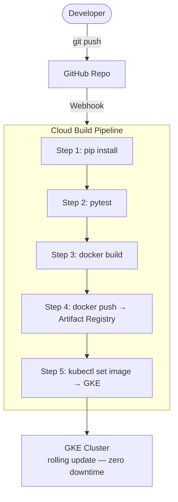

# Tutorial 4.3: Automated CI/CD with Cloud Build and GitHub

Right now, deploying a new version of the app requires running several manual commands. **CI/CD (Continuous Integration / Continuous Deployment)** automates this: every push to your GitHub repository triggers a pipeline that tests, builds, and deploys the new version automatically.



**Previous tutorial:** [4.2 Kubernetes Engine (GKE)](./02_kubernetes_gke.md)

---

## 1. Create the GitHub Repository

We will use the `gh` CLI to create a repository and push the application code.

#### CLI Instructions

```bash
# 1. Navigate to the app code
cd web_app_gcp/app/v5

# 2. Prepare a clean workspace
mkdir -p ~/gh-cloudbuild-tutorial
cp -r . ~/gh-cloudbuild-tutorial
cd ~/gh-cloudbuild-tutorial

# 3. Initialize and Push
git init
git add .
git commit -m "initial commit: app v5"
gh repo create cc-gcp-github --private --source=. --remote=origin --push
```

---

## 2. Connect GitHub to Cloud Build

This handles the authentication between GitHub and Google Cloud.

1. Open the [Cloud Build Triggers](https://console.cloud.google.com/cloud-build/triggers) page.
2. Click **Manage Repositories**.
3. Click **Connect Repository**.
4. Select **GitHub (Cloud Build GitHub App)**.
5. Authenticate with your GitHub account if prompted.
6. **Select Repository**: Find and select `cc-gcp-github`.
7. Click **Connect**.

---

## 3. Create the Trigger

Now that the repository is linked, create a trigger to run `cloudbuild.yaml` on every push to the `main` branch.

1. Go back to the **Triggers** page and click **Create Trigger**.
2. **Name**: `deploy-on-push`.
3. **Event**: Push to a branch.
4. **Source**: Select your connected `cc-gcp-github` repository.
5. **Branch**: `^main$`.
6. **Configuration**: Cloud Build configuration file (yaml or json).
7. **Location**: Repository, `/cloudbuild.yaml`.
8. **Substitution variables**:
   - `_REGION` = `us-central1`
   - `_REPO` = `python-app-repo`
   - `_IMAGE` = `image-app`
   - `_CLUSTER_NAME` = `scaling-cluster`
   - `_CLUSTER_ZONE` = `us-central1-a`
9. Click **Create**.

---

## 4. Grant Permissions

Cloud Build runs as a service account and needs permission to push images and deploy to GKE.

```bash
PROJECT_ID=$(gcloud config get-value project)
PROJECT_NUMBER=$(gcloud projects describe $PROJECT_ID --format='get(projectNumber)')
CLOUD_BUILD_SA="$PROJECT_NUMBER@cloudbuild.gserviceaccount.com"

# Allow GKE deployment
gcloud projects add-iam-policy-binding $PROJECT_ID \
  --member="serviceAccount:$CLOUD_BUILD_SA" \
  --role="roles/container.developer"

# Allow Artifact Registry access
gcloud projects add-iam-policy-binding $PROJECT_ID \
  --member="serviceAccount:$CLOUD_BUILD_SA" \
  --role="roles/artifactregistry.writer"

# Allow getting GKE credentials
gcloud projects add-iam-policy-binding $PROJECT_ID \
  --member="serviceAccount:$CLOUD_BUILD_SA" \
  --role="roles/container.clusterViewer"
```

---

## 5. Trigger a deployment

Make a change to the app and push to GitHub:

```bash
# Example: update the health endpoint response
# Edit app.py, change a string or print statement

git add app.py
git commit -m "chore: test automated deployment"
git push origin main
```

Watch the pipeline run:

```bash
# List recent builds
gcloud builds list --region=us-central1 --limit=5

# Stream logs of the latest build
BUILD_ID=$(gcloud builds list --region=us-central1 --limit=1 --format='get(id)')
gcloud builds log $BUILD_ID --region=us-central1 --stream
```

### Console

**Cloud Build > Build History** — each row shows the commit SHA, branch, status, and duration.

---

## 6. Verification

Once the build finishes, verify the update:

```bash
EXTERNAL_IP=$(kubectl get service image-app-service \
  -o jsonpath='{.status.loadBalancer.ingress[0].ip}')

curl http://$EXTERNAL_IP/health
```

Check the rollout status:

```bash
kubectl rollout status deployment/image-app
kubectl get pods
```

---

## 7. Rollback a bad deployment

If a build deploys broken code, roll back via Git or Kubernetes:

```bash
# Option A: roll back Kubernetes deployment to previous revision
kubectl rollout undo deployment/image-app
kubectl rollout status deployment/image-app

# Option B: revert the Git commit, push again, let CI/CD re-deploy
git revert HEAD
git push origin main
```

*Note: Option B is preferred because it keeps the deployment state in sync with the Git history.*

---

## 8. Add tests to the pipeline

The pipeline has a commented-out test step in `cloudbuild.yaml`. To activate it, uncomment the following in `app/v5/cloudbuild.yaml`:

```yaml
# Uncomment in cloudbuild.yaml:
- name: 'python:3.11-slim'
  entrypoint: python
  args: ['-m', 'pytest', 'tests/']
  dir: 'app/v5'
```

A failing test will block the build from proceeding, preventing broken code from reaching production.

---

## 9. Congratulations

You have completed the full roadmap:

| Phase | What you built |
|-------|---------------|
| 1.1 | Single VM monolith |
| 1.2 | Cloud SQL (managed DB) |
| 1.3 | MIG + Global Load Balancer |
| 2.1 | Memorystore Redis (Cache-Aside) |
| 2.2 | GCS storage + Cloud CDN |
| 3.1 | Pub/Sub + Cloud Run Functions (async thumbnails) |
| 4.1 | Docker + Cloud Run (serverless containers) |
| 4.2 | GKE (full Kubernetes orchestration) |
| 4.3 | Cloud Build CI/CD (GitHub push-to-deploy) |

The app evolved from a single server that crashes under load, to a globally distributed, autoscaling, event-driven system — mirroring the architecture of real production systems.

---

## Next steps

- [Tutorial 4.4: Destroy Container Infrastructure](./04_destroy_infrastructure.md) — clean up the Phase 4 resources to avoid costs.
